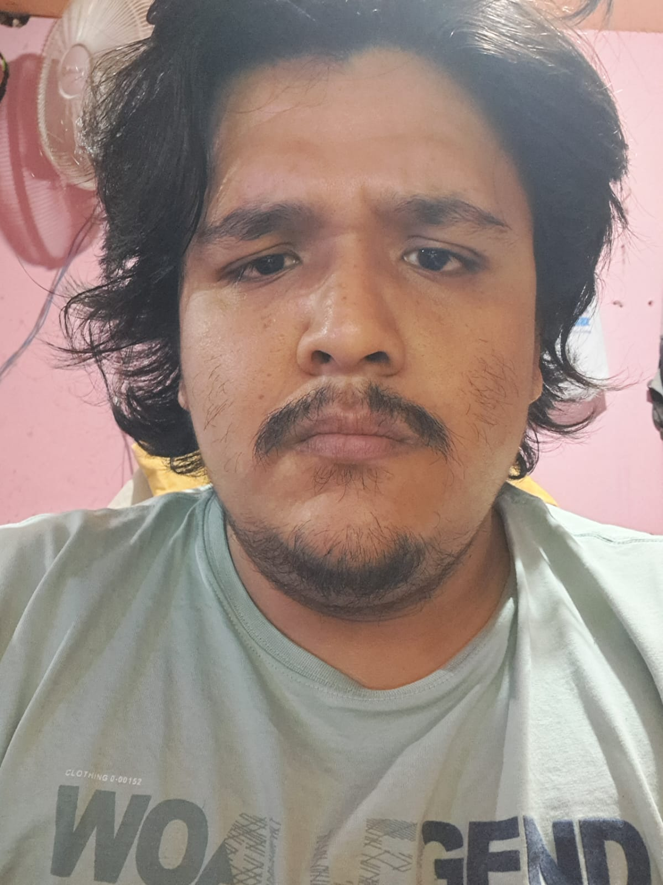
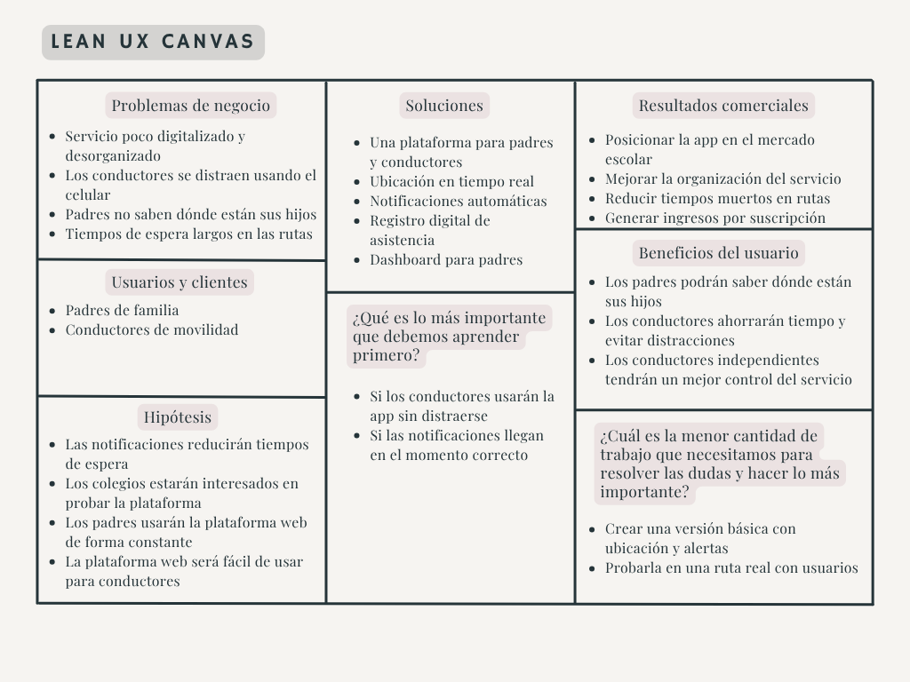

# **Chapter I: Introduction**
## **1.1. Startup Profile**
### **1.1.1. Startup Description**
En el Perú, el servicio de movilidad escolar es un sector que, pese a su enorme importancia para las familias, funciona de manera manual y no cuenta con sistemas tecnológicos que permitan un seguimiento en tiempo real. Esto hace que muchos padres sientan incertidumbre diariamente, quienes desean tener un control más cercano y la certeza de saber si sus hijos entraron en el vehículo o si ya llegaron a salvo a su destino.

Frente a esta realidad surge **MoviSafe**, una startup tecnológica que se enfoca en revolucionar la seguridad y tranquilidad en el ambiente del transporte escolar. Nuestro modelo de negocio propone reemplazar procesos manuales con herramientas digitales a través de **KidsOnWay**. KidsOnWay reúne en una sola plataforma a todos los actores involucrados en el transporte escolar, ofreciendo trazabilidad en tiempo real y ofreciendo a las familias mayor tranquilidad durante el traslado diario.

**Misión** 

Facilitar la logística y el monitoreo del transporte escolar mediante un entorno digital seguro, en tiempo real e intuitivo, que tiene como prioridad la tranquilidad de las familias y la eficiencia de los conductores.

**Visión** 

Convertirnos en la plataforma líder y el estándar de seguridad en el transporte escolar, siendo reconocidos por brindar total transparencia en el traslado de estudiantes en tiempo real.

**Objetivos de la Startup**
  * Optimizar la gestión del transporte escolar mediante herramientas digitales que reemplacen procesos manuales.
  * Diseñar una aplicación intuitiva y accesible que facilite la interacción entre los padres con los conductores.
  * Fomentar la adopción tecnológica en el sector de transporte escolar, promoviendo soluciones modernas y eficientes.
  * Establecer alianzas estratégicas con instituciones educativas y servicios de transporte para ampliar la cobertura del servicio.

**Valores de la Startup**
  * **Seguridad:** Es nuestra máxima prioridad, donde cada funcionalidad está diseñada para proteger la integridad del estudiante y la tranquilidad de los padres.
  * **Transparencia:** Compartimos información real y visible sobre cada viaje, generando confianza entre padres, conductores e instituciones.
  * **Innovación:** Mejoramos constantemente nuestra plataforma mediante el uso de tecnologías modernas que facilitan la experiencia de usuarios y conductores.

### **1.1.2. Team Member Profiles**

<table width="100%">
  <tbody>
    <tr>
      <td width="30%" align="center" valign="middle">
        
         
        <i></i>
      </td>
      <td width="70%" valign="top" style="padding-left: 20px;">
        <h3>Alonso Enrique Higa Kohatsu</h3>
        
<b>Código de estudiante:</b> u202416276

        
<b>Edad:</b> 19 años

        
<b>Carrera:</b> Ingeniería de Software

         
        
<b>Sobre mí:</b>

        
Me apasiona la tecnología y aprender cosas nuevas. Tengo conocimientos en C++ y un poco de Python y actualmente estoy enfocado en el aprendizaje de desarrollo web con Spring Boot. Me considero una persona curiosa, en constante aprendizaje y firmemente comprometido con el logro de mis objetivos profesionales y personales.

      </td>
    </tr>
    <tr>
      <td width="30%" align="center" valign="middle">
        
         
        <i></i>
      </td>
      <td width="70%" valign="top" style="padding-left: 20px;">
        <h3>Luis Alonso Huaco Oliva</h3>
        
<b>Código de estudiante: u202417743</b> 

        
<b>Edad: 24</b> 

        
<b>Carrera: Ingeniería de Software</b> 

         
        
<b>Sobre mí:</b>

        
Me apasiona aprender y me gusta aprender. Tengo conocimientos en html, logica de programación y actualmente ando llevando complejidad algoritmica , aplicaciones web y el curso de open source. Me considero una persona que busca aprender bien las cosas para intentar darle usos variados y no en casillar las cosas en un solo tema

      </td>
    </tr>
    <tr>
      <td width="30%" align="center" valign="middle">
        
         
        <i></i>
      </td>
      <td width="70%" valign="top" style="padding-left: 20px;">
        <h3>Jose Gabriel Rudas Chavarria</h3>
        
<b>Código de estudiante: U202410662</b> 

        
<b>Edad: 19</b> 

        
<b>Carrera: Ingeniería de Software</b> 

         
        
<b>Sobre mí: Soy un estudiante enfocado en desarrollar soluciones tecnológicas con impacto real. Me interesa combinar habilidades técnicas con trabajo en equipo para crear sistemas eficientes y centrados en el usuario.</b>

        

      </td>
    </tr>
    <tr>
      <td width="30%" align="center" valign="middle">
        
         
        <i></i>
      </td>
      <td width="70%" valign="top" style="padding-left: 20px;">
        <h3>Nombre</h3>
        
<b>Código de estudiante:</b> 

        
<b>Edad:</b> 

        
<b>Carrera:</b> 

         
        
<b>Sobre mí:</b>

        

      </td>
    </tr>
    <tr>
      <td width="30%" align="center" valign="middle">
        
         
        <i></i>
      </td>
      <td width="70%" valign="top" style="padding-left: 20px;">
        <h3>Nombre</h3>
        
<b>Código de estudiante:</b> 

        
<b>Edad:</b> 

        
<b>Carrera:</b> 

         
        
<b>Sobre mí:</b>

        

      </td>
    </tr>
  </tbody>
</table>

## **1.2. Solution Profile**
### **1.2.1 Background and Problem Statement**
El servicio de movilidad escolar en el Perú se ha caracterizado históricamente por un alto nivel de informalidad y la ausencia de estándares tecnológicos. Las familias confían el traslado de sus hijos a terceros basándose en la recomendación de otro padre, pero carecen de una plataforma dedicada que profesionalice el servicio y les brinde visibilidad durante los trayectos. Al no existir un sistema de seguimiento en tiempo real, los padres de familia experimentan una constante incertidumbre, desconociendo si los estudiantes abordaron la unidad de forma segura o si llegaron a su destino.

En este contexto, la problemática principal que buscamos afrontar es la falta de formalización digital en el transporte escolar y la inexistencia de un canal de comunicación centralizado que garantice la tranquilidad de los padres. Esta carencia no solo afecta emocionalmente a las familias, sino que también genera ineficiencias y riesgos para los conductores, quienes se ven obligados a gestionar la comunicación de manera improvisada y manual mientras operan el vehículo.

**Método 5W y 2H**

* **What (¿Qué?)** 
  
  La problemática principal es la falta de organización y de información durante el trayecto de transporte escolar. Actualmente, los padres dependen de comunicarse con los conductores mediante llamadas o mensajes, lo cual son distractores peligrosos para el conductor e insuficientes para la tranquilidad de los padres. Además, no siempre es efectivo y puede haber una confusión por parte del conductor al notificar lo que el padre esta preguntando, posiblemente por un error humano.
* **Who (¿Quién?)** 
  
  Los más afectados son los padres de familia y más si son de estudiantes en etapa escolar básica, que no tienen una certeza sobre el traslado de sus hijos y los conductores de movilidad, que tiene que hacer varias tareas a la vez, lo cual puede llevar a involuntario.
* **When (¿Cuándo?)** 
  
  Esta situación ocurre diariamente, las días de clases, durante las horas pico, ya sea en el recojo matutino, entre las (6:20 am - 7:10 am) y retorno en las tardes, entre las(2:00 pm - 4:00 pm).
* **Where (¿Dónde?)** 
  
  Principalmente en distritos de Lima Metropolitana con una alta demanda de movilidad escolar y tráfico constante.
* **Why (¿Por qué?)** 
  
  Porque el servicio del transporte escolar sigue funcionando de forma tradicional, es decir, aún no está tan incorporado herramientas digitales que ayuden a organizar el recorrido o informar a los padres en tiempo real.
* **How (¿Cómo?)** 
  
  El problema se refleja en tiempos de espera innecesarios, congestión en los puntos de recojo y constantes llamadas al conductor para preguntar por su ubicación. Para poder solucionarlo, proponemos **KidsOnWay**, que es una aplicación que permite ver la ubicación de la movilidad y recibir notificaciones sobre el estado del trayecto.
* **How Much (¿Cuánto?)** 
  
  Esto genera más gasto de tiempo y combustible para los conductores y para los padres involucra una preocupación constante y tiempo perdido esperando sin información clara.
### **1.2.2 Lean UX Process**
#### **1.2.2.1. Lean UX Problem Statements**
Los servicios de movilidad escolar en el Perú, sobre todo los que son manejados por conductores independientes o pequeñas empresas, todavía tienen poco uso de tecnología para controlar y dar seguimiento a los trayectos diarios. Esto afecta directamente la tranquilidad de los padres, ya que muchas veces no saben con certeza dónde se encuentran sus hijos y también, complica el trabajo de los conductores.

Actualmente, la comunicación se basa en llamadas o mensajes y el control de la asistencia suele hacerse de forma manual, haciendolo propenso a un posible error. Esto puede generar confusión, retrasos y poca coordinación cuando ocurre algún imprevisto durante el recorrido, ya sea si un padre se olvido de notificar que su hijo no iba a asistir o que algún estudiante se demore más de lo previsto.

Además, existen factores que dificultan mejorar este servicio, puede ser el tráfico en ciudades como Lima, que es una de las ciudades con más tiempo se pierde en horas pico, haciendo difícil cumplir horarios exactos y el hecho de que el conductor no debería estar usando el celular mientras maneja, ya que esto representa un riesgo, cosa que actualmente se ven obligados a hacer cuando algún padre pregunta ya sea mediante mensaje o llamada por su hijo.

Frente a esta situación proponemos KidsOnWay, una solución que busca facilitar el seguimiento del transporte escolar mediante una aplicación sencilla de usar. Esta permitirá a los padres conocer la ubicación de la movilidad y recibir notificaciones sobre el trayecto, además de registrar la asistencia de los estudiantes de forma digital, sin necesidad de que el conductor esté constantemente interactuando con el sistema.

De esta manera, buscamos mejorar la organización del servicio y brindar mayor tranquilidad tanto a padres como a conductores.

¿Cómo podemos ayudar a los padres y conductores de movilidad escolar a tener un mejor control del recorrido, brindando información clara y segura, sin generar distracciones ni complicar su uso?
#### **1.2.2.2. Lean UX Assumptions**

**Business Outcomes**
* Establecer a MoviSafe como la herramienta tecnológica estándar para el transporte escolar en Lima Metropolitana.
* Aumentar la retención de los conductores afiliados al demostrarles ahorro en tiempo y combustible.
* Generar ingresos recurrentes mediante un modelo SaaS dirigido a empresas de transporte y para conductores independientes.
* Fomentar la formalización y profesionalización del sector de movilidad escolar.

**User Benefits**
* **Padres** 
  
  Eliminar la incertidumbre al conocer la ubicación exacta y el estado del traslado de su hijo en tiempo real.
* **Conductores** 
  
  Ahorrar tiempo en cada parada y reducir el consumo de combustible al evitar esperas innecesarias y reducir sus tareas manuales de responder llamadas o mensajes.

**Assumptions**
* Se cree que los padres de familia tienen una necesidad urgente de visibilidad y control sobre el transporte escolar.
* Estas necesidades se pueden resolver con una plataforma centralizada que automatice las notificaciones de ruta sin distraer al conductor.
* Nuestros clientes iniciales son conductores independientes y padres de familia de colegios privados que buscan modernizar su servicio.
* Lo que un padre quiere de nuestro servicio es la tranquilidad y lo que espera el conductor es la eficiencia y reducción de tareas.
* Vamos a adquirir a nuestros primeros clientes a través de alianzas con Asociaciones de Padres de Familia y recomendaciones boca a boca entre conductores de una misma zona.
* Haremos dinero a través de planes de suscripción mensual pagados por el conductor independiente o la empresa de transportes.
* Nuestra competencia principal actual son los métodos informales como son los grupos de WhatsApp y algunas plataformas genéricas de rastreo GPS vehicular.
* Nuestro mayor riesgo es la resistencia al cambio por parte de conductores mayores o la pérdida de señal GPS/Internet en ciertas zonas urbanas.

**Assumptions Worksheet**
* **¿Quién es el usuario?** 
  
  Principalmente padres de familia preocupados por la seguridad de sus hijos y conductores de movilidad escolar que buscan optimizar su tiempo y dar un mejor servicio.
* **¿Dónde encaja nuestro producto en su trabajo o vida?** 
  
  En los días de colegio. Para los padres que se encuentren en casa o el trabajo mientras esperan algún aviso del conductor sobre su hijo. Para los conductores, sería en su vehículo durante todo el trayecto desde que los estudiantes ingresan hasta que los dejan en sus respectivos hogares.
* **¿Qué problemas tiene nuestro producto y cómo se puede resolver?** 
  
  Un problema grave podría ser la distracción del conductor al usar la app. Esto se resolverá automatizando los avisos por proximidad, para que el conductor no tenga que tocar la pantalla o escribir manualmente. Otro problema que se tiene es la dependencia de los datos móviles, esto se resolverá optimizando la app para consumir un ancho de banda mínimo y con un funcionamiento básico en segundo plano.
* **¿Cuándo y cómo es usado nuestro producto?** 
  
  Se usa intensivamente durante las ventanas de transporte escolar ya sea en las mañanas como en las tardes. El conductor lo usa activo en un soporte en el tablero del auto o con algo que sostenga su celular y el padre lo usa mediante notificaciones desde su móvil.
* **¿Qué características son importantes?** 
  
  Alta precisión del GPS, notificaciones rápidas y automáticas, bajo consumo de la batería del dispositivo del conductor y un registro claro de quién subió y bajó del vehículo en todo momento.
* **¿Cómo debe verse nuestro producto y cómo comportarse?** 
  
  Para el padre, debe verse confiable, limpio y transmitir seguridad. Para el conductor, debe verse sumamente práctico con modo oscuro incluído como una opción por si lo quiere, además de contar con una tipografía grande y un comportamiento fluido que no requiera más de un toque por acción, para que no se demore y no pierda tiempo en aprender a usar la aplicación ni cuando la este usando.
#### **1.2.2.3. Lean UX Hypothesis Statements**
* Creemos que implementar alertas automáticas de proximidad podrá ayudar a los conductores y a los padres a tener un mejor control del recorrido, reduciendo los tiempos de espera y la necesidad de comunicarse constantemente. Se podrá saber que funciona sí el tiempo de parada se reduce a menos de 2 minutos y las llamadas o mensajes bajan en un 80%.

* Creemos que desarrollar un dashboard web para los padres de familia permitirá tener un mejor control de la movilidad y de las rutas que realizan. Sabremos que funciona si al menos 1 conductores independientes aceptan probar la plataforma durante el primer trimestre.

* Creemos que contar con un registro digital automático de asistencia dará mayor tranquilidad a los padres, ya que podrán saber si sus hijos subieron o llegaron correctamente. Sabremos que funciona si la satisfacción de los usuarios y el uso diario de la aplicación supera el 80% en el primer mes.

* Creemos que diseñar una interfaz simple y fácil de usar para el conductor reducirá distracciones y facilitará su uso durante el trabajo. Sabremos que funciona si el 90% de los conductores considera que la aplicación es intuitiva y no afecta su atención al manejar.
#### **1.2.2.4. Lean UX Canvas**

Mediante el Lean UX Canvas de KidWay permite identificar de forma clara los principales problemas del servicio de movilidad escolar, destacando la falta de digitalización como el eje central. Esto se traduce en rutas desorganizadas, tiempos de espera innecesarios y situaciones de riesgo, ya que los conductores deben usar el celular mientras manejan para comunicarse con los padres. Ante esta situación, se plantea una solución basada en una plataforma web dirigida a padres y conductores, junto con un dashboard para padres de familia, que permita conocer la ubicación en tiempo real y recibir notificaciones automáticas sin necesidad de interacción constante.

A partir de esta propuesta, se espera mejorar la organización del servicio, reducir las distracciones al volante y brindar mayor tranquilidad a las familias. Además, se considera viable un modelo de ingresos por suscripción a largo plazo. Se plantea desarrollar un MVP enfocado en funciones clave como la ubicación en tiempo real y las alertas de proximidad, el cual será probado en una ruta real para validar su utilidad y comprobar si realmente mejora la experiencia tanto para conductores como para padres.

## **1.3. Target Segments**
### Segmento #1 Conductores Independientes
* **Aspectos demográficos**
  * **Sexo:** Masculino y femenino
  * **Edades:** Entre 20 y 60 años
  * **Nivel socioeconómico:** Clases B y C
* **Aspectos geográficos**
  * **Nacionalidad:** Peruana o Venezolana
  * **Zona geográfica:** Urbana, que tienen como ruta 2 a 3 distritos cercanos
  * **Departamento:** Lima Metropolitana
* **Aspectos psicográficos**
  * Su negocio depende 100% de la confianza y el "boca a boca" de los padres de familia
  * Se sienten frustrados por la pérdida de tiempo y combustible al esperar a alumnos que se demoran en salir o que faltan sin previo aviso
  * Prefieren herramientas tecnológicas directas e intuitivas.
* **Información estadística de sustento**
  * Lima es catalogada como la ciudad con mayor congestión vehicular de América y a nivel mundial está dentro del top 10. Esto genera que un conductor promedio pierda aproximadamente 254 horas al año estando en el tráfico (El Comercio, 2023). En este contexto, estar largos periodos detenido con el motor encendido aumenta considerablemente el consumo de combustible, lo que reduce la rentabilidad diaria y hace menos eficiente el trabajo de los conductores de movilidad escolar.

### Segmento #2 Empresas dedicadas a movilidad escolar
* **Aspectos demográficos**
  * **Perfil:** Dueños o administradores de flotas pequeñas
  * **Edades:** Entre 30 y 60 años
  * **Nivel socioeconómico:** Clases A y B
* **Aspectos geográficos**
  * **Nacionalidad:** Peruana o Venezolana
  * **Zona geográfica:** Urbana, que opera distintas rutas para varios colegios
  * **Departamento:** Lima Metropolitana
* **Aspectos psicográficos**
  * Su objetivo principal es la eficiencia operativa y la rentabilidad
  * Buscan formalizar y estandarizar su servicio para poder poder tener contratos con instituciones educativas privadas.
  * Necesitan dashboards administrativos para monitorear a sus choferes en tiempo real y justificar la calidad de su servicio
* **Información estadística de sustento**
  * Para las pequeñas y medianas empresas del sector transporte, no contar con herramientas digitales hace que su trabajo sea más lento y costoso. Incorporar soluciones tecnológicas puede ayudar a organizar mejor sus operaciones y reducir gastos innecesarios (Ministerio de Transportes y Comunicaciones, s.f.). De esta manera, las empresas de movilidad escolar necesitan apoyarse en herramientas que les permitan monitorear sus unidades, mejorar sus tiempos y ser más competitivas en el mercado.
