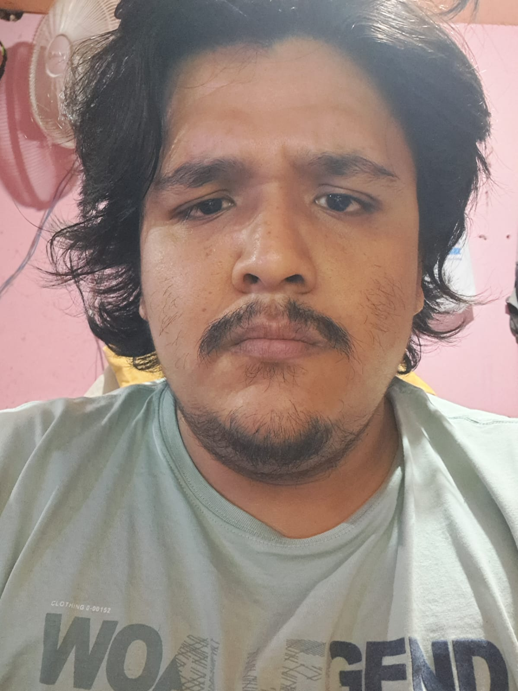
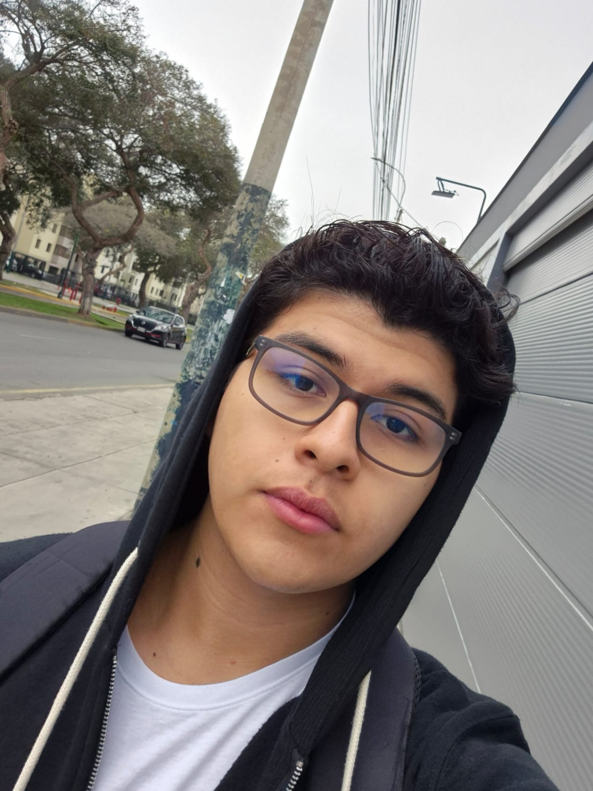
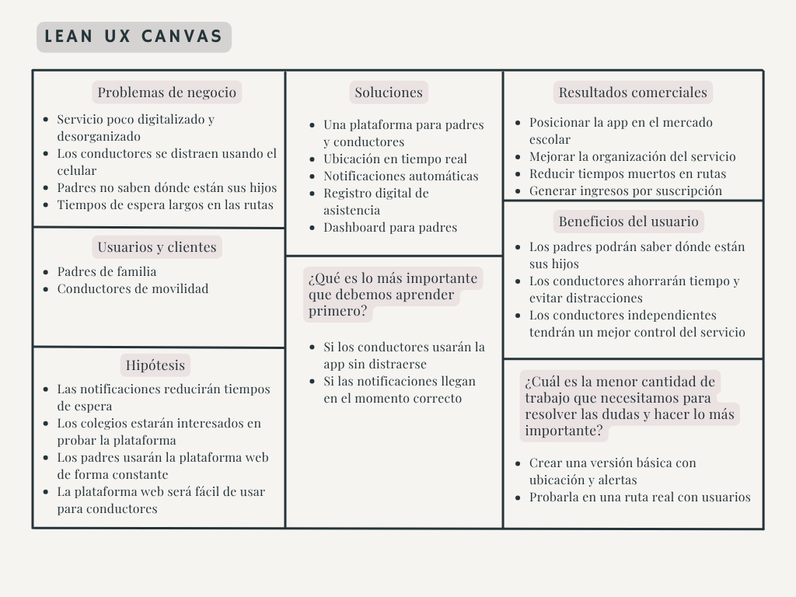

# **Chapter I: Introduction**
## **1.1. Startup Profile**
### **1.1.1. Startup Description**
In Peru, school transportation is a sector that, despite its great importance for families, still operates manually and lacks technological systems that allow real-time tracking. This causes many parents to feel daily uncertainty, as they want closer control and the certainty of knowing whether their children boarded the vehicle or arrived safely at their destination.

In response to this reality, **MoviSafe** emerges as a technology startup focused on revolutionizing safety and peace of mind in the school transportation environment. Our business model proposes replacing manual processes with digital tools through **KidsOnWay**. KidsOnWay brings together all the actors involved in school transportation on a single platform, offering real-time traceability and giving families greater peace of mind during daily commutes.

**Mission** 

To facilitate the logistics and monitoring of school transportation through a secure, real-time, and intuitive digital environment that prioritizes families’ peace of mind and drivers’ efficiency.

**Vision** 

To become the leading platform and safety standard in school transportation, recognized for providing full transparency in real-time student transportation.

**Startup Objectives**
  * Optimize school transportation management through digital tools that replace manual processes.
  * Design an intuitive and accessible application that facilitates interaction between parents and drivers.
  * Promote technological adoption in the school transportation sector by encouraging modern and efficient solutions.
  * Establish strategic partnerships with educational institutions and transportation services to expand service coverage.

**Startup Values**
  * **Safety:** It is our highest priority, where every feature is designed to protect students’ integrity and parents’ peace of mind.
  * **Transparency:** We share real and visible information about each trip, building trust among parents, drivers, and institutions.
  * **Innovation:** We constantly improve our platform through the use of modern technologies that enhance the experience of users and drivers.

### **1.1.2. Team Member Profiles**

<table width="100%">
  <tbody>
      <tr>
      <td width="30%" align="center" valign="middle">
        
         
        <i></i>
      </td>
      <td width="70%" valign="top" style="padding-left: 20px;">
        <h3>Ever Giusephi Carlos Lavado</h3>
        
<b>Student code:</b> u202224867

        
<b>Age:</b> 21 years old

        
<b>Major:</b> Software Engineering 

         
        
<b>About me:</b> My name is Giusephi Carlos. I am 21 years old and I am currently studying software engineering at the UPC. I am fascinated by how technology has evolved over the years and that is why I chose this career. In my free time, I enjoy playing video games and hope to improve my way of thinking before programming, as well as my programming skills.

        

      </td>
    </tr>
    <tr>
      <td width="30%" align="center" valign="middle">
        
         
        <i></i>
      </td>
      <td width="70%" valign="top" style="padding-left: 20px;">
        <h3>Alonso Enrique Higa Kohatsu</h3>
        
<b>Student code:</b> u202416276

        
<b>Age:</b> 19 years old

        
<b>Major:</b> Software Engineering

         
        
<b>About me:</b>

        
I am passionate about technology and learning new things. I have knowledge of C++ and some Python, and I am currently focused on learning web development with Spring Boot. I consider myself a curious person, constantly learning and strongly committed to achieving my professional and personal goals.

      </td>
    </tr>
    <tr>
      <td width="30%" align="center" valign="middle">
        
         
        <i></i>
      </td>
      <td width="70%" valign="top" style="padding-left: 20px;">
        <h3>Luis Alonso Huaco Oliva</h3>
        
<b>Student code: u202417743</b> 

        
<b>Age: 24</b> 

        
<b>Major: Software Engineering</b> 

         
        
<b>About me:</b>

        
I am passionate about learning and I enjoy learning new things. I have knowledge of HTML and programming logic, and I am currently taking Algorithmic Complexity, Web Applications, and Open Source courses. I consider myself a person who seeks to learn things properly in order to apply them in different ways and avoid limiting knowledge to only one topic.

      </td>
      <tr>
      <td width="30%" align="center" valign="middle">
        
         
        <i></i>
      </td>
      <td width="70%" valign="top" style="padding-left: 20px;">
        <h3>Tomás Alessandro Paredes Diaz</h3>
        
<b>Student code:</b> u202416552

        
<b>Age:</b> 19 years old

        
<b>Major:</b> Software Engineering 

         
        
<b>About me:</b> Student passionate about technology and creative design, with a strong interest in building mockups and landing pages. Focused on improving skills in UI/UX and web development, aiming to create engaging and user-friendly digital experiences.

        

      </td>
    </tr>
    <tr>
      <td width="30%" align="center" valign="middle">
        
         
        <i></i>
      </td>
      <td width="70%" valign="top" style="padding-left: 20px;">
        <h3>Jose Gabriel Rudas Chavarria</h3>
        
<b>Student code: U202410062</b> 

        
<b>Age: 19</b> 

        
<b>Major: Software Engineering</b> 

         
        
<b>About me: I am a student focused on developing technological solutions with real impact. I am interested in combining technical skills with teamwork to create efficient and user-centered systems.</b>

        

      </td>
    </tr>
  </tbody>
</table>

## **1.2. Solution Profile**
### **1.2.1 Background and Problem Statement**
School transportation in Peru has historically been characterized by a high level of informality and the absence of technological standards. Families entrust the transportation of their children to third parties based on recommendations from other parents, but they lack a dedicated platform that professionalizes the service and provides visibility during trips. Since there is no real-time tracking system, parents experience constant uncertainty, not knowing whether students boarded the vehicle safely or arrived at their destination.

In this context, the main problem we seek to address is the lack of digital formalization in school transportation and the absence of a centralized communication channel that guarantees parents’ peace of mind. This deficiency not only affects families emotionally, but also creates inefficiencies and risks for drivers, who are forced to manage communication in an improvised and manual way while operating the vehicle.

**5W and 2H Method**

* **What?** 
  
  The main problem is the lack of organization and information during the school transportation route. Currently, parents depend on communicating with drivers through calls or messages, which are dangerous distractions for the driver and insufficient for parents’ peace of mind. In addition, this is not always effective and may lead to confusion when the driver notifies what the parent is asking about, possibly due to human error.
* **Who?** 
  
  The most affected are parents, especially those with children in basic school education, who do not have certainty about their children’s transportation, and school transportation drivers, who must perform several tasks at the same time, which can lead to involuntary mistakes.
* **When?** 
  
  This situation occurs daily on school days during peak hours, both during the morning pickup between 6:20 a.m. and 7:10 a.m. and during the afternoon return between 2:00 p.m. and 4:00 p.m.
* **Where?** 
  
  Mainly in districts of Metropolitan Lima with high demand for school transportation and constant traffic.
* **Why?** 
  
  Because school transportation services continue to operate traditionally; in other words, digital tools that help organize routes or inform parents in real time have not yet been sufficiently incorporated.
* **How?** 
  
  The problem is reflected in unnecessary waiting times, congestion at pickup points, and constant calls to the driver asking for their location. To solve this, we propose **KidsOnWay**, an application that allows users to view the school vehicle’s location and receive notifications about the trip status.
* **How Much?** 
  
  This generates greater time and fuel costs for drivers, while for parents it involves constant concern and time lost waiting without clear information.
### **1.2.2 Lean UX Process**
#### **1.2.2.1. Lean UX Problem Statements**
School transportation services in Peru, especially those managed by independent drivers or small companies, still make limited use of technology to control and track daily routes. This directly affects parents’ peace of mind, since they often do not know with certainty where their children are, and it also complicates the work of drivers.

Currently, communication is based on calls or messages, and attendance control is usually done manually, making it prone to possible errors. This can create confusion, delays, and poor coordination when an unexpected event occurs, such as when a parent forgets to notify that their child will not attend or when a student takes longer than expected.

In addition, there are factors that make it difficult to improve this service, such as traffic in cities like Lima, where a large amount of time is lost during peak hours, making it difficult to meet exact schedules. Another factor is that the driver should not be using a cellphone while driving, as this represents a risk; however, drivers are currently forced to do so when parents ask about their children through messages or calls.

In response to this situation, we propose KidsOnWay, a solution that seeks to facilitate school transportation tracking through an easy-to-use application. It will allow parents to know the vehicle’s location and receive notifications about the trip, in addition to digitally recording student attendance without requiring the driver to constantly interact with the system.

In this way, we aim to improve service organization and provide greater peace of mind for both parents and drivers.

How can we help parents and school transportation drivers have better control of the route by providing clear and safe information without creating distractions or making the system difficult to use?
#### **1.2.2.2. Lean UX Assumptions**

**Business Outcomes**
* Establish MoviSafe as the standard technological tool for school transportation in Metropolitan Lima.
* Increase the retention of affiliated drivers by demonstrating savings in time and fuel.
* Generate recurring revenue through a SaaS model aimed at transportation companies and independent drivers.
* Promote the formalization and professionalization of the school transportation sector.

**User Benefits**
* **Parents** 
  
  Eliminate uncertainty by knowing the exact location and transportation status of their child in real time.
* **Drivers** 
  
  Save time at each stop and reduce fuel consumption by avoiding unnecessary waiting and reducing manual tasks such as answering calls or messages.

**Assumptions**
* We believe that parents have an urgent need for visibility and control over school transportation.
* These needs can be solved with a centralized platform that automates route notifications without distracting the driver.
* Our initial customers are independent drivers and parents from private schools who seek to modernize their service.
* What parents want from our service is peace of mind, while what drivers expect is efficiency and a reduction in tasks.
* We will acquire our first customers through partnerships with Parents’ Associations and word-of-mouth recommendations among drivers in the same area.
* We will make money through monthly subscription plans paid by independent drivers or transportation companies.
* Our current main competitors are informal methods such as WhatsApp groups and some generic vehicle GPS tracking platforms.
* Our greatest risk is resistance to change from older drivers or the loss of GPS/Internet signal in certain urban areas.

**Assumptions Worksheet**
* **Who is the user?** 
  
  Mainly parents concerned about their children’s safety and school transportation drivers who seek to optimize their time and provide better service.
* **Where does our product fit into their work or life?** 
  
  On school days. For parents, it fits while they are at home or at work waiting for a notification from the driver about their child. For drivers, it fits inside their vehicle throughout the entire trip, from the moment students board until they are dropped off at their homes.
* **What problems does our product have and how can they be solved?** 
  
  A serious problem could be driver distraction when using the app. This will be solved by automating proximity alerts so that the driver does not have to touch the screen or write manually. Another problem is the dependence on mobile data; this will be solved by optimizing the app to consume minimal bandwidth and support basic background operation.
* **When and how is our product used?** 
  
  It is used intensively during school transportation windows, both in the morning and afternoon. The driver uses it actively on a phone holder attached to the car dashboard, while parents use it through mobile notifications.
* **What features are important?** 
  
  High GPS accuracy, fast and automatic notifications, low battery consumption on the driver’s device, and a clear record of who boarded and left the vehicle at all times.
* **How should our product look and behave?** 
  
  For parents, it should look reliable, clean, and convey safety. For drivers, it should be highly practical, include dark mode as an option, have large typography, and behave smoothly without requiring more than one tap per action, so that drivers do not take too long to learn or use the application.
#### **1.2.2.3. Lean UX Hypothesis Statements**
* We believe that implementing automatic proximity alerts will help drivers and parents have better control of the route, reducing waiting times and the need for constant communication. We will know it works if stop time is reduced to less than 2 minutes and calls or messages decrease by 80%.

* We believe that developing a web dashboard for parents will allow them to have better control of the school vehicle and its routes. We will know it works if at least one independent driver agrees to test the platform during the first quarter.

* We believe that having an automatic digital attendance record will give parents greater peace of mind, as they will know whether their children boarded or arrived correctly. We will know it works if user satisfaction and daily use of the application exceed 80% during the first month.

* We believe that designing a simple and easy-to-use interface for drivers will reduce distractions and facilitate its use during work. We will know it works if 90% of drivers consider the application intuitive and state that it does not affect their attention while driving.
#### **1.2.2.4. Lean UX Canvas**

The KidWay Lean UX Canvas clearly identifies the main problems in the school transportation service, highlighting the lack of digitalization as the central issue. This results in disorganized routes, unnecessary waiting times, and risky situations, since drivers must use their cellphones while driving to communicate with parents. In response to this situation, a solution is proposed based on a web platform aimed at parents and drivers, along with a dashboard for parents that allows them to know the real-time location and receive automatic notifications without requiring constant interaction.

Based on this proposal, the goal is to improve service organization, reduce distractions behind the wheel, and provide greater peace of mind to families. In addition, a long-term subscription-based revenue model is considered viable. The plan is to develop an MVP focused on key features such as real-time location and proximity alerts, which will be tested on a real route to validate its usefulness and verify whether it truly improves the experience for both drivers and parents.

## **1.3. Target Segments**
### Segment #1 Independent Drivers
* **Demographic aspects**
  * **Gender:** Male and female
  * **Ages:** Between 20 and 60 years old
  * **Socioeconomic level:** Classes B and C
* **Geographic aspects**
  * **Nationality:** Peruvian or Venezuelan
  * **Geographic area:** Urban, with routes covering 2 to 3 nearby districts
  * **Department:** Metropolitan Lima
* **Psychographic aspects**
  * Their business depends entirely on parents’ trust and word-of-mouth recommendations.
  * They feel frustrated by the loss of time and fuel when waiting for students who take too long to leave or are absent without prior notice.
  * They prefer direct and intuitive technological tools.
* **Supporting statistical information**
  * Lima is considered the city with the greatest traffic congestion in the Americas and is among the top 10 worldwide. This causes an average driver to lose approximately 254 hours per year in traffic (El Comercio, 2023). In this context, remaining stopped for long periods with the engine running considerably increases fuel consumption, reducing daily profitability and making the work of school transportation drivers less efficient.

### Segment #2 Companies Dedicated to School Transportation
* **Demographic aspects**
  * **Profile:** Owners or administrators of small fleets
  * **Ages:** Between 30 and 60 years old
  * **Socioeconomic level:** Classes A and B
* **Geographic aspects**
  * **Nationality:** Peruvian or Venezuelan
  * **Geographic area:** Urban, operating different routes for several schools
  * **Department:** Metropolitan Lima
* **Psychographic aspects**
  * Their main objective is operational efficiency and profitability.
  * They seek to formalize and standardize their service in order to obtain contracts with private educational institutions.
  * They need administrative dashboards to monitor their drivers in real time and justify the quality of their service.
* **Supporting statistical information**
  * For small and medium-sized companies in the transportation sector, not having digital tools makes their work slower and more expensive. Incorporating technological solutions can help them better organize their operations and reduce unnecessary expenses (Ministry of Transport and Communications, n.d.). In this way, school transportation companies need to rely on tools that allow them to monitor their units, improve their times, and become more competitive in the market.
