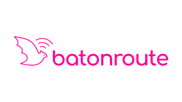

# **Chapter II: Requirements Elicitation & Analysis**
## **2.1. Competitors**
**OnTrack School** 

OnTrack School es una plataforma desarrollada en Latinoamérica que ayuda a gestionar el transporte escolar de forma más segura y organizada. Permite a los padres ver la ubicación de la movilidad en tiempo real, mientras que los colegios y empresas pueden llevar un control de la asistencia de los estudiantes. Esto la convierte en una herramienta útil para mejorar la comunicación y el seguimiento del servicio (OnTrack, s. f.).

**titiGO** 

titiGO es una plataforma peruana diseñada para el seguimiento y control del transporte escolar. Su propuesta permite que las familias reciban notificaciones en tiempo real de los estados de viaje de cada estudiante, registrando cuando suben a la movilidad, cuando llegan al colegio o regresan a casa. Además, utilizan un sistema de control de salida mediante un código QR único, buscando brindar seguridad total en la comunicación y confianza a los padres de familia (titiGO, 2026).

**BatOnRoute**

BatOnRoute es un software de origen europeo que ayuda a gestionar rutas de transporte escolar. Permite a colegios y empresas conocer la ubicación de los vehículos en tiempo real, llevar un control de la asistencia y enviar notificaciones a los padres cuando la movilidad está cerca. Su enfoque está en mejorar la organización del servicio y brindar mayor seguridad a todos los involucrados (BatOnRoute, s.f.).
### **2.1.1. Competitive Analysis**
**Competitive Analysis Landscape**

| Nombre | KidsOnWay | titiGO | BatOnRoute | OnTrack School |
| :--- | :---: | :---: | :---: | :---: |
| **Logo** |  |  |  |  |
| **Perfil** | | | | |
| **Overview** | Software que automatiza la comunicación entre conductores y padres mediante alertas de proximidad. | Aplicación peruana que se enfoca en el control del transporte escolar mediante estados de viaje y validación por QR | Software orientado a empresas que gestiona flotas escolares con seguimiento en tiempo real y alertas. | Sistema latinoamericano que permite monitorear rutas escolares y llevar control de asistencia |
| **Ventaja competitiva** | Envía avisos automáticos sin que el conductor tenga que usar el celular, evitando distracciones y reduciendo tiempos de espera. | Controla la salida de los estudiantes mediante códigos QR para mayor seguridad | Está pensado para manejar muchas unidades y rutas complejas | Ofrece seguimiento constante de las rutas con un enfoque adaptado a la región. |
| **Perfil de Marketing** | | | | |
| **Mercado objetivo** | Colegios, conductores independientes y pequeñas empresas de transporte en Lima. | Colegios y padres interesados en controlar la asistencia de los alumnos. | Directivos de colegios privados con mayor capacidad económica | Colegios, empresas de transporte y familias |
| **Estrategias de marketing** | Difusión mediante recomendaciones y alianzas con colegios y asociaciones de padres. | Trabajo directo con colegios para que adopten la app como parte de su sistema | Ventas directas a instituciones mostrando beneficios del servicio. | Enfoque en seguridad y organización del transporte para atraer usuarios. |
| **Perfil de Producto** | | | | |
| **Productos & Servicios** | App para padres y conductores, ubicación en tiempo real y panel web con control de asistencia | App de seguimiento con registro digital y validación por QR. | Plataforma web, apps y herramientas para organizar rutas | Apps móviles, panel administrativo y reportes de recorridos. |
| **Precios & Costos** | Planes según la cantidad de alumnos y de la cantidad de vehículos. | Planes de suscripción según cantidad de alumnos | Planes más costosos con contratos institucionales | Suscripción según funciones del sistema. |
| **Canales de distribución** | Aplicación móvil y plataforma web. | Aplicación móvil y plataforma web. | Aplicación móvil y plataforma web. | Aplicación móvil y plataforma web. |

### **2.1.2. Strategies and Tactics Against Competitors**
En una ciudad como Lima Metropolitana en donde el tráfico y la desorganización del transporte son parte del día a día, en KidsOnWay buscamos diferenciarnos ofreciendo una solución más simple y útil para padres y conductores a diferencia otras aplicaciones del rubro. No solo nos enfocamos en la ubicación en tiempo real, sino también en mejorar la seguridad y la tranquilidad durante todo el recorrido.

**Fortalezas**

* **Automatización de avisos**
  
   A diferencia de métodos actuales como llamadas o mensajes en WhatsApp, la aplicación envía notificaciones automáticas cuando la movilidad está cerca o llega al destino. Esto permite que el conductor no tenga que usar el celular mientras maneja y pueda concentrarse en la ruta.
* **Información clara y verídica para los padres** 
  
  Los padres pueden ver el recorrido sin necesidad de estar llamando o escribiendo. Esto les da mayor tranquilidad y confianza durante el traslado de sus hijos. Además, viendo información en tiempo real.

**Debilidades**

* **Baja presencia en el mercado**
  
   Al ser una startup nueva, todavía no contamos con una marca conocida. Para poder generar confianza, se realizarán pruebas piloto con algunos usuarios y se compartirán sus experiencias, para demostrar que nuestra solución es sólida y vale la pena apostar por ella.
* **Dependencia del internet** 
  
  En algunas zonas de Lima la señal puede fallar, lo que afecta la actualización en tiempo real. Para reducir este problema, la app estará optimizada para consumir pocos datos y guardar información cuando no haya señal. 

**Oportunidades**

* **Problemas de tráfico e inseguridad**
  
   El tráfico en Lima hace que los tiempos sean impredecibles. La app puede ayudar a los padres a saber cuándo llegará la movilidad y reducir el tiempo de espera en la calle.
* **Mayor uso de tecnología** 
  
  Cada vez más servicios se están digitalizando, esto permite que soluciones como KidsOnWay sean mejor aceptadas por conductores y empresas de transporte.

**Amenazas**

* **Competencia de otras plataformas**
  
   Existen aplicaciones más desarrolladas en otros países. Ante esta situación, KidsOnWay se enfocará en adaptarse mejor a la realidad local, con precios accesibles y soluciones más cercanas al contexto local.
* **Resistencia al cambio** 
  
  Algunos conductores prefieren seguir usando métodos tradicionales, es por esto que la aplicación será simple de usar y se brindará una explicación clara de sus beneficios.
## **2.2. Interviews**
### **2.2.1. Interview Design**
Con el objetivo de obtener información cualitativa que nos ayude a validar nuestras ideas y entender mejor a los usuarios, se diseñaron tres entrevistas para cada grupo objetivo de la plataforma KidsOnWay.Las preguntas fueron planteadas buscando obtener respuestas abiertas, para poder evitar en lo posible las respuestas de sí o nó. Además, se organizaron en bloques para conocer el perfil de los usuarios, sus hábitos tecnológicos, los problemas que enfrentan y lo que esperan de un servicio de transporte escolar.

**Segmento #1: Conductores Independientes**

Se presentan, le pides su consentimiento para entrevistarlo y empiezas:

1. ¿Podrías indicarme tu edad, distrito de residencia y cuántos años llevas trabajando como conductor de movilidad escolar?
2. ¿Qué marca y modelo de vehículo manejas actualmente? ¿Es de tu propiedad o alquilado?
3. En tu día a día, ¿qué aplicaciones utilizas más en tu celular? (Algunos ejemplos como Waze, WhatsApp, redes sociales).
4. ¿Cómo organizas el orden de tu ruta cada mañana? ¿Utilizas alguna herramienta digital o confías en tu memoria?
5. Describe tu experiencia manejando en las horas pico en Lima, ¿Cómo afecta el tráfico a tu estado de ánimo y a tu puntualidad?
6. ¿Qué es lo que más te molesta cuando llegas a recoger a un alumno y este no está listo en la puerta?
7. ¿Cuántas veces al día recibes llamadas o mensajes de padres preguntando por tu ubicación mientras estás conduciendo?
8. ¿Alguna vez has tenido una distracción peligrosa por intentar contestar el celular para avisar que ya estabas cerca de un domicilio?
9. Si una aplicación avisara automáticamente a los padres cuando estás a 5 minutos de su casa sin que tú hagas nada, ¿cómo cambiaría tu jornada?
10. ¿Qué tan importante es para ti que la aplicación sea extremadamente simple de usar, por ejemplo con botones grandes y que no te distraiga del volante?
11. ¿Qué beneficio económico o de tiempo esperarías obtener al usar una plataforma como la nuestra?

**Segmento #2: Empresas dedicadas a movilidad escolar**

Se presentan, le pides su consentimiento para entrevistarlo y empiezas:

1. ¿Cuál es el nombre de la empresa, cuántas unidades conforman su flota actual y en qué distritos de Lima operan principalmente?
2. ¿Cuál es su cargo dentro de la empresa y cuáles son sus principales retos logísticos diarios?
3. ¿Qué métodos utilizan actualmente para supervisar que sus conductores estén cumpliendo con las rutas y horarios establecidos?
4. ¿Cómo manejan el registro de asistencia de los alumnos? (Algunos ejemplos como ¿Es manual, en papel o tienen algún sistema digital?)
5. ¿Cuál es el costo operativo más alto que enfrentan, como combustible, mantenimiento o multas y cómo intentan reducirlo?
6. ¿Qué tipo de reclamos reciben con más frecuencia por parte de los padres de familia?
7. ¿Qué tan valioso sería para su empresa contar con un Dashboard centralizado donde puedan ver todas sus unidades en un solo mapa en tiempo real?
8. ¿Cómo cree que impactaría en la confianza de los padres el ofrecerles una aplicación para monitorear el bus de sus hijos?
9. Para adoptar una solución como KidsOnWay, ¿qué tipo de reportes o datos estadísticos necesitarían que la plataforma les entregue mensualmente?

**Segmento #3: Colegios con movilidad propia**

Se presentan, le pides su consentimiento para entrevistarlo y empiezas:

1. ¿Qué cargo ocupa en la institución y cuál es la visión del colegio respecto a la seguridad y bienestar de los alumnos durante el traslado?
2. ¿A cuántos alumnos moviliza el colegio diariamente con su propia flota?
3. ¿Cómo garantizan hoy que un alumno ha subido correctamente al bus y ha sido entregado a la persona autorizada en su domicilio?
4. Ante una emergencia en la ruta, ya sea un accidente, falla mecánica o retraso severo, ¿cuál es el protocolo de comunicación que sigue el colegio con los padres?
5. ¿Qué importancia tiene para el colegio evitar que los padres llamen directamente a los conductores de la institución mientras estos están en ruta?
6. ¿Considera que contar con un sistema de monitoreo en tiempo real exclusivo del colegio mejoraría el prestigio y la propuesta de valor institucional frente a otros colegios?
7. ¿Qué nivel de privacidad y protección de datos esperaría el colegio de una plataforma que maneja la ubicación de sus estudiantes?
8. ¿Qué funcionalidades específicas (Algunos ejemplos como, registro de asistencia con fotos o código, alertas de velocidad) harían que el colegio decida invertir en una plataforma como KidsOnWay en lugar de usar GPS tradicionales?

### **2.2.2. Interview Recording**
### **2.2.3. Interview Analysis**
## **2.3. Needfinding**
### **2.3.1. User Personas**
### **2.3.2. User Task Matrix**
### **2.3.3. User Journey Mapping**
### **2.3.4. Empathy Mapping**
## **2.4. Big Picture Event Storming**
## **2.5. Ubiquitous Language**