# **Chapter II: Requirements Elicitation & Analysis**
## **2.1. Competitors**
**OnTrack School** 

OnTrack School es una plataforma desarrollada en Latinoamérica que ayuda a gestionar el transporte escolar de forma más segura y organizada. Permite a los padres ver la ubicación de la movilidad en tiempo real, mientras que los colegios y empresas pueden llevar un control de la asistencia de los estudiantes. Esto la convierte en una herramienta útil para mejorar la comunicación y el seguimiento del servicio (OnTrack, s. f.).

**titiGO** 

titiGO es una plataforma peruana diseñada para el seguimiento y control del transporte escolar. Su propuesta permite que las familias reciban notificaciones en tiempo real de los estados de viaje de cada estudiante, registrando cuando suben a la movilidad, cuando llegan al colegio o regresan a casa. Además, utilizan un sistema de control de salida mediante un código QR único, buscando brindar seguridad total en la comunicación y confianza a los padres de familia (titiGO, 2026).

**BatOnRoute**

BatOnRoute es un software de origen europeo que ayuda a gestionar rutas de transporte escolar. Permite a colegios y empresas conocer la ubicación de los vehículos en tiempo real, llevar un control de la asistencia y enviar notificaciones a los padres cuando la movilidad está cerca. Su enfoque está en mejorar la organización del servicio y brindar mayor seguridad a todos los involucrados (BatOnRoute, s.f.).
### **2.1.1. Competitive Analysis**
**Competitive Analysis Landscape**

<table width="100%">
  <thead>
    <tr>
      <th align="left" width="20%">
        ¿Por qué llevar a cabo este análisis?
      </th>
      <th colspan="4" align="left">
        Identificar las limitaciones en el uso y nivel de automatización de las plataformas actuales de transporte escolar, con el fin de definir una propuesta que facilite el trabajo del conductor y reduzca las distracciones durante la ruta.
      </th>
    </tr>
    <tr>
      <th align="left"></th>
      <th align="center">
        KidsOnWay 
        
      </th>
      <th align="center">
        titiGO 
        
      </th>
      <th align="center">
        BatOnRoute 
        
      </th>
      <th align="center">
        OnTrack School 
        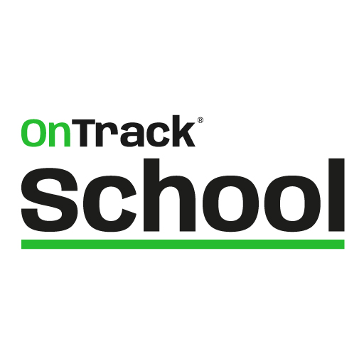
      </th>
    </tr>
  </thead>
  <tbody>
    <tr>
      <th colspan="5" align="left">Perfil</th>
    </tr>
    <tr>
      <td><b>Overview</b></td>
      <td>Software que automatiza la comunicación entre conductores y padres mediante alertas de proximidad.</td>
      <td>Aplicación peruana que se enfoca en el control del transporte escolar mediante estados de viaje y validación por QR.</td>
      <td>Software orientado a empresas que gestiona flotas escolares con seguimiento en tiempo real y alertas.</td>
      <td>Sistema latinoamericano que permite monitorear rutas escolares y llevar control de asistencia.</td>
    </tr>
    <tr>
      <td><b>Ventaja competitiva (¿Qué valor ofrece a los clientes?)</b></td>
      <td>Envía avisos automáticos sin que el conductor tenga que usar el celular, evitando distracciones y reduciendo tiempos de espera.</td>
      <td>Controla la salida de los estudiantes mediante códigos QR para mayor seguridad.</td>
      <td>Está pensado para manejar muchas unidades y rutas complejas.</td>
      <td>Ofrece seguimiento constante de las rutas con un enfoque adaptado a la región.</td>
    </tr>
    <tr>
      <th colspan="5" align="left">Perfil de Marketing</th>
    </tr>
    <tr>
      <td><b>Mercado objetivo</b></td>
      <td>Conductores independientes y pequeñas empresas de transporte en Lima.</td>
      <td>Colegios y padres interesados en controlar la asistencia de los alumnos.</td>
      <td>Directivos de colegios privados con mayor capacidad económica.</td>
      <td>Colegios, empresas de transporte y familias.</td>
    </tr>
    <tr>
      <td><b>Estrategias de marketing</b></td>
      <td>Difusión mediante recomendaciones y asociaciones de padres (APAFA).</td>
      <td>Trabajo directo con colegios para que adopten la app como parte de su sistema.</td>
      <td>Ventas directas a instituciones mostrando beneficios del servicio.</td>
      <td>Enfoque en seguridad y organización del transporte para atraer usuarios.</td>
    </tr>
    <tr>
      <th colspan="5" align="left">Perfil de Producto</th>
    </tr>
    <tr>
      <td><b>Productos & Servicios</b></td>
      <td>App para padres y conductores, ubicación en tiempo real y panel web con control de asistencia.</td>
      <td>App de seguimiento con registro digital y validación por QR.</td>
      <td>Plataforma web, apps y herramientas para organizar rutas.</td>
      <td>Apps móviles, panel administrativo y reportes de recorridos.</td>
    </tr>
    <tr>
      <td><b>Precios & Costos</b></td>
      <td>Planes según la cantidad de alumnos y de la cantidad de vehículos.</td>
      <td>Planes de suscripción según cantidad de alumnos.</td>
      <td>Planes más costosos con contratos institucionales.</td>
      <td>Suscripción según funciones del sistema.</td>
    </tr>
    <tr>
      <td><b>Canales de distribución (Web y/o Móvil)</b></td>
      <td>Aplicación móvil y plataforma web.</td>
      <td>Aplicación móvil y plataforma web.</td>
      <td>Aplicación móvil y plataforma web.</td>
      <td>Aplicación móvil y plataforma web.</td>
    </tr>
    <tr>
      <th colspan="5" align="left">SWOT Análisis</th>
    </tr>
    <tr>
      <td><b>Fortalezas</b></td>
      <td>Automatización de alertas de proximidad con mínima interacción del conductor</td>
      <td>Fuerte enfoque en seguridad institucional mediante códigos QR físicos</td>
      <td>Software robusto para gestionar grandes flotas escolares</td>
      <td>Amplio alcance regional y monitoreo consolidado</td>
    </tr>
    <tr>
      <td><b>Debilidades</b></td>
      <td>Marca nueva sin validación institucional a gran escala</td>
      <td>Requiere interacción manual constante (escaneo QR)</td>
      <td>Complejo y costoso para conductores independientes</td>
      <td>Interfaz genérica poco adaptada a contextos locales específicos</td>
    </tr>
    <tr>
      <td><b>Oportunidades</b></td>
      <td>Alta necesidad de reducir distracciones en conductores urbanos</td>
      <td>Creciente interés en digitalización de seguridad escolar</td>
      <td>Expansión en colegios privados de alto nivel</td>
      <td>Crecimiento del mercado de transporte escolar en LATAM</td>
    </tr>
    <tr>
      <td><b>Amenazas</b></td>
      <td>Resistencia al cambio tecnológico en conductores mayores</td>
      <td>Problemas con lectura de QR en condiciones adversas</td>
      <td>Competidores más baratos en el segmento PYME</td>
      <td>Dificultad para adaptar soluciones globales a nichos locales</td>
    </tr>
  </tbody>
</table>

### **2.1.2. Strategies and Tactics Against Competitors**
En una ciudad como Lima Metropolitana en donde el tráfico y la desorganización del transporte son parte del día a día, en KidsOnWay buscamos diferenciarnos ofreciendo una solución más simple y útil para padres y conductores a diferencia otras aplicaciones del rubro. No solo nos enfocamos en la ubicación en tiempo real, sino también en mejorar la seguridad y la tranquilidad durante todo el recorrido.

**Fortalezas**

* **Automatización de avisos**
   
   A diferencia de métodos actuales como llamadas o mensajes en WhatsApp, la aplicación envía notificaciones automáticas cuando la movilidad está cerca o llega al destino. Esto permite que el conductor no tenga que usar el celular mientras maneja y pueda concentrarse en la ruta.
* **Información clara y verídica para los padres** Los padres pueden ver el recorrido sin necesidad de estar llamando o escribiendo. Esto les da mayor tranquilidad y confianza durante el traslado de sus hijos. Además, viendo información en tiempo real.

**Debilidades**

* **Baja presencia en el mercado**
   
   Al ser una startup nueva, todavía no contamos con una marca conocida. Para poder generar confianza, se realizarán pruebas piloto con algunos usuarios y se compartirán sus experiencias, para demostrar que nuestra solución es sólida y vale la pena apostar por ella.
* **Dependencia del internet** En algunas zonas de Lima la señal puede fallar, lo que afecta la actualización en tiempo real. Para reducir este problema, la app estará optimizada para consumir pocos datos y guardar información cuando no haya señal. 

**Oportunidades**

* **Problemas de tráfico e inseguridad**
   
   El tráfico en Lima hace que los tiempos sean impredecibles. La app puede ayudar a los padres a saber cuándo llegará la movilidad y reducir el tiempo de espera en la calle.
* **Mayor uso de tecnología** Cada vez más servicios se están digitalizando, esto permite que soluciones como KidsOnWay sean mejor aceptadas por conductores y empresas de transporte.

**Amenazas**

* **Competencia de otras plataformas**
   
   Existen aplicaciones más desarrolladas en otros países. Ante esta situación, KidsOnWay se enfocará en adaptarse mejor a la realidad local, con precios accesibles y soluciones más cercanas al contexto local.
* **Resistencia al cambio** Algunos conductores prefieren seguir usando métodos tradicionales, es por esto que la aplicación será simple de usar y se brindará una explicación clara de sus beneficios.

## **2.2. Interviews**
### **2.2.1. Interview Design**
Con el objetivo de obtener información cualitativa que nos ayude a validar nuestras ideas y entender mejor a los usuarios, se diseñaron tres entrevistas para cada grupo objetivo de la plataforma KidsOnWay. Las preguntas fueron planteadas buscando obtener respuestas abiertas, para poder evitar en lo posible las respuestas de sí o no. Además, se organizaron en bloques para conocer el perfil de los usuarios, sus hábitos tecnológicos, los problemas que enfrentan y lo que esperan de un servicio de transporte escolar.

**Segmento #1: Conductores Independientes**

Se presentan, le pides su consentimiento para entrevistarlo y empiezas:

1. ¿Podrías indicarme tu edad, distrito de residencia y cuántos años llevas trabajando como conductor de movilidad escolar?
2. ¿Qué marca y modelo de vehículo manejas actualmente? ¿Es de tu propiedad o alquilado?
3. En tu día a día, ¿qué aplicaciones utilizas más en tu celular? (Algunos ejemplos como Waze, WhatsApp, redes sociales).
4. ¿Cómo organizas el orden de tu ruta cada mañana? ¿Utilizas alguna herramienta digital o confías en tu memoria?
5. Describe tu experiencia manejando en las horas pico en Lima, ¿Cómo afecta el tráfico a tu estado de ánimo y a tu puntualidad?
6. ¿Qué es lo que más te molesta cuando llegas a recoger a un alumno y este no está listo en la puerta?
7. ¿Cuántas veces al día recibes llamadas o mensajes de padres preguntando por tu ubicación mientras estás conduciendo?
8. ¿Alguna vez has tenido una distracción peligrosa por intentar contestar el celular para avisar que ya estabas cerca de un domicilio?
9. Si una aplicación avisara automáticamente a los padres cuando estás a 5 minutos de su casa sin que tú hagas nada, ¿cómo cambiaría tu jornada?
10. ¿Qué tan importante es para ti que la aplicación sea extremadamente simple de usar, por ejemplo con botones grandes y que no te distraiga del volante?
11. ¿Qué beneficio económico o de tiempo esperarías obtener al usar una plataforma como la nuestra?

**Segmento #2: Empresas dedicadas a movilidad escolar**

Se presentan, le pides su consentimiento para entrevistarlo y empiezas:

1. ¿Cuál es el nombre de la empresa, cuántas unidades conforman su flota actual y en qué distritos de Lima operan principalmente?
2. ¿Cuál es su cargo dentro de la empresa y cuáles son sus principales retos logísticos diarios?
3. ¿Qué métodos utilizan actualmente para supervisar que sus conductores estén cumpliendo con las rutas y horarios establecidos?
4. ¿Cómo manejan el registro de asistencia de los alumnos? (Algunos ejemplos como ¿Es manual, en papel o tienen algún sistema digital?)
5. ¿Cuál es el costo operativo más alto que enfrentan, como combustible, mantenimiento o multas y cómo intentan reducirlo?
6. ¿Qué tipo de reclamos reciben con más frecuencia por parte de los padres de familia?
7. ¿Qué tan valioso sería para su empresa contar con un Dashboard centralizado donde puedan ver todas sus unidades en un solo mapa en tiempo real?
8. ¿Cómo cree que impactaría en la confianza de los padres el ofrecerles una aplicación para monitorear el bus de sus hijos?
9. Para adoptar una solución como KidsOnWay, ¿qué tipo de reportes o datos estadísticos necesitarían que la plataforma les entregue mensualmente?

### **2.2.2. Interview Recording**

**Segmento 1: Conductores Independientes**

<table width="100%">
  <thead>
    <tr>
      <th colspan="2" align="center"><h2>Entrevista #1</h2></th>
    </tr>
  </thead>
  <tbody>
    <tr>
      <th colspan="2" align="left">Datos del entrevistado</th>
    </tr>
    <tr>
      <td width="30%"><b>Nombre completo</b></td>
      <td>Carlos Marcelo Mansilla Rivero</td>
    </tr>
    <tr>
      <td><b>Edad</b></td>
      <td>24 años</td>
    </tr>
    <tr>
      <td><b>Ocupación</b></td>
      <td>Conductor de movilidad escolar</td>
    </tr>
    <tr>
      <td><b>Distrito de residencia</b></td>
      <td>Surquillo</td>
    </tr>
    <tr>
      <th colspan="2" align="left">Datos del video</th>
    </tr>
    <tr>
      <td><b>Link</b></td>
      <td><a href="">link</a></td>
    </tr>
    <tr>
      <td><b>Duración</b></td>
      <td>5:36</td>
    </tr>
    <tr>
      <td><b>Timing de inicio</b></td>
      <td>0:00</td>
    </tr>
    <tr>
      <th colspan="2" align="center">Screenshot</th>
    </tr>
    <tr>
      <td colspan="2" align="center">
        
      </td>
    </tr>
  </tbody>
</table>

**Resumen de la entrevista**

Carlos es un conductor de movilidad escolar con poca experiencia en el rubro, por lo que aún depende de herramientas como Waze o Google Maps para organizar sus rutas y evitar errores. En su día a día se basa en recoger a los estudiantes, mantener la puntualidad y coordinar constantemente con los padres mediante WhatsApp. Sin embargo, enfrenta varios problemas como la impuntualidad de algunos alumnos, que afecta toda su ruta y el tráfico en Lima que es bastante denso, que incrementa su estrés y dificulta cumplir con los horarios. Además, le preocupa su imagen frente a los padres, ya que al ser nuevo siente mayor presión por demostrar responsabilidad y generar confianza.

Otro punto crítico es la comunicación con los padres, ya que recibe constantemente mensajes y llamadas preguntando por su ubicación, lo que lo obliga a responder mientras conduce, generando distracciones peligrosas. Ante esta situación, valora mucho una solución que automatice los avisos de proximidad, que le podrían ayudar a enfocarse en manejar y reducir el estrés. También, destaca que la herramienta debe ser muy simple de usar, con mínima interacción, debido a que esta al volante. Finalmente, espera que una solución así le ayude a mejorar su reputación, optimizar su tiempo y reducir costos como el consumo de combustible por esperas innecesarias.

<table width="100%">
  <thead>
    <tr>
      <th colspan="2" align="center"><h2>Entrevista #2</h2></th>
    </tr>
  </thead>
  <tbody>
    <tr>
      <th colspan="2" align="left">Datos del entrevistado</th>
    </tr>
    <tr>
      <td width="30%"><b>Nombre completo</b></td>
      <td>Mateo Nicolás de Mendiburu Aguilar</td>
    </tr>
    <tr>
      <td><b>Edad</b></td>
      <td>20 años</td>
    </tr>
    <tr>
      <td><b>Ocupación</b></td>
      <td>Conductor de movilidad escolar</td>
    </tr>
    <tr>
      <td><b>Distrito de residencia</b></td>
      <td>Santiago de Surco</td>
    </tr>
    <tr>
      <th colspan="2" align="left">Datos del video</th>
    </tr>
    <tr>
      <td><b>Link</b></td>
      <td><a href="(link)" target="_blank">(link)</a></td>
    </tr>
    <tr>
      <td><b>Duración</b></td>
      <td>8:47</td>
    </tr>
    <tr>
      <td><b>Timing de inicio</b></td>
      <td>5:37</td>
    </tr>
    <tr>
      <th colspan="2" align="center">Screenshot</th>
    </tr>
    <tr>
      <td colspan="2" align="center">
        
      </td>
    </tr>
  </tbody>
</table>

**Resumen de la entrevista**

Mateo es un conductor de movilidad escolar con aproximadamente dos años de experiencia, que opera principalmente en distritos como Surco. En su día a día combina el uso de herramientas digitales como Google Maps con su propio conocimiento de rutas, utilizando también un calendario para organizar sus recorridos. Esta mezcla entre apoyo tecnológico y experiencia le permite optimizar su trabajo, aunque todavía depende de las condiciones del entorno, especialmente del tráfico en horas punta, que representa uno de sus mayores desafíos y afecta directamente su puntualidad y nivel de estrés.

Durante sus recorridos, uno de los principales problemas que enfrenta es la impuntualidad de algunos alumnos donde los padres no avisan con tiempo, lo que genera retrasos acumulados y desorden en toda la ruta. A esto se suma la constante comunicación con los padres, quienes lo contactan con frecuencia no solo para consultar su ubicación, sino también por imprevistos como objetos olvidados. Esta situación lo obliga a dividir su atención entre manejar, responder mensajes y supervisar a los estudiantes dentro del vehículo, generando una sobrecarga que impacta tanto en su desempeño como en la seguridad durante el trayecto.

Ante este contexto, Mateo valora de forma muy positiva una solución que automatice la comunicación con los padres, especialmente mediante alertas de proximidad, ya que reduciría significativamente las interrupciones y le permitiría enfocarse en la conducción. Además, destaca la importancia de que la aplicación sea simple, visual y fácil de usar, con elementos grandes que no generen distracción. Finalmente, espera que una herramienta como KidsOnWay le ayude a optimizar su tiempo, reducir el consumo de combustible y hacer su trabajo más eficiente, mejorando al mismo tiempo la experiencia para los padres y estudiantes, haciendo su servicio más sólido.

<table width="100%">
  <thead>
    <tr>
      <th colspan="2" align="center"><h2>Entrevista #3</h2></th>
    </tr>
  </thead>
  <tbody>
    <tr>
      <th colspan="2" align="left">Datos del entrevistado</th>
    </tr>
    <tr>
      <td width="30%"><b>Nombre completo</b></td>
      <td>Joao David Jiménez Abarca</td>
    </tr>
    <tr>
      <td><b>Edad</b></td>
      <td>36 años</td>
    </tr>
    <tr>
      <td><b>Ocupación</b></td>
      <td>Conductor de movilidad escolar</td>
    </tr>
    <tr>
      <td><b>Distrito de residencia</b></td>
      <td>Comas</td>
    </tr>
    <tr>
      <th colspan="2" align="left">Datos del video</th>
    </tr>
    <tr>
      <td><b>Link</b></td>
      <td><a href="(link)" target="_blank">(link)</a></td>
    </tr>
    <tr>
      <td><b>Duración</b></td>
      <td>5:42</td>
    </tr>
    <tr>
      <td><b>Timing de inicio</b></td>
      <td>14:24</td>
    </tr>
    <tr>
      <th colspan="2" align="center">Screenshot</th>
    </tr>
    <tr>
      <td colspan="2" align="center">
        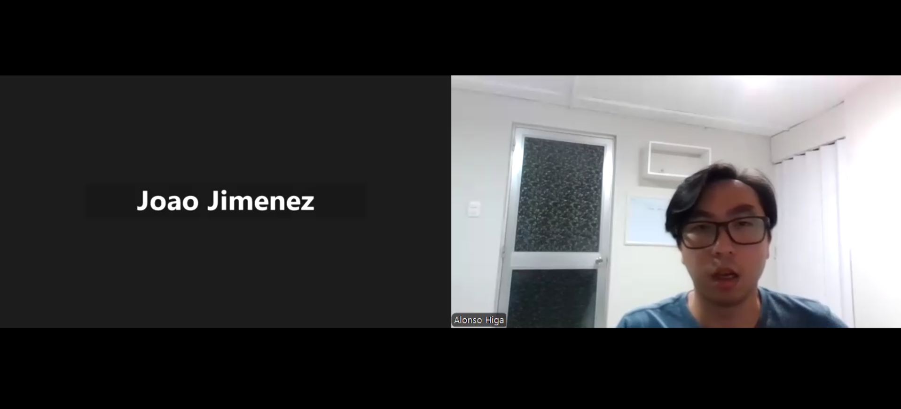
      </td>
    </tr>
  </tbody>
</table>

**Resumen de la entrevista**

Joao es un conductor de movilidad escolar con varios años de experiencia, lo que le permite organizar sus rutas principalmente de memoria, apoyándose ocasionalmente en herramientas como Waze para evitar el tráfico. Su rutina diaria consiste en recoger a los alumnos respetando horarios establecidos, aunque las condiciones del tráfico en Lima suelen generarle estrés y retrasos. A diferencia de algunos conductores más nuevos, maneja mejor la dinámica del servicio con respecto a la puntualidad, pero igual se ve afectado cuando los alumnos no están listos a tiempo, ya que esto puede alterar su planificación, aunque intenta adaptarse según la situación.

Uno de los principales retos que enfrenta es la constante comunicación con los padres, llegando a recibir varias llamadas al día para consultar su ubicación. Esto lo pone en una situación complicada ya que, aunque entiende la preocupación de los padres, responder mientras conduce implica un riesgo para él y para los estudiantes. Por esto considera que una solución que automatice los avisos sería de gran ayuda, ya que reduciría interrupciones y le permitiría enfocarse en manejar. También, resalta la importancia de que la aplicación sea simple y accesible para todo tipo de conductores. Para acabar menciona que espera que una herramienta así, le ayude a ahorrar tiempo en sus rutas, evitar retrasos y mejorar su reputación, incluso permitiéndole asumir más servicios.

**Segmento 2: Empresas dedicadas a movilidad escolar**

<table width="100%">
  <thead>
    <tr>
      <th colspan="2" align="center"><h2>Entrevista #1</h2></th>
    </tr>
  </thead>
  <tbody>
    <tr>
      <th colspan="2" align="left">Datos del entrevistado</th>
    </tr>
    <tr>
      <td width="30%"><b>Nombre completo</b></td>
      <td>Cheyla Paredes Mattos</td>
    </tr>
    <tr>
      <td><b>Edad</b></td>
      <td>27 años</td>
    </tr>
    <tr>
      <td><b>Ocupación</b></td>
      <td>Administradora de empresa de movilidad escolar</td>
    </tr>
    <tr>
      <td><b>Distrito de residencia</b></td>
      <td>Ate</td>
    </tr>
    <tr>
      <th colspan="2" align="left">Datos del video</th>
    </tr>
    <tr>
      <td><b>Link</b></td>
      <td><a href="(link)" target="_blank">(link)</a></td>
    </tr>
    <tr>
      <td><b>Duración</b></td>
      <td>3:55</td>
    </tr>
    <tr>
      <td><b>Timing de inicio</b></td>
      <td>0:00</td>
    </tr>
    <tr>
      <th colspan="2" align="center">Screenshot</th>
    </tr>
    <tr>
      <td colspan="2" align="center">
        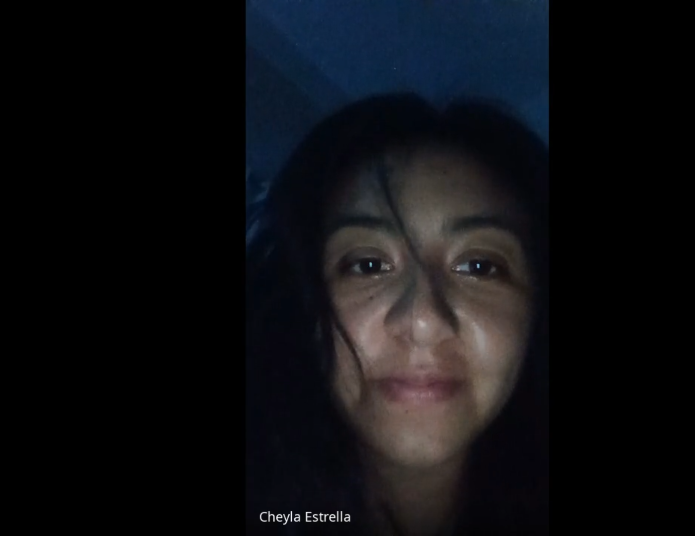
      </td>
    </tr>
  </tbody>
</table>

**Resumen de la entrevista**

Cheyla Paredes Mattos administra una empresa de movilidad escolar en Santa Clara con una flota de 15 microbuses que operan principalmente en La Molina y Ate. En su día a día enfrenta retos como la congestión vehicular especialmente en la avenida Javier Prado y la necesidad de reaccionar rápidamente ante cambios de última hora por inasistencias. Actualmente, la supervisión de rutas es manual y dispersa, ya que depende de un GPS básico y de reportes por WhatsApp enviados por los conductores. El control de asistencia también es mixto, combinando registros en papel con fotografías enviadas como respaldo digital.

En el plano operativo, uno de sus mayores costos proviene del mantenimiento correctivo debido al estado de las vías, el cual intenta reducir mediante revisiones preventivas. A nivel de servicio, las principales quejas de los padres están relacionadas con la falta de sincronización en los horarios, ya sea por llegadas anticipadas o retrasos sin previo aviso, lo que afecta la percepción de calidad del servicio.

Cheyla considera que un dashboard centralizado sería clave para mejorar su gestión, ya que le permitiría monitorear todas las unidades en tiempo real sin depender de múltiples canales de comunicación. Además, ve valor en ofrecer una aplicación a los padres como un diferenciador competitivo que proyecte mayor seguridad y modernidad. Para adoptar una solución como KidsOnWay, esperaría contar con reportes claros y útiles, como indicadores de puntualidad de los conductores y estimaciones de consumo de combustible por ruta.

<table width="100%">
  <thead>
    <tr>
      <th colspan="2" align="center"><h2>Entrevista #2</h2></th>
    </tr>
  </thead>
  <tbody>
    <tr>
      <th colspan="2" align="left">Datos del entrevistado</th>
    </tr>
    <tr>
      <td width="30%"><b>Nombre completo</b></td>
      <td>Dery Estrella Perez</td>
    </tr>
    <tr>
      <td><b>Edad</b></td>
      <td>27 años</td>
    </tr>
    <tr>
      <td><b>Ocupación</b></td>
      <td>Dueña y conductora de una pequeña empresa familiar</td>
    </tr>
    <tr>
      <td><b>Distrito de residencia</b></td>
      <td>Los Olivos</td>
    </tr>
    <tr>
      <th colspan="2" align="left">Datos del video</th>
    </tr>
    <tr>
      <td><b>Link</b></td>
      <td><a href="(link)" target="_blank">(link)</a></td>
    </tr>
    <tr>
      <td><b>Duración</b></td>
      <td>4:35</td>
    </tr>
    <tr>
      <td><b>Timing de inicio</b></td>
      <td>0:00</td>
    </tr>
    <tr>
      <th colspan="2" align="center">Screenshot</th>
    </tr>
    <tr>
      <td colspan="2" align="center">
        
      </td>
    </tr>
  </tbody>
</table>

**Resumen de la entrevista**

Dery Estrella Perez es dueña y conductora de una pequeña empresa familiar de movilidad escolar con una flota de cinco unidades, operando principalmente en Los Olivos y San Martín de Porres. En su día a día enfrenta retos como esquivar zonas con obras constantes y mantener la puntualidad en el recojo y entrega de los alumnos. Al tratarse de un equipo reducido, la coordinación es bastante directa, apoyándose en llamadas entre conductores para avisar retrasos o problemas en la ruta.

La supervisión de las unidades es totalmente manual y depende de la comunicación constante entre el equipo. Asimismo, el registro de asistencia se lleva en cuadernos individuales por cada conductor, lo que genera un control poco centralizado y propenso a errores o pérdida de información. Esta forma de trabajo a pesar de que es funcional, limita la capacidad de tener una visión general del servicio en tiempo real.

En cuanto a los costos, los principales problemas están relacionados con el consumo de combustible y las multas, los cuales intentan reducir buscando rutas alternas para evitar el tráfico. Por el lado del servicio al cliente, el mayor punto de tensión es la incertidumbre de los padres, quienes suelen llamar con frecuencia cuando perciben retrasos, generando presión adicional sobre los conductores mientras están al volante.

Dery percibe un alto valor en contar con un sistema más organizado, como un dashboard centralizado que le permita ver la ubicación de sus unidades y reaccionar rápidamente ante imprevistos, como fallas mecánicas. También, considera que una aplicación para padres aportaría tranquilidad y mejoraría la percepción de seguridad del servicio. Ella esperaría de nuestra solución cuente con reportes claros de incidencias en ruta y asistencia mensual, que le ayuden a llevar un mejor control operativo y administrativo.

<table width="100%">
  <thead>
    <tr>
      <th colspan="2" align="center"><h2>Entrevista #3</h2></th>
    </tr>
  </thead>
  <tbody>
    <tr>
      <th colspan="2" align="left">Datos del entrevistado</th>
    </tr>
    <tr>
      <td width="30%"><b>Nombre completo</b></td>
      <td>Luis Fernando Becerra Ninahuanca</td>
    </tr>
    <tr>
      <td><b>Edad</b></td>
      <td>25 años</td>
    </tr>
    <tr>
      <td><b>Ocupación</b></td>
      <td>Coordinador de operaciones de rutas escolares</td>
    </tr>
    <tr>
      <td><b>Distrito de residencia</b></td>
      <td>Santiago de Surco</td>
    </tr>
    <tr>
      <th colspan="2" align="left">Datos del video</th>
    </tr>
    <tr>
      <td><b>Link</b></td>
      <td><a href="(link)" target="_blank">(link)</a></td>
    </tr>
    <tr>
      <td><b>Duración</b></td>
      <td>3:59</td>
    </tr>
    <tr>
      <td><b>Timing de inicio</b></td>
      <td>0:00</td>
    </tr>
    <tr>
      <th colspan="2" align="center">Screenshot</th>
    </tr>
    <tr>
      <td colspan="2" align="center">
        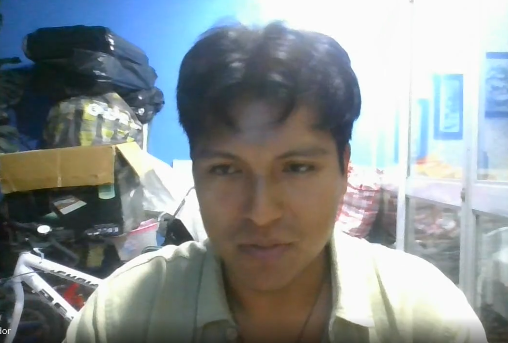
      </td>
    </tr>
  </tbody>
</table>

**Resumen de la entrevista**

Luis Becerra Ninahuanca de 25 años es coordinador de operaciones en Rutas Escolares S.A., una empresa con una flota de 10 minivans que operan en distritos como Surco, San Borja y la zona de Monterrico. En su día a día, enfrenta problemas como el tráfico impredecible y los tiempos muertos cuando los alumnos no están listos, lo que termina afectando toda la planificación de las rutas. Su rol exige coordinar múltiples unidades al mismo tiempo, lo que incrementa la complejidad operativa.

Actualmente, la empresa utiliza un GPS básico que solo brinda una ubicación general, mientras que la supervisión real depende de grupos de WhatsApp donde los conductores reportan manualmente su avance. Este proceso resulta poco eficiente, además fomenta la distracción al volante. El control de asistencia también es manual, ya que se registra en listas físicas que recién se revisan días después, lo que limita la capacidad de reacción ante cualquier incidente.

A nivel operativo, el mayor costo es el combustible, el cual intentan reducir sin mucho éxito debido a la falta de herramientas que optimicen rutas en tiempo real. Desde el lado de los clientes, el principal problema es la falta de información, ya que los padres suelen preocuparse y llamar incluso ante retrasos mínimos, generando presión adicional sobre el equipo.

Luis considera que contar con un dashboard centralizado podría ser clave para mejorar la gestión, ya que le permitiría monitorear todas las unidades en tiempo real sin depender de llamadas constantes. De igual manera ve un gran valor en ofrecer una aplicación a los padres, ya que aumentaría la confianza y reduciría la incertidumbre durante los traslados. Para utilizar KidsOnWay, esperaría contar con reportes claros sobre puntualidad, comportamiento de conducción y asistencia digital, que le ayuden a optimizar tanto la operación como los procesos administrativos.

### **2.2.3. Interview Analysis**

<table width="100%">
  <thead>
    <tr>
      <th colspan="4" align="center">
        <h2>Segmento 1: Conductores Independientes (Análisis Objetivo)</h2>
      </th>
    </tr>
    <tr>
      <th align="left" width="30%">Característica</th>
      <th align="center" width="15%">Frecuencia en entrevistas</th>
      <th align="center" width="10%">Porcentaje</th>
      <th align="left" width="45%">Fuente en entrevistas</th>
    </tr>
  </thead>

  <tbody>
    <tr>
      <td><b>Uso intensivo de aplicaciones de mensajería (WhatsApp) para la gestión diaria</b></td>
      <td align="center">Mencionado por los 3</td>
      <td align="center">100%</td>
      <td>
        <b>Joao:</b> "uso bastante WhatsApp para comunicarme con los padres" 
        <b>Mateo:</b> "lo que más utilizo en mi día a día puede ser... WhatsApp" 
        <b>Marcelo:</b> "WhatsApp para los grupos de padres"
      </td>
    </tr>
    <tr>
      <td><b>El tráfico genera altos niveles de estrés, afectando su jornada y estado de ánimo</b></td>
      <td align="center">Mencionado por los 3</td>
      <td align="center">100%</td>
      <td>
        <b>Joao:</b> "es muy complicado... me genera a veces estrés" 
        <b>Mateo:</b> "el horario es muy fuerte... hay combis que se atraviesan" 
        <b>Marcelo:</b> "manejar en horas pico es muy tedioso... me pone tenso"
      </td>
    </tr>
    <tr>
      <td><b>Frustración y efecto dominó en la ruta por demoras del alumno en el recojo</b></td>
      <td align="center">Mencionado por los 3</td>
      <td align="center">100%</td>
      <td>
        <b>Joao:</b> "puede afectar (la ruta), a veces no" 
        <b>Mateo:</b> "me retrasa a todos los demás pasajeros... se me va alargando la ruta" 
        <b>Marcelo:</b> "me malogra toda la ruta y luego tengo que estar pidiendo disculpas"
      </td>
    </tr>
    <tr>
      <td><b>Pre-planifica la ruta con anticipación mediante calendarios o herramientas digitales</b></td>
      <td align="center">Mencionado por 2/3</td>
      <td align="center">66.7%</td>
      <td>
        <b>Mateo:</b> "organizo mi ruta con un calendario... y a su vez con Google Maps" 
        <b>Marcelo:</b> "utilizo Waze para marcar los puntos desde la noche anterior"
      </td>
    </tr>
    <tr>
      <td><b>Confía principalmente en su memoria para estructurar el orden de recojo</b></td>
      <td align="center">Mencionado por 1/3</td>
      <td align="center">33.3%</td>
      <td>
        <b>Joao:</b> "mayormente lo hago por mi memoria ya que conozco a mis alumnos"
      </td>
    </tr>
    <tr>
      <td><b>Buscan explícitamente mejorar su reputación y profesionalismo frente a los padres</b></td>
      <td align="center">Mencionado por 2/3</td>
      <td align="center">66.7%</td>
      <td>
        <b>Joao:</b> "mejorar mi reputación con los padres" 
        <b>Marcelo:</b> "me daría mucha autoridad... quisiera ganar reputación"
      </td>
    </tr>
    <tr>
      <td><b>Priorizan el ahorro económico directo (gasolina y batería) gracias a la app</b></td>
      <td align="center">Mencionado por 2/3</td>
      <td align="center">66.7%</td>
      <td>
        <b>Mateo:</b> "económico por el ahorro en combustible... gasto menos electricidad" 
        <b>Marcelo:</b> "ahorrar gasolina al no tener que estar dando vueltas o parado"
      </td>
    </tr>
    <tr>
      <td><b>Han experimentado maniobras de peligro (giros, frenos secos) por usar el celular</b></td>
      <td align="center">Mencionado por 2/3</td>
      <td align="center">66.7%</td>
      <td>
        <b>Mateo:</b> "ha venido una combi y se me ha metido y he tenido que hacer un giro inesperado" 
        <b>Marcelo:</b> "casi freno en seco porque el de adelante paró de la nada"
      </td>
    </tr>
    <tr>
      <td><b>Reciben interrupciones en ruta por objetos olvidados de los estudiantes</b></td>
      <td align="center">Mencionado por 1/3</td>
      <td align="center">33.3%</td>
      <td>
        <b>Mateo:</b> "alguno de los niños se les ha olvidado la lonchera o alguna cosa... y me están llamando"
      </td>
    </tr>
    <tr>
      <td><b>Validación positiva de alertas automáticas para mejorar la concentración</b></td>
      <td align="center">Mencionado por los 3</td>
      <td align="center">100%</td>
      <td>
        <b>Joao:</b> "me permitiría concentrarme más en manejar" 
        <b>Mateo:</b> "no tendría que estar mirando dos cosas a la vez" 
        <b>Marcelo:</b> "me dejarían de escribir tanto y solo me concentraría en manejar bien"
      </td>
    </tr>
  </tbody>
</table>

 

<table width="100%">
  <thead>
    <tr>
      <th colspan="4" align="center">
        <h2>Segmento 1: Conductores Independientes (Análisis Subjetivo)</h2>
      </th>
    </tr>
    <tr>
      <th align="left" width="30%">Característica</th>
      <th align="center" width="15%">Frecuencia en entrevistas</th>
      <th align="center" width="10%">Porcentaje</th>
      <th align="left" width="45%">Fuente en entrevistas</th>
    </tr>
  </thead>
  <tbody>
    <tr>
      <td><b>Siente presión constante por responder a los padres y generar confianza</b></td>
      <td align="center">Mencionado por los 3</td>
      <td align="center">100%</td>
      <td>
        <b>Joao:</b> "sé que los padres de familia... deben estar preocupados" 
        <b>Mateo:</b> "los padres que ya están con el tiempo ya establecido me llaman y me dicen de que dónde estoy" 
        <b>Marcelo:</b> "Es una presión extra porque quiero contestar para que confíen en mí"
      </td>
    </tr>
    <tr>
      <td><b>Tiene dificultades para manejar y responder mensajes al mismo tiempo</b></td>
      <td align="center">Mencionado por los 3</td>
      <td align="center">100%</td>
      <td>
        <b>Joao:</b> "mirar el celular mientras manejo... es muy riesgoso para mí y para los alumnos" 
        <b>Mateo:</b> "tengo que estar haciendo las dos cosas a la vez... son varias cosas que estoy viendo en el mismo instante y no me puedo concentrar" 
        <b>Marcelo:</b> "por querer dar un buen servicio me estaba arriesgando"
      </td>
    </tr>
    <tr>
      <td><b>Los retrasos de alumnos afectan toda su ruta y generan quejas de otros padres</b></td>
      <td align="center">Mencionado por 2/3</td>
      <td align="center">66.7%</td>
      <td>
        <b>Mateo:</b> "me retrasa a todos los demás pasajeros... las mamás me comienzan a escribir" 
        <b>Marcelo:</b> "lo que más me mata es que me hacen quedar mal con el siguiente padre"
      </td>
    </tr>
    <tr>
      <td><b>Busca ser visto como un conductor confiable y organizado por los padres</b></td>
      <td align="center">Mencionado por 2/3</td>
      <td align="center">66.7%</td>
      <td>
        <b>Joao:</b> "mejorar mi reputación con los padres" 
        <b>Marcelo:</b> "que me recomienden porque soy el tío de la movilidad que tiene todo bajo control"
      </td>
    </tr>
    <tr>
      <td><b>Percibe que usar tecnología mejora su imagen frente a los padres</b></td>
      <td align="center">Mencionado por 1/3</td>
      <td align="center">33.3%</td>
      <td>
        <b>Marcelo:</b> "Me daría mucha autoridad y profesionalismo. Los padres verían que soy tecnológico y además organizado"
      </td>
    </tr>
    <tr>
      <td><b>Algunos conductores sienten inseguridad por su poca experiencia en el rubro</b></td>
      <td align="center">Mencionado por 1/3</td>
      <td align="center">33.3%</td>
      <td>
        <b>Marcelo:</b> "me preocupa que piensen que soy impuntual por ser joven"
      </td>
    </tr>
    <tr>
      <td><b>Existe diferencia en el uso de tecnología según la edad o experiencia del conductor</b></td>
      <td align="center">Mencionado por 1/3</td>
      <td align="center">33.3%</td>
      <td>
        <b>Joao:</b> "hay otros colegas... más mayores que yo que pueden tener una dificultad al ver"
      </td>
    </tr>
  </tbody>
</table>

<table width="100%">
  <thead>
    <tr>
      <th colspan="4" align="center"><h2>Segmento 2: Empresas de Movilidad Escolar (Análisis Objetivo)</h2></th>
    </tr>
    <tr>
      <th align="left" width="30%">Característica</th>
      <th align="center" width="15%">Frecuencia en entrevistas</th>
      <th align="center" width="10%">Porcentaje</th>
      <th align="left" width="45%">Fuente en entrevistas</th>
    </tr>
  </thead>
  <tbody>
    <tr>
      <td><b>Gestión del registro de asistencia de forma estrictamente manual (papel o cuadernos)</b></td>
      <td align="center">Mencionado por los 3</td>
      <td align="center">100%</td>
      <td>
        <b>Cheyla:</b> "La acompañante marca una lista de papel y luego le envía una foto" 
        <b>Dery:</b> "Es manual... cada conductor tiene su cuaderno" 
        <b>Luis:</b> "El nuestro es manual, en papel... cada chofer lleva una lista y marca con lapicero"
      </td>
    </tr>
    <tr>
      <td><b>Supervisión operativa dependiente de comunicación directa (WhatsApp/Llamadas)</b></td>
      <td align="center">Mencionado por los 3</td>
      <td align="center">100%</td>
      <td>
        <b>Cheyla:</b> "dependemos de que los choferes reporten por WhatsApp al llegar" 
        <b>Dery:</b> "nos supervisamos por llamadas telefónicas constantes" 
        <b>Luis:</b> "la supervisión real es por WhatsApp... avisar por mensaje cada vez que llega a un punto"
      </td>
    </tr>
    <tr>
      <td><b>El gasto de combustible es identificado como el costo operativo principal a reducir</b></td>
      <td align="center">Mencionado por 2/3</td>
      <td align="center">66.7%</td>
      <td>
        <b>Dery:</b> "Las multas y el combustible... buscando rutas alternas para no quemar gasolina" 
        <b>Luis:</b> "el costo más alto es el combustible, que es el gasto más fuerte que tenemos"
      </td>
    </tr>
    <tr>
      <td><b>Utilizan GPS básicos exigidos por terceros como monitoreo secundario</b></td>
      <td align="center">Mencionado por 2/3</td>
      <td align="center">66.7%</td>
      <td>
        <b>Cheyla:</b> "utilizamos el GPS que nos pide la aseguradora"  
        <b>Luis:</b> "utilizamos el GPS básico para ver toda la ubicación, pero la supervisión real es por WhatsApp"
      </td>
    </tr>
    <tr>
      <td><b>Demandan reportes automáticos de asistencia para agilizar cobros y facturación</b></td>
      <td align="center">Mencionado por 2/3</td>
      <td align="center">66.7%</td>
      <td>
        <b>Dery:</b> "asistencia mensual para cobrarles a los padres sin errores" 
        <b>Luis:</b> "el consolidado digital de asistencia para la facturación"
      </td>
    </tr>
    <tr>
      <td><b>Requieren métricas de gestión de flota (Puntualidad, Velocidad, Incidencias)</b></td>
      <td align="center">Mencionado por los 3</td>
      <td align="center">100%</td>
      <td>
        <b>Cheyla:</b> "Necesitaría un ranking de conectores basado en su puntualidad" 
        <b>Dery:</b> "un reporte de incidencias en la ruta" 
        <b>Luis:</b> "un reporte de puntualidad... y uno de velocidad de los choferes"
      </td>
    </tr>
  </tbody>
</table>

<table width="100%">
  <thead>
    <tr>
      <th colspan="4" align="center"><h2>Segmento 2: Empresas de Movilidad Escolar (Análisis Subjetivo)</h2></th>
    </tr>
    <tr>
      <th align="left" width="30%">Característica</th>
      <th align="center" width="15%">Frecuencia en entrevistas</th>
      <th align="center" width="10%">Porcentaje</th>
      <th align="left" width="45%">Fuente en entrevistas</th>
    </tr>
  </thead>
  <tbody>
    <tr>
      <td><b>Perciben la ansiedad de los padres, por falta de información como su mayor foco de quejas</b></td>
      <td align="center">Mencionado por los 3</td>
      <td align="center">100%</td>
      <td>
        <b>Cheyla:</b> "reclaman cuando el bus pasa muy temprano... o cuando hay retrasos y no se les avisa" 
        <b>Dery:</b> "La incertidumbre. Los padres se desesperan si no ven llegar a la hora a sus hijos" 
        <b>Luis:</b> "La falta de información. Los padres llaman angustiados si el bus se demora 5 minutos"
      </td>
    </tr>
    <tr>
      <td><b>Sienten pérdida de tiempo al "triangular" la comunicación entre choferes y padres</b></td>
      <td align="center">Mencionado por los 3</td>
      <td align="center">100%</td>
      <td>
        <b>Cheyla:</b> "sin tener que estar monitoreando chats individuales" 
        <b>Dery:</b> "empiezan a llamarnos mientras nosotros estamos manejando" 
        <b>Luis:</b> "Me ahorraría muchas horas de estar llamando por teléfono a cada chofer para saber por dónde van"
      </td>
    </tr>
    <tr>
      <td><b>Consideran que una App elevará el estatus, seguridad y confianza de su empresa</b></td>
      <td align="center">Mencionado por los 3</td>
      <td align="center">100%</td>
      <td>
        <b>Cheyla:</b> "Mejoraría mucho la imagen... sentirían que somos una empresa moderna y segura" 
        <b>Dery:</b> "Les daría pues mucha seguridad en esta zona... sería un gran alivio" 
        <b>Luis:</b> "Sería un cambio total... sentirían que tienen el control y seguridad"
      </td>
    </tr>
    <tr>
      <td><b>Sienten frustración por la ineficiencia causada por alumnos impuntuales</b></td>
      <td align="center">Mencionado por 2/3</td>
      <td align="center">66.7%</td>
      <td>
        <b>Cheyla:</b> "coordinar los cambios de última hora cuando un alumno no va a asistir" 
        <b>Luis:</b> "los minutos que perdemos esperando a los alumnos que no están listos en la puerta"
      </td>
    </tr>
    <tr>
      <td><b>Ven el dashboard como una herramienta crítica para el soporte en emergencias o crisis</b></td>
      <td align="center">Mencionado por 2/3</td>
      <td align="center">66.7%</td>
      <td>
        <b>Dery:</b> "Si alguna unidad se malogra, necesitamos ver quién está cerca para poder recoger a los niños" 
        <b>Luis:</b> "saber por dónde van y por qué ruta están detenidos"
      </td>
    </tr>
  </tbody>
</table>

En conclusión, en este análisis de las entrevistas de ambos segmentos nos revela que el problema central del transporte escolar no radica en la conducción en sí, sino en la ineficiencia, el peligro y el estrés que genera la comunicación manual. La ansiedad de los padres por la falta de visibilidad obliga a los conductores a distraerse al volante y a los administradores a perder horas siendo como intermediarios. Estos hallazgos validan la necesidad de desarrollar KidOnWay. Las entrevistas confirman que la implementación de un monitoreo GPS centralizado y un sistema de notificaciones automáticas de proximidad son los requisitos de software fundamentales para erradicar la incertidumbre de las familias y optimizar la logística de las empresas operadoras.

## **2.3. Needfinding**
### **2.3.1. User Person**

Los User Persona han sido construidos como representaciones de los principales tipos de usuarios de KidsOnWay. Estos perfiles se basan directamente en los hallazgos obtenidos durante las entrevistas, donde se identificaron problemas recurrentes como el estrés, la dificultad de gestionar varias tareas al mismo tiempo y los riesgos al usar el celular mientras se conduce o se coordina una ruta.

Además, se consideró el análisis de la competencia, lo que permitió entender que los usuarios buscan soluciones más simples y automatizadas que las opciones actuales del mercado. En este contexto, se identificó la necesidad de una herramienta que reduzca la intervención manual y facilite el uso en situaciones reales.

**Segmento 1: Conductores Independientes**

Este arquetipo representa a los conductores propietarios de sus propios vehículos que operan de manera independiente. Su principal motivación es brindar un servicio seguro y mantener una buena reputación, pero se ven constantemente frustrados por el estrés del tráfico de Lima y las interrupciones telefónicas de los padres. Valoran la tecnología, siempre y cuando esta ofrezca herramientas automáticas y extremadamente simples de usar que les permitan mantener su atención total en la conducción.

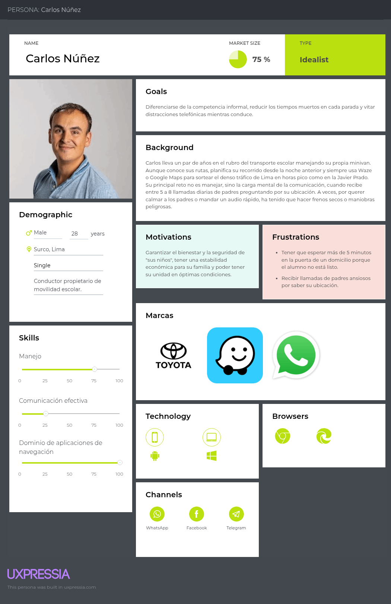

**Segmento 2: Empresas de Movilidad Escolar**

Este arquetipo representa a los dueños y administradores de pequeñas y medianas empresas de movilidad escolar, cuya principal motivación es optimizar la eficiencia de sus operaciones y proyectar una imagen de seguridad y confianza hacia los padres de familia, sin embargo se ven constantemente limitados por la falta de visibilidad en tiempo real de su flota y por la desorganización que implica coordinar todo de forma manual mediante WhatsApp. Es por esto que valoran soluciones tecnológicas que les permitan centralizar el monitoreo de sus unidades y automatizar la comunicación, reduciendo la carga operativa y evitando la dependencia de llamadas y mensajes, para así enfocarse en mejorar el servicio y fortalecer el crecimiento y prestigio de su negocio.

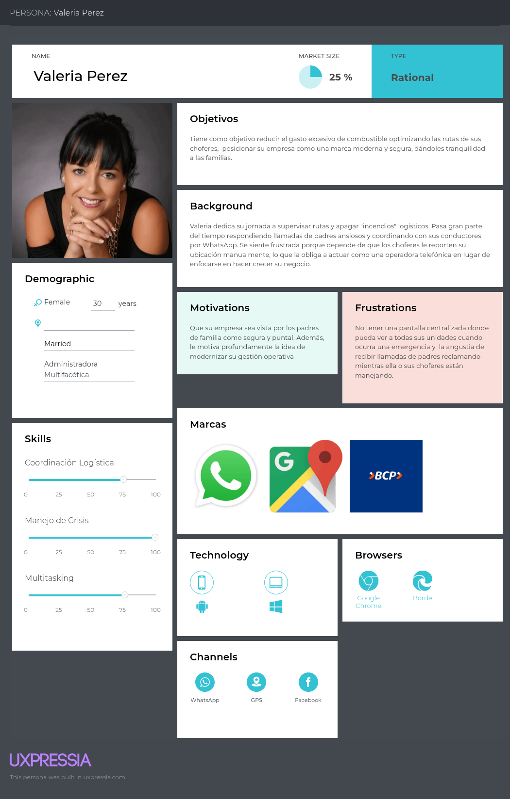

### **2.3.2. User Task Matrix**

En esta sección se presenta el User Task Matrix, una herramienta que concentra las actividades principales que nuestros dos arquetipos de usuario realizan en su día a día para cumplir sus objetivos logísticos y de seguridad, sin tener en cuenta de si utilizan o no una plataforma digital. Para este análisis, hemos considerado a nuestros 2 segmentos clave representados por Carlos Nuñez que representa al conductor independiente y Valeria Perez que es administradora multifacética.

Las tareas han sido evaluadas en función de dos variables que es la frecuencia, es decir qué tan seguido se realiza la tarea, puede ser Alta, Media, Baja e importancia, qué tan crítica es la tarea para el éxito de su trabajo y se puede medir de igual manera con Alta, Media, Baja.

<table width="100%">
  <thead>
    <tr>
      <th align="left" width="40%">User Tasks</th>
      <th align="center" width="30%">Segmento 1: Carlos (Conductor Independiente)</th>
      <th align="center" width="30%">Segmento 2: Valeria (Administradora de Flota)</th>
    </tr>
  </thead>
  <tbody>
    <tr>
      <td><b>Navegar por el tráfico y cumplir la ruta establecida</b></td>
      <td align="center">Alta</td>
      <td align="center">Baja</td>
    </tr>
    <tr>
      <td><b>Registrar la asistencia de los alumnos al subir/bajar</b></td>
      <td align="center">Alta</td>
      <td align="center">Nunca</td>
    </tr>
    <tr>
      <td><b>Monitorear el estado y ubicación de múltiples unidades</b></td>
      <td align="center">Nunca</td>
      <td align="center">Alta</td>
    </tr>
    <tr>
      <td><b>Enviar notificaciones de proximidad o retraso a los padres</b></td>
      <td align="center">Alta</td>
      <td align="center">Alta</td>
    </tr>
    <tr>
      <td><b>Atender llamadas de padres ansiosos consultando ubicación</b></td>
      <td align="center">Alta</td>
      <td align="center">Alta</td>
    </tr>
    <tr>
      <td><b>Coordinar cambios de ruta y reasignar vehículos por averías</b></td>
      <td align="center">Baja</td>
      <td align="center">Alta</td>
    </tr>
    <tr>
      <td><b>Elaborar reportes de asistencia para cobros a fin de mes</b></td>
      <td align="center">Baja</i></td>
      <td align="center">Alta</i></td>
    </tr>
  </tbody>
</table>

 

El análisis del User Task Matrix evidencia una clara diferencia en las necesidades operativas de ambos segmentos, lo que justifica el diseño de interfaces diferenciadas dentro de la plataforma. Por un lado, el Segmento 1 necesita una interfaz móvil enfocada en la ejecución, que tenga como prioridad una navegación donde no tenga que interactuar lo menos posible y un registro rápido de asistencia, ya que sus tareas se realizan mientras el vehículo está en movimiento y su atención debe centrarse en la conducción. Por otro lado, el Segmento 2 requiere una visión más amplia del sistema, a través de un dashboard o panel centralizado que facilite el monitoreo de múltiples unidades y la gestión eficiente de incidencias.

Hay una clara diferencia, pero también revela un punto clave en común, que es la comunicación con los padres de familia. Ambos segmentos presentan una alta frecuencia en el envío de información y en la atención de consultas, lo que genera una carga operativa significativa. Esta coincidencia confirma que la automatización de notificaciones de proximidad aborda directamente el principal problema compartido, ya que reduce la necesidad de llamadas y mensajes. De esta manera, el conductor puede concentrarse en manejar sin distracciones y el administrador deja de depender de la coordinación manual, cumpliendo así con el objetivo central de la solución.

### **2.3.3. User Journey Mapping**

**Segmento 1: Conductores Independientes**

 Mediante el User Journey Mapping se verá el recorrido operativo de nuestro arquetipo, Carlos Núñez durante su rutina matutina de recojo de estudiantes. El objetivo de este mapa es evidenciar los altos niveles de estrés e inseguridad vial que experimenta el conductor al intentar navegar por el tráfico de Lima y comunicarse manualmente con los padres al mismo tiempo.

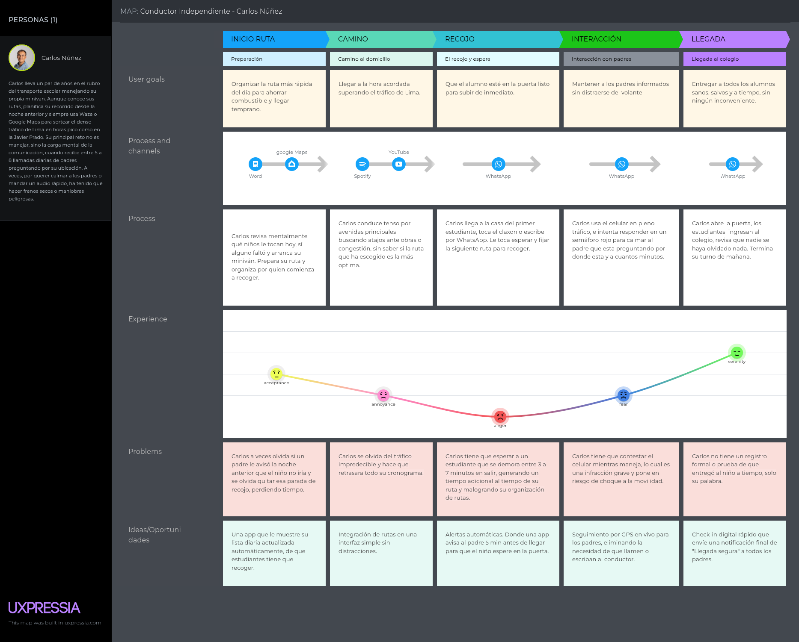

El mapa refleja que los momentos más críticos y peligrosos de la jornada del conductor donde se concentran en las etapas de Recojo e Interacción. La demora de los alumnos genera un efecto dominó que retrasa toda la ruta, lo que a su vez provoca llamadas de padres ansiosos. El intento del conductor por responder WhatsApps o llamadas mientras conduce representa un riesgo de accidente grave. Este escenario confirma que la implementación de alertas de proximidad y seguimiento GPS en vivo no solo mejorará la puntualidad, sino que mitigará un riesgo de seguridad vial inminente.

**Segmento 2: Empresas de Movilidad Escolar**

 Este User Journey Mapping nos ilustra el recorrido operativo de nuestra User Persona, Valeria durante la gestión matutina de la flota, desde la planificación del despacho hasta el registro de asistencia. El objetivo de este mapeo es visibilizar los puntos de fricción y el desgaste que genera la coordinación manual de múltiples vehículos.

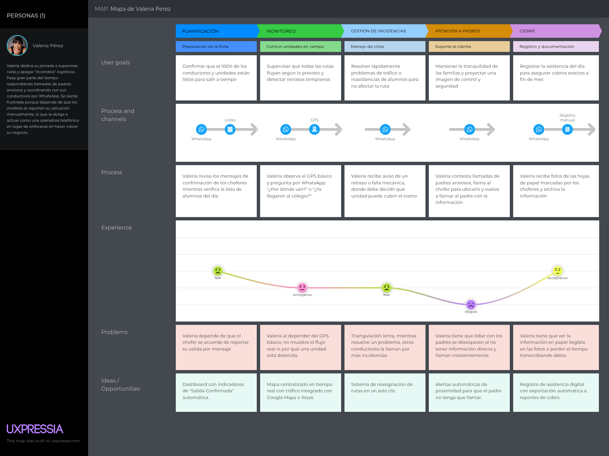

Como se evidencia en el mapa, el punto de mayor quiebre en la experiencia del usuario ocurre durante las etapas de Monitoreo y de Atención a Padres. La necesidad de triangular la comunicación telefónica entre conductores y padres ansiosos genera un alto nivel de estrés y sobrecarga cognitiva. Esta ineficiencia operativa confirma la oportunidad crítica de automatizar el flujo de información a través de notificaciones de proximidad.

### **2.3.4. Empathy Mapping**

El Empathy Map nos permite ponernos en el lugar de nuestros usuarios finales para comprender profundamente su entorno, emociones, pensamientos y actitudes. Nos ayudaran a identificar no solo las necesidades operativas de los usuarios, sino también sus puntos de dolor psicológicos y sus expectativas, garantizando un diseño de software verdaderamente para los segmentos objetivos.

**Segmento 1: Conductores Independientes**

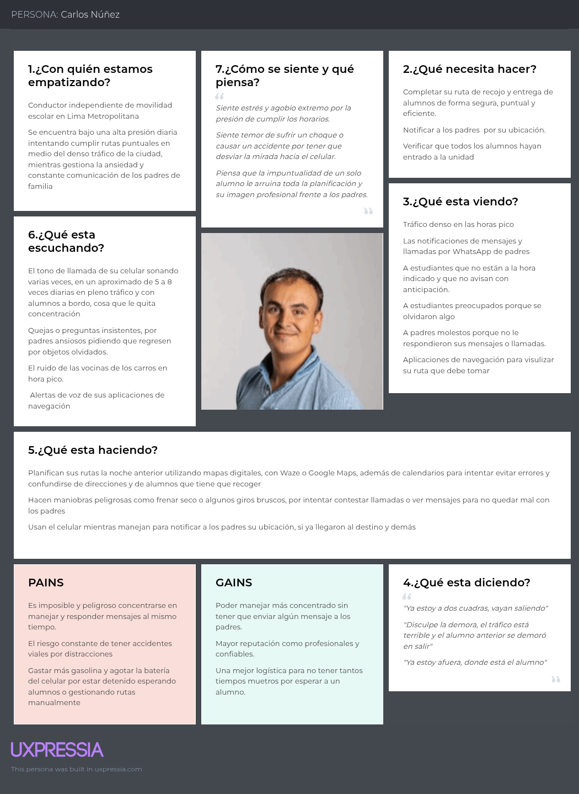

El análisis del entorno y los sentimientos de Carlos revela un hallazgo importante, nos muestra que su mayor fuente de frustración y peligro no es la conducción en sí, sino la interrupción constante. Al estar inmerso en un entorno ruidoso y altamente demandante, su nivel de ansiedad al volante se dispara cuando se ve obligado a interactuar con su dispositivo móvil para calmar a los padres. La principal Gains es que busca recuperar la concentración total en la vía. Esto valida técnicamente que la interfaz de KidOnWay para el conductor debe requerir una interacción nula o mínima durante la ruta, automatizando por completo las comunicaciones para proteger su vida y la de los estudiantes.

**Segmento 2: Empresas de Movilidad Escolar**

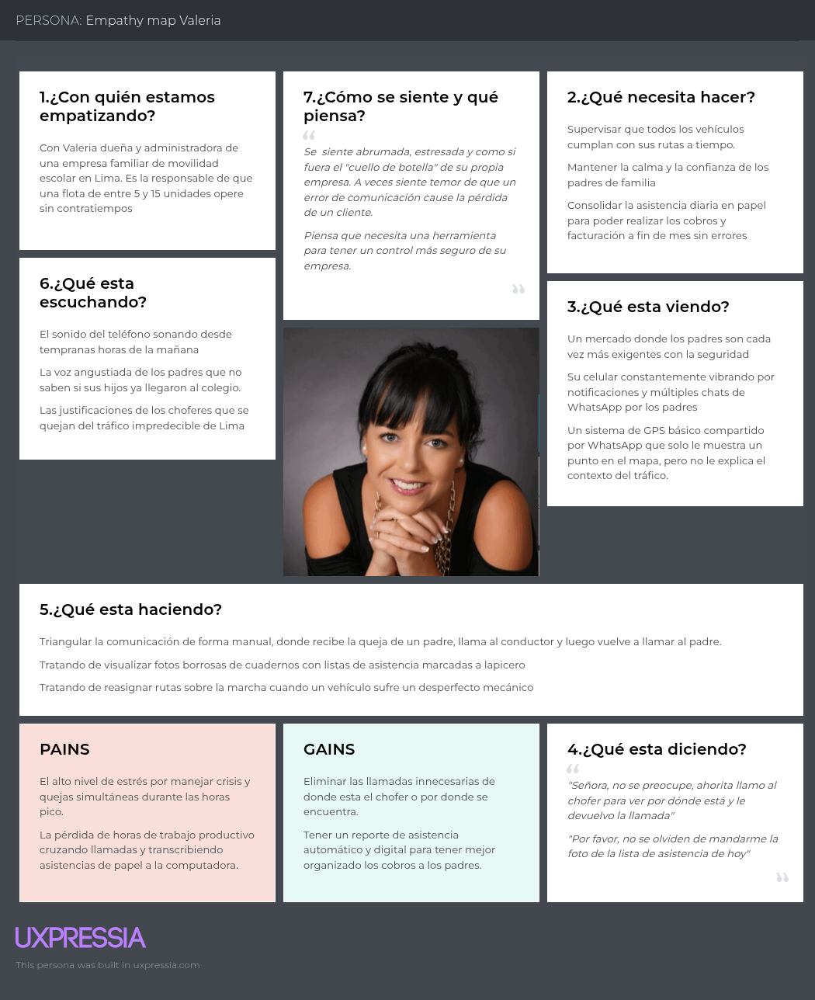

El análisis revela que el principal enemigo de Valeria no es la logística vehicular, sino la saturación de las comunicaciones. Al estar en el centro de un flujo de información manual. La propuesta de valor de nuestra aplicación impacta directamente en sus Gains, ya que al delegar el monitoreo a un software automatizado, ella recupera su tiempo y reduce su carga mental, logrando transformar su negocio y aprovechar mejor el tiempo para otras cosas.

**AS-IS Escenario Mapping**

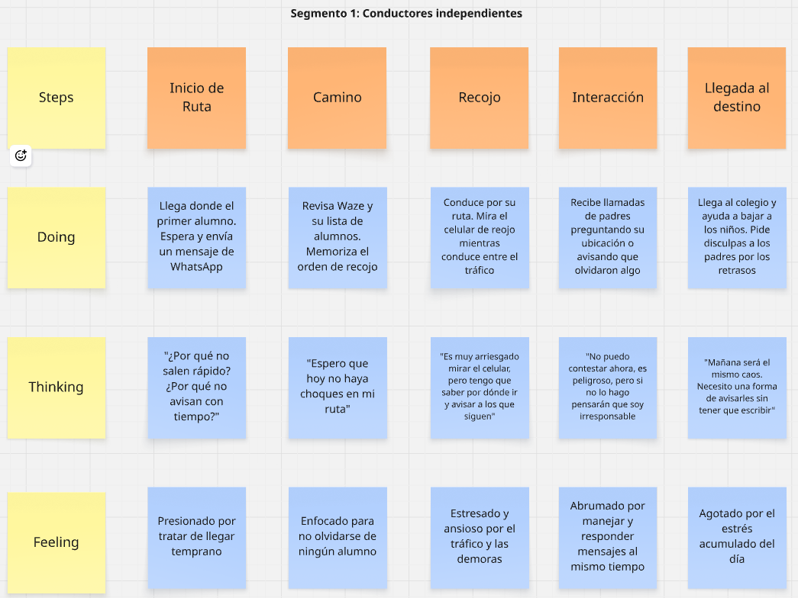

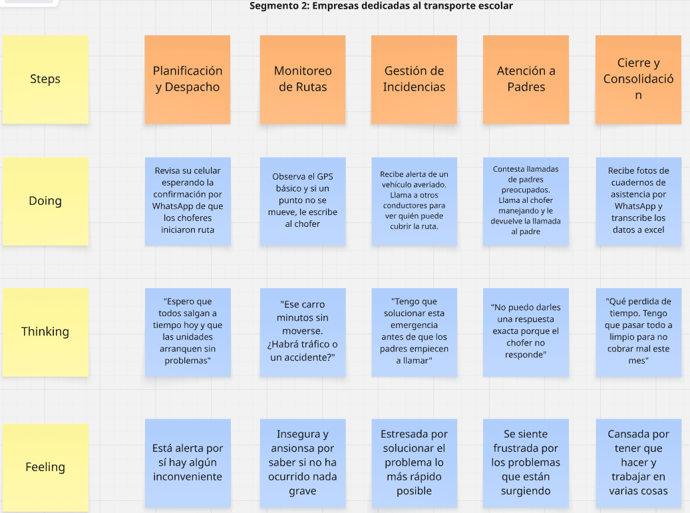

## **2.4. Big Picture Event Storming**
## **2.5. Ubiquitous Language**

El Lenguaje Ubicuo es un vocabulario común y estandarizado entre el equipo de desarrollo y los expertos del dominio, que en este caso son los conductores de movilidad escolar o administradores y padres de familia. Es un tipo de glosario que garantiza que todos los stakeholders compartan la misma comprensión de los conceptos clave del negocio, reduciendo la ambigüedad en la especificación de requisitos y en el código fuente.

* **Administrador**, es el usuario encargado de la gestión logística de la flota. Su rol principal es monitorear rutas, resolver incidencias y administrar la comunicación macro con los clientes.
* **Alerta de Proximidad**, es la notificación push automatizada generada por el sistema y enviada al dispositivo móvil del apoderado cuando la unidad se encuentra a una distancia o tiempo predeterminado del punto de recojo.
* **Padre de familia**, es el cliente final que contrata el servicio de movilidad escolar y requiere visibilidad sobre el estado del transporte de su menor hijo.
* **Asistencia**, es el registro del momento exacto en el que un estudiante sube o baja del vehículo.
* **Conductor**, es el usuario responsable de manejar el vehículo, ejecutar la ruta establecida y velar por la seguridad física de los estudiantes durante el trayecto.
* **Dashboard**, es la interfaz web o de tablet centralizada, diseñada para el administrador y padres, que muestra en tiempo real la ubicación, velocidad y estado de todas las unidades activas mediante integración GPS.
* **Estudiante**, es el pasajero que va a ser transportado.
* **Flota**, es el conjunto total de vehículos operativos gestionados por una misma empresa de movilidad escolar.
* **Ruta**, es el trayecto planificado de puntos de recojo y entrega.
* **Unidad**, es el vehículo de transporte físico asignado a un conductor y a una ruta específica.