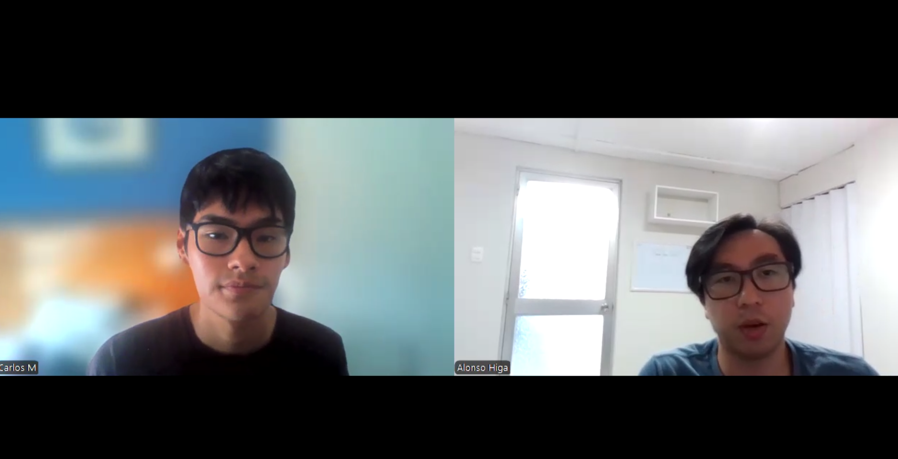

# **Chapter II: Requirements Elicitation & Analysis**
## **2.1. Competitors**
**OnTrack School** 

OnTrack School es una plataforma desarrollada en Latinoamérica que ayuda a gestionar el transporte escolar de forma más segura y organizada. Permite a los padres ver la ubicación de la movilidad en tiempo real, mientras que los colegios y empresas pueden llevar un control de la asistencia de los estudiantes. Esto la convierte en una herramienta útil para mejorar la comunicación y el seguimiento del servicio (OnTrack, s. f.).

**titiGO** 

titiGO es una plataforma peruana diseñada para el seguimiento y control del transporte escolar. Su propuesta permite que las familias reciban notificaciones en tiempo real de los estados de viaje de cada estudiante, registrando cuando suben a la movilidad, cuando llegan al colegio o regresan a casa. Además, utilizan un sistema de control de salida mediante un código QR único, buscando brindar seguridad total en la comunicación y confianza a los padres de familia (titiGO, 2026).

**BatOnRoute**

BatOnRoute es un software de origen europeo que ayuda a gestionar rutas de transporte escolar. Permite a colegios y empresas conocer la ubicación de los vehículos en tiempo real, llevar un control de la asistencia y enviar notificaciones a los padres cuando la movilidad está cerca. Su enfoque está en mejorar la organización del servicio y brindar mayor seguridad a todos los involucrados (BatOnRoute, s.f.).
### **2.1.1. Competitive Analysis**
**Competitive Analysis Landscape**

<table width="100%">
  <thead>
    <tr>
      <th align="left">Nombre</th>
      <th align="center">KidsOnWay</th>
      <th align="center">titiGO</th>
      <th align="center">BatOnRoute</th>
      <th align="center">OnTrack School</th>
    </tr>
  </thead>
  <tbody>
    <tr>
      <td align="left"><b>Logo</b></td>
      <td align="center"></td>
      <td align="center"></td>
      <td align="center"></td>
      <td align="center"></td>
    </tr>
    <tr>
      <th colspan="5" align="left">Perfil</th>
    </tr>
    <tr>
      <td><b>Overview</b></td>
      <td>Software que automatiza la comunicación entre conductores y padres mediante alertas de proximidad.</td>
      <td>Aplicación peruana que se enfoca en el control del transporte escolar mediante estados de viaje y validación por QR.</td>
      <td>Software orientado a empresas que gestiona flotas escolares con seguimiento en tiempo real y alertas.</td>
      <td>Sistema latinoamericano que permite monitorear rutas escolares y llevar control de asistencia.</td>
    </tr>
    <tr>
      <td><b>Ventaja competitiva</b></td>
      <td>Envía avisos automáticos sin que el conductor tenga que usar el celular, evitando distracciones y reduciendo tiempos de espera.</td>
      <td>Controla la salida de los estudiantes mediante códigos QR para mayor seguridad.</td>
      <td>Está pensado para manejar muchas unidades y rutas complejas.</td>
      <td>Ofrece seguimiento constante de las rutas con un enfoque adaptado a la región.</td>
    </tr>
    <tr>
      <th colspan="5" align="left">Perfil de Marketing</th>
    </tr>
    <tr>
      <td><b>Mercado objetivo</b></td>
      <td>Conductores independientes y pequeñas empresas de transporte en Lima.</td>
      <td>Colegios y padres interesados en controlar la asistencia de los alumnos.</td>
      <td>Directivos de colegios privados con mayor capacidad económica.</td>
      <td>Colegios, empresas de transporte y familias.</td>
    </tr>
    <tr>
      <td><b>Estrategias de marketing</b></td>
      <td>Difusión mediante recomendaciones y asociaciones de padres (APAFA).</td>
      <td>Trabajo directo con colegios para que adopten la app como parte de su sistema.</td>
      <td>Ventas directas a instituciones mostrando beneficios del servicio.</td>
      <td>Enfoque en seguridad y organización del transporte para atraer usuarios.</td>
    </tr>
    <tr>
      <th colspan="5" align="left">Perfil de Producto</th>
    </tr>
    <tr>
      <td><b>Productos & Servicios</b></td>
      <td>App para padres y conductores, ubicación en tiempo real y panel web con control de asistencia.</td>
      <td>App de seguimiento con registro digital y validación por QR.</td>
      <td>Plataforma web, apps y herramientas para organizar rutas.</td>
      <td>Apps móviles, panel administrativo y reportes de recorridos.</td>
    </tr>
    <tr>
      <td><b>Precios & Costos</b></td>
      <td>Planes según la cantidad de alumnos y de la cantidad de vehículos.</td>
      <td>Planes de suscripción según cantidad de alumnos.</td>
      <td>Planes más costosos con contratos institucionales.</td>
      <td>Suscripción según funciones del sistema.</td>
    </tr>
    <tr>
      <td><b>Canales de distribución</b></td>
      <td>Aplicación móvil y plataforma web.</td>
      <td>Aplicación móvil y plataforma web.</td>
      <td>Aplicación móvil y plataforma web.</td>
      <td>Aplicación móvil y plataforma web.</td>
    </tr>
  </tbody>
</table>

### **2.1.2. Strategies and Tactics Against Competitors**
En una ciudad como Lima Metropolitana en donde el tráfico y la desorganización del transporte son parte del día a día, en KidsOnWay buscamos diferenciarnos ofreciendo una solución más simple y útil para padres y conductores a diferencia otras aplicaciones del rubro. No solo nos enfocamos en la ubicación en tiempo real, sino también en mejorar la seguridad y la tranquilidad durante todo el recorrido.

**Fortalezas**

* **Automatización de avisos**
   
   A diferencia de métodos actuales como llamadas o mensajes en WhatsApp, la aplicación envía notificaciones automáticas cuando la movilidad está cerca o llega al destino. Esto permite que el conductor no tenga que usar el celular mientras maneja y pueda concentrarse en la ruta.
* **Información clara y verídica para los padres** Los padres pueden ver el recorrido sin necesidad de estar llamando o escribiendo. Esto les da mayor tranquilidad y confianza durante el traslado de sus hijos. Además, viendo información en tiempo real.

**Debilidades**

* **Baja presencia en el mercado**
   
   Al ser una startup nueva, todavía no contamos con una marca conocida. Para poder generar confianza, se realizarán pruebas piloto con algunos usuarios y se compartirán sus experiencias, para demostrar que nuestra solución es sólida y vale la pena apostar por ella.
* **Dependencia del internet** En algunas zonas de Lima la señal puede fallar, lo que afecta la actualización en tiempo real. Para reducir este problema, la app estará optimizada para consumir pocos datos y guardar información cuando no haya señal. 

**Oportunidades**

* **Problemas de tráfico e inseguridad**
   
   El tráfico en Lima hace que los tiempos sean impredecibles. La app puede ayudar a los padres a saber cuándo llegará la movilidad y reducir el tiempo de espera en la calle.
* **Mayor uso de tecnología** Cada vez más servicios se están digitalizando, esto permite que soluciones como KidsOnWay sean mejor aceptadas por conductores y empresas de transporte.

**Amenazas**

* **Competencia de otras plataformas**
   
   Existen aplicaciones más desarrolladas en otros países. Ante esta situación, KidsOnWay se enfocará en adaptarse mejor a la realidad local, con precios accesibles y soluciones más cercanas al contexto local.
* **Resistencia al cambio** Algunos conductores prefieren seguir usando métodos tradicionales, es por esto que la aplicación será simple de usar y se brindará una explicación clara de sus beneficios.

## **2.2. Interviews**
### **2.2.1. Interview Design**
Con el objetivo de obtener información cualitativa que nos ayude a validar nuestras ideas y entender mejor a los usuarios, se diseñaron tres entrevistas para cada grupo objetivo de la plataforma KidsOnWay. Las preguntas fueron planteadas buscando obtener respuestas abiertas, para poder evitar en lo posible las respuestas de sí o no. Además, se organizaron en bloques para conocer el perfil de los usuarios, sus hábitos tecnológicos, los problemas que enfrentan y lo que esperan de un servicio de transporte escolar.

**Segmento #1: Conductores Independientes**

Se presentan, le pides su consentimiento para entrevistarlo y empiezas:

1. ¿Podrías indicarme tu edad, distrito de residencia y cuántos años llevas trabajando como conductor de movilidad escolar?
2. ¿Qué marca y modelo de vehículo manejas actualmente? ¿Es de tu propiedad o alquilado?
3. En tu día a día, ¿qué aplicaciones utilizas más en tu celular? (Algunos ejemplos como Waze, WhatsApp, redes sociales).
4. ¿Cómo organizas el orden de tu ruta cada mañana? ¿Utilizas alguna herramienta digital o confías en tu memoria?
5. Describe tu experiencia manejando en las horas pico en Lima, ¿Cómo afecta el tráfico a tu estado de ánimo y a tu puntualidad?
6. ¿Qué es lo que más te molesta cuando llegas a recoger a un alumno y este no está listo en la puerta?
7. ¿Cuántas veces al día recibes llamadas o mensajes de padres preguntando por tu ubicación mientras estás conduciendo?
8. ¿Alguna vez has tenido una distracción peligrosa por intentar contestar el celular para avisar que ya estabas cerca de un domicilio?
9. Si una aplicación avisara automáticamente a los padres cuando estás a 5 minutos de su casa sin que tú hagas nada, ¿cómo cambiaría tu jornada?
10. ¿Qué tan importante es para ti que la aplicación sea extremadamente simple de usar, por ejemplo con botones grandes y que no te distraiga del volante?
11. ¿Qué beneficio económico o de tiempo esperarías obtener al usar una plataforma como la nuestra?

**Segmento #2: Empresas dedicadas a movilidad escolar**

Se presentan, le pides su consentimiento para entrevistarlo y empiezas:

1. ¿Cuál es el nombre de la empresa, cuántas unidades conforman su flota actual y en qué distritos de Lima operan principalmente?
2. ¿Cuál es su cargo dentro de la empresa y cuáles son sus principales retos logísticos diarios?
3. ¿Qué métodos utilizan actualmente para supervisar que sus conductores estén cumpliendo con las rutas y horarios establecidos?
4. ¿Cómo manejan el registro de asistencia de los alumnos? (Algunos ejemplos como ¿Es manual, en papel o tienen algún sistema digital?)
5. ¿Cuál es el costo operativo más alto que enfrentan, como combustible, mantenimiento o multas y cómo intentan reducirlo?
6. ¿Qué tipo de reclamos reciben con más frecuencia por parte de los padres de familia?
7. ¿Qué tan valioso sería para su empresa contar con un Dashboard centralizado donde puedan ver todas sus unidades en un solo mapa en tiempo real?
8. ¿Cómo cree que impactaría en la confianza de los padres el ofrecerles una aplicación para monitorear el bus de sus hijos?
9. Para adoptar una solución como KidsOnWay, ¿qué tipo de reportes o datos estadísticos necesitarían que la plataforma les entregue mensualmente?

### **2.2.2. Interview Recording**

**Segmento 1: Conductores Independientes**

<table width="100%">
  <thead>
    <tr>
      <th colspan="2" align="center"><h2>Entrevista #1</h2></th>
    </tr>
  </thead>
  <tbody>
    <tr>
      <th colspan="2" align="left">Datos del entrevistado</th>
    </tr>
    <tr>
      <td width="30%"><b>Nombre completo</b></td>
      <td>Carlos Marcelo Mansilla Rivero</td>
    </tr>
    <tr>
      <td><b>Edad</b></td>
      <td>24 años</td>
    </tr>
    <tr>
      <td><b>Ocupación</b></td>
      <td>Conductor de movilidad escolar</td>
    </tr>
    <tr>
      <td><b>Distrito de residencia</b></td>
      <td>Surquillo</td>
    </tr>
    <tr>
      <th colspan="2" align="left">Datos del video</th>
    </tr>
    <tr>
      <td><b>Link</b></td>
      <td><a href="(link)" target="_blank">(link)</a></td>
    </tr>
    <tr>
      <td><b>Duración</b></td>
      <td>5:36</td>
    </tr>
    <tr>
      <td><b>Timing de inicio</b></td>
      <td>0:00</td>
    </tr>
    <tr>
      <th colspan="2" align="center">Screenshot</th>
    </tr>
    <tr>
      <td colspan="2" align="center">
        
      </td>
    </tr>
  </tbody>
</table>

**Resumen de la entrevista**

Carlos es un conductor de movilidad escolar con poca experiencia en el rubro, por lo que aún depende de herramientas como Waze o Google Maps para organizar sus rutas y evitar errores. En su día a día se basa en recoger a los estudiantes, mantener la puntualidad y coordinar constantemente con los padres mediante WhatsApp. Sin embargo, enfrenta varios problemas como la impuntualidad de algunos alumnos, que afecta toda su ruta y el tráfico en Lima que es bastante denso, que incrementa su estrés y dificulta cumplir con los horarios. Además, le preocupa su imagen frente a los padres, ya que al ser nuevo siente mayor presión por demostrar responsabilidad y generar confianza.

Otro punto crítico es la comunicación con los padres, ya que recibe constantemente mensajes y llamadas preguntando por su ubicación, lo que lo obliga a responder mientras conduce, generando distracciones peligrosas. Ante esta situación, valora mucho una solución que automatice los avisos de proximidad, que le podrían ayudar a enfocarse en manejar y reducir el estrés. También, destaca que la herramienta debe ser muy simple de usar, con mínima interacción, debido a que esta al volante. Finalmente, espera que una solución así le ayude a mejorar su reputación, optimizar su tiempo y reducir costos como el consumo de combustible por esperas innecesarias.

<table width="100%">
  <thead>
    <tr>
      <th colspan="2" align="center"><h2>Entrevista #2</h2></th>
    </tr>
  </thead>
  <tbody>
    <tr>
      <th colspan="2" align="left">Datos del entrevistado</th>
    </tr>
    <tr>
      <td width="30%"><b>Nombre completo</b></td>
      <td>Mateo Nicolás de Mendiburu Aguilar</td>
    </tr>
    <tr>
      <td><b>Edad</b></td>
      <td>20 años</td>
    </tr>
    <tr>
      <td><b>Ocupación</b></td>
      <td>Conductor de movilidad escolar</td>
    </tr>
    <tr>
      <td><b>Distrito de residencia</b></td>
      <td>Santiago de Surco</td>
    </tr>
    <tr>
      <th colspan="2" align="left">Datos del video</th>
    </tr>
    <tr>
      <td><b>Link</b></td>
      <td><a href="(link)" target="_blank">(link)</a></td>
    </tr>
    <tr>
      <td><b>Duración</b></td>
      <td>8:47</td>
    </tr>
    <tr>
      <td><b>Timing de inicio</b></td>
      <td>5:37</td>
    </tr>
    <tr>
      <th colspan="2" align="center">Screenshot</th>
    </tr>
    <tr>
      <td colspan="2" align="center">
        
      </td>
    </tr>
  </tbody>
</table>

**Resumen de la entrevista**

Mateo es un conductor de movilidad escolar con aproximadamente dos años de experiencia, que opera principalmente en distritos como Surco. En su día a día combina el uso de herramientas digitales como Google Maps con su propio conocimiento de rutas, utilizando también un calendario para organizar sus recorridos. Esta mezcla entre apoyo tecnológico y experiencia le permite optimizar su trabajo, aunque todavía depende de las condiciones del entorno, especialmente del tráfico en horas punta, que representa uno de sus mayores desafíos y afecta directamente su puntualidad y nivel de estrés.

Durante sus recorridos, uno de los principales problemas que enfrenta es la impuntualidad de algunos alumnos donde los padres no avisan con tiempo, lo que genera retrasos acumulados y desorden en toda la ruta. A esto se suma la constante comunicación con los padres, quienes lo contactan con frecuencia no solo para consultar su ubicación, sino también por imprevistos como objetos olvidados. Esta situación lo obliga a dividir su atención entre manejar, responder mensajes y supervisar a los estudiantes dentro del vehículo, generando una sobrecarga que impacta tanto en su desempeño como en la seguridad durante el trayecto.

Ante este contexto, Mateo valora de forma muy positiva una solución que automatice la comunicación con los padres, especialmente mediante alertas de proximidad, ya que reduciría significativamente las interrupciones y le permitiría enfocarse en la conducción. Además, destaca la importancia de que la aplicación sea simple, visual y fácil de usar, con elementos grandes que no generen distracción. Finalmente, espera que una herramienta como KidsOnWay le ayude a optimizar su tiempo, reducir el consumo de combustible y hacer su trabajo más eficiente, mejorando al mismo tiempo la experiencia para los padres y estudiantes, haciendo su servicio más sólido.

<table width="100%">
  <thead>
    <tr>
      <th colspan="2" align="center"><h2>Entrevista #3</h2></th>
    </tr>
  </thead>
  <tbody>
    <tr>
      <th colspan="2" align="left">Datos del entrevistado</th>
    </tr>
    <tr>
      <td width="30%"><b>Nombre completo</b></td>
      <td>Joao David Jiménez Abarca</td>
    </tr>
    <tr>
      <td><b>Edad</b></td>
      <td>36 años</td>
    </tr>
    <tr>
      <td><b>Ocupación</b></td>
      <td>Conductor de movilidad escolar</td>
    </tr>
    <tr>
      <td><b>Distrito de residencia</b></td>
      <td>Comas</td>
    </tr>
    <tr>
      <th colspan="2" align="left">Datos del video</th>
    </tr>
    <tr>
      <td><b>Link</b></td>
      <td><a href="(link)" target="_blank">(link)</a></td>
    </tr>
    <tr>
      <td><b>Duración</b></td>
      <td>5:42</td>
    </tr>
    <tr>
      <td><b>Timing de inicio</b></td>
      <td>14:24</td>
    </tr>
    <tr>
      <th colspan="2" align="center">Screenshot</th>
    </tr>
    <tr>
      <td colspan="2" align="center">
        
      </td>
    </tr>
  </tbody>
</table>

**Resumen de la entrevista**

Joao es un conductor de movilidad escolar con varios años de experiencia, lo que le permite organizar sus rutas principalmente de memoria, apoyándose ocasionalmente en herramientas como Waze para evitar el tráfico. Su rutina diaria consiste en recoger a los alumnos respetando horarios establecidos, aunque las condiciones del tráfico en Lima suelen generarle estrés y retrasos. A diferencia de algunos conductores más nuevos, maneja mejor la dinámica del servicio con respecto a la puntualidad, pero igual se ve afectado cuando los alumnos no están listos a tiempo, ya que esto puede alterar su planificación, aunque intenta adaptarse según la situación.

Uno de los principales retos que enfrenta es la constante comunicación con los padres, llegando a recibir varias llamadas al día para consultar su ubicación. Esto lo pone en una situación complicada ya que, aunque entiende la preocupación de los padres, responder mientras conduce implica un riesgo para él y para los estudiantes. Por esto considera que una solución que automatice los avisos sería de gran ayuda, ya que reduciría interrupciones y le permitiría enfocarse en manejar. También, resalta la importancia de que la aplicación sea simple y accesible para todo tipo de conductores. Para acabar menciona que espera que una herramienta así, le ayude a ahorrar tiempo en sus rutas, evitar retrasos y mejorar su reputación, incluso permitiéndole asumir más servicios.

### **2.2.3. Interview Analysis**

<table width="100%">
  <thead>
    <tr>
      <th colspan="4" align="center">
        <h2>Segmento 1: Conductores Independientes (Análisis Objetivo)</h2>
      </th>
    </tr>
    <tr>
      <th align="left" width="30%">Característica</th>
      <th align="center" width="15%">Frecuencia en entrevistas</th>
      <th align="center" width="10%">Porcentaje</th>
      <th align="left" width="45%">Fuente en entrevistas</th>
    </tr>
  </thead>

  <tbody>
    <tr>
      <td><b>Uso intensivo de aplicaciones de mensajería (WhatsApp) para la gestión diaria</b></td>
      <td align="center">Mencionado por los 3</td>
      <td align="center">100%</td>
      <td>
        <b>Joao:</b> "uso bastante WhatsApp para comunicarme con los padres" 
        <b>Mateo:</b> "lo que más utilizo en mi día a día puede ser... WhatsApp" 
        <b>Marcelo:</b> "WhatsApp para los grupos de padres"
      </td>
    </tr>
    <tr>
      <td><b>El tráfico genera altos niveles de estrés, afectando su jornada y estado de ánimo</b></td>
      <td align="center">Mencionado por los 3</td>
      <td align="center">100%</td>
      <td>
        <b>Joao:</b> "es muy complicado... me genera a veces estrés" 
        <b>Mateo:</b> "el horario es muy fuerte... hay combis que se atraviesan" 
        <b>Marcelo:</b> "manejar en horas pico es muy tedioso... me pone tenso"
      </td>
    </tr>
    <tr>
      <td><b>Frustración y efecto dominó en la ruta por demoras del alumno en el recojo</b></td>
      <td align="center">Mencionado por los 3</td>
      <td align="center">100%</td>
      <td>
        <b>Joao:</b> "puede afectar (la ruta), a veces no" 
        <b>Mateo:</b> "me retrasa a todos los demás pasajeros... se me va alargando la ruta" 
        <b>Marcelo:</b> "me malogra toda la ruta y luego tengo que estar pidiendo disculpas"
      </td>
    </tr>
    <tr>
      <td><b>Pre-planifica la ruta con anticipación mediante calendarios o herramientas digitales</b></td>
      <td align="center">Mencionado por 2/3</td>
      <td align="center">66.7%</td>
      <td>
        <b>Mateo:</b> "organizo mi ruta con un calendario... y a su vez con Google Maps" 
        <b>Marcelo:</b> "utilizo Waze para marcar los puntos desde la noche anterior"
      </td>
    </tr>
    <tr>
      <td><b>Confía principalmente en su memoria para estructurar el orden de recojo</b></td>
      <td align="center">Mencionado por 1/3</td>
      <td align="center">33.3%</td>
      <td>
        <b>Joao:</b> "mayormente lo hago por mi memoria ya que conozco a mis alumnos"
      </td>
    </tr>
    <tr>
      <td><b>Buscan explícitamente mejorar su reputación y profesionalismo frente a los padres</b></td>
      <td align="center">Mencionado por 2/3</td>
      <td align="center">66.7%</td>
      <td>
        <b>Joao:</b> "mejorar mi reputación con los padres" 
        <b>Marcelo:</b> "me daría mucha autoridad... quisiera ganar reputación"
      </td>
    </tr>
    <tr>
      <td><b>Priorizan el ahorro económico directo (gasolina y batería) gracias a la app</b></td>
      <td align="center">Mencionado por 2/3</td>
      <td align="center">66.7%</td>
      <td>
        <b>Mateo:</b> "económico por el ahorro en combustible... gasto menos electricidad" 
        <b>Marcelo:</b> "ahorrar gasolina al no tener que estar dando vueltas o parado"
      </td>
    </tr>
    <tr>
      <td><b>Han experimentado maniobras de peligro (giros, frenos secos) por usar el celular</b></td>
      <td align="center">Mencionado por 2/3</td>
      <td align="center">66.7%</td>
      <td>
        <b>Mateo:</b> "ha venido una combi y se me ha metido y he tenido que hacer un giro inesperado" 
        <b>Marcelo:</b> "casi freno en seco porque el de adelante paró de la nada"
      </td>
    </tr>
    <tr>
      <td><b>Reciben interrupciones en ruta por objetos olvidados de los estudiantes</b></td>
      <td align="center">Mencionado por 1/3</td>
      <td align="center">33.3%</td>
      <td>
        <b>Mateo:</b> "alguno de los niños se les ha olvidado la lonchera o alguna cosa... y me están llamando"
      </td>
    </tr>
    <tr>
      <td><b>Validación positiva de alertas automáticas para mejorar la concentración</b></td>
      <td align="center">Mencionado por los 3</td>
      <td align="center">100%</td>
      <td>
        <b>Joao:</b> "me permitiría concentrarme más en manejar" 
        <b>Mateo:</b> "no tendría que estar mirando dos cosas a la vez" 
        <b>Marcelo:</b> "me dejarían de escribir tanto y solo me concentraría en manejar bien"
      </td>
    </tr>
  </tbody>
</table>

 

<table width="100%">
  <thead>
    <tr>
      <th colspan="4" align="center">
        <h2>Segmento 1: Conductores Independientes (Análisis Subjetivo)</h2>
      </th>
    </tr>
    <tr>
      <th align="left" width="30%">Característica</th>
      <th align="center" width="15%">Frecuencia en entrevistas</th>
      <th align="center" width="10%">Porcentaje</th>
      <th align="left" width="45%">Fuente en entrevistas</th>
    </tr>
  </thead>

  <tbody>
    <tr>
      <td><b>Siente presión constante por responder a los padres y generar confianza</b></td>
      <td align="center">Mencionado por los 3</td>
      <td align="center">100%</td>
      <td>
        <b>Joao:</b> "sé que los padres de familia... deben estar preocupados" 
        <b>Mateo:</b> "los padres que ya están con el tiempo ya establecido me llaman y me dicen de que dónde estoy" 
        <b>Marcelo:</b> "Es una presión extra porque quiero contestar para que confíen en mí"
      </td>
    </tr>
    <tr>
      <td><b>Tiene dificultades para manejar y responder mensajes al mismo tiempo</b></td>
      <td align="center">Mencionado por los 3</td>
      <td align="center">100%</td>
      <td>
        <b>Joao:</b> "mirar el celular mientras manejo... es muy riesgoso para mí y para los alumnos" 
        <b>Mateo:</b> "tengo que estar haciendo las dos cosas a la vez... son varias cosas que estoy viendo en el mismo instante y no me puedo concentrar" 
        <b>Marcelo:</b> "por querer dar un buen servicio me estaba arriesgando"
      </td>
    </tr>
    <tr>
      <td><b>Los retrasos de alumnos afectan toda su ruta y generan quejas de otros padres</b></td>
      <td align="center">Mencionado por 2/3</td>
      <td align="center">66.7%</td>
      <td>
        <b>Mateo:</b> "me retrasa a todos los demás pasajeros... las mamás me comienzan a escribir" 
        <b>Marcelo:</b> "lo que más me mata es que me hacen quedar mal con el siguiente padre"
      </td>
    </tr>
    <tr>
      <td><b>Busca ser visto como un conductor confiable y organizado por los padres</b></td>
      <td align="center">Mencionado por 2/3</td>
      <td align="center">66.7%</td>
      <td>
        <b>Joao:</b> "mejorar mi reputación con los padres" 
        <b>Marcelo:</b> "que me recomienden porque soy el tío de la movilidad que tiene todo bajo control"
      </td>
    </tr>
    <tr>
      <td><b>Percibe que usar tecnología mejora su imagen frente a los padres</b></td>
      <td align="center">Mencionado por 1/3</td>
      <td align="center">33.3%</td>
      <td>
        <b>Marcelo:</b> "Me daría mucha autoridad y profesionalismo. Los padres verían que soy tecnológico y además organizado"
      </td>
    </tr>
    <tr>
      <td><b>Algunos conductores sienten inseguridad por su poca experiencia en el rubro</b></td>
      <td align="center">Mencionado por 1/3</td>
      <td align="center">33.3%</td>
      <td>
        <b>Marcelo:</b> "me preocupa que piensen que soy impuntual por ser joven"
      </td>
    </tr>
    <tr>
      <td><b>Existe diferencia en el uso de tecnología según la edad o experiencia del conductor</b></td>
      <td align="center">Mencionado por 1/3</td>
      <td align="center">33.3%</td>
      <td>
        <b>Joao:</b> "hay otros colegas... más mayores que yo que pueden tener una dificultad al ver"
      </td>
    </tr>
  </tbody>
</table>

## **2.3. Needfinding**
### **2.3.1. User Personas**
### **2.3.2. User Task Matrix**
### **2.3.3. User Journey Mapping**
### **2.3.4. Empathy Mapping**
## **2.4. Big Picture Event Storming**
## **2.5. Ubiquitous Language**