# **Chapter II: Requirements Elicitation & Analysis**

## **2.1. Competitors**

**OnTrack School**

OnTrack School is a platform developed in Latin America that helps manage school transportation in a safer and more organized way. It allows parents to view the school vehicle's location in real time, while schools and companies can monitor student attendance. This makes it a useful tool for improving communication and service tracking (OnTrack, n.d.).

**titiGO**

titiGO is a Peruvian platform designed for tracking and controlling school transportation. Its proposal allows families to receive real-time notifications about each student's trip status, recording when they board the vehicle, arrive at school, or return home. In addition, it uses an exit control system through a unique QR code, seeking to provide complete security in communication and trust for parents (titiGO, 2026).

**BatOnRoute**

BatOnRoute is European-origin software that helps manage school transportation routes. It allows schools and companies to know the location of vehicles in real time, keep attendance control, and send notifications to parents when the school vehicle is nearby. Its focus is on improving service organization and providing greater security to everyone involved (BatOnRoute, n.d.).

### **2.1.1. Competitive Analysis**

**Competitive Analysis Landscape**

<table width="100%">
  <thead>
    <tr>
      <th align="left" width="20%">
        Why carry out this analysis?
      </th>
      <th colspan="4" align="left">
        To identify the limitations in the use and level of automation of current school transportation platforms, in order to define a proposal that facilitates the driver's work and reduces distractions during the route.
      </th>
    </tr>
    <tr>
      <th align="left"></th>
      <th align="center">
        KidsOnWay 
        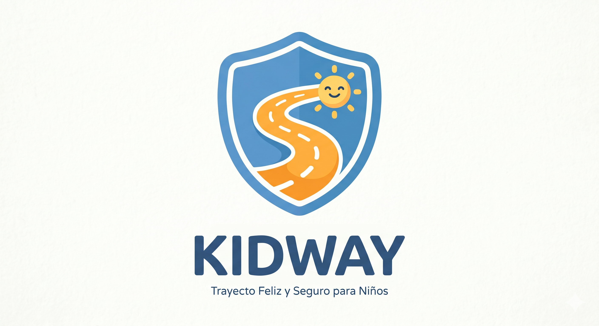
      </th>
      <th align="center">
        titiGO 
        
      </th>
      <th align="center">
        BatOnRoute 
        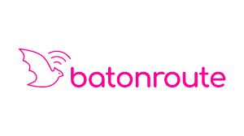
      </th>
      <th align="center">
        OnTrack School 
        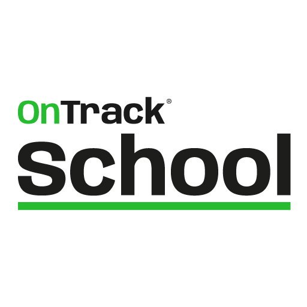
      </th>
    </tr>
  </thead>
  <tbody>
    <tr>
      <th colspan="5" align="left">Profile</th>
    </tr>
    <tr>
      <td><b>Overview</b></td>
      <td>Software that automates communication between drivers and parents through proximity alerts.</td>
      <td>Peruvian application focused on controlling school transportation through trip statuses and QR validation.</td>
      <td>Business-oriented software that manages school fleets with real-time tracking and alerts.</td>
      <td>Latin American system that allows users to monitor school routes and keep attendance control.</td>
    </tr>
    <tr>
      <td><b>Competitive advantage (What value does it offer customers?)</b></td>
      <td>It sends automatic alerts without requiring the driver to use the phone, preventing distractions and reducing waiting times.</td>
      <td>It controls student dismissal through QR codes for greater security.</td>
      <td>It is designed to manage many units and complex routes.</td>
      <td>It offers constant route tracking with an approach adapted to the region.</td>
    </tr>
    <tr>
      <th colspan="5" align="left">Marketing Profile</th>
    </tr>
    <tr>
      <td><b>Target market</b></td>
      <td>Independent drivers and small transportation companies in Lima.</td>
      <td>Schools and parents interested in controlling student attendance.</td>
      <td>Private school directors with higher purchasing power.</td>
      <td>Schools, transportation companies, and families.</td>
    </tr>
    <tr>
      <td><b>Marketing strategies</b></td>
      <td>Promotion through recommendations and parent associations (APAFA).</td>
      <td>Direct work with schools so they adopt the app as part of their system.</td>
      <td>Direct sales to institutions by showing the benefits of the service.</td>
      <td>Focus on school transportation safety and organization to attract users.</td>
    </tr>
    <tr>
      <th colspan="5" align="left">Product Profile</th>
    </tr>
    <tr>
      <td><b>Products & Services</b></td>
      <td>App for parents and drivers, real-time location, and web panel with attendance control.</td>
      <td>Tracking app with digital registration and QR validation.</td>
      <td>Web platform, apps, and tools to organize routes.</td>
      <td>Mobile apps, administrative panel, and route reports.</td>
    </tr>
    <tr>
      <td><b>Prices & Costs</b></td>
      <td>Plans according to the number of students and vehicles.</td>
      <td>Subscription plans according to the number of students.</td>
      <td>More expensive plans with institutional contracts.</td>
      <td>Subscription according to system features.</td>
    </tr>
    <tr>
      <td><b>Distribution channels (Web and/or Mobile)</b></td>
      <td>Mobile application and web platform.</td>
      <td>Mobile application and web platform.</td>
      <td>Mobile application and web platform.</td>
      <td>Mobile application and web platform.</td>
    </tr>
    <tr>
      <th colspan="5" align="left">SWOT Analysis</th>
    </tr>
    <tr>
      <td><b>Strengths</b></td>
      <td>Automation of proximity alerts with minimal driver interaction</td>
      <td>Strong focus on institutional security through physical QR codes</td>
      <td>Robust software for managing large school fleets</td>
      <td>Broad regional reach and consolidated monitoring</td>
    </tr>
    <tr>
      <td><b>Weaknesses</b></td>
      <td>New brand without large-scale institutional validation</td>
      <td>Requires constant manual interaction through QR scanning</td>
      <td>Complex and expensive for independent drivers</td>
      <td>Generic interface with limited adaptation to specific local contexts</td>
    </tr>
    <tr>
      <td><b>Opportunities</b></td>
      <td>High need to reduce distractions among urban drivers</td>
      <td>Growing interest in the digitalization of school safety</td>
      <td>Expansion into high-level private schools</td>
      <td>Growth of the school transportation market in LATAM</td>
    </tr>
    <tr>
      <td><b>Threats</b></td>
      <td>Resistance to technological change among older drivers</td>
      <td>QR reading problems under adverse conditions</td>
      <td>Cheaper competitors in the SME segment</td>
      <td>Difficulty adapting global solutions to local niches</td>
    </tr>
  </tbody>
</table>

### **2.1.2. Strategies and Tactics Against Competitors**

In a city like Metropolitan Lima, where traffic and transportation disorder are part of everyday life, at KidsOnWay we seek to differentiate ourselves by offering a simpler and more useful solution for parents and drivers compared to other applications in the sector. We do not only focus on real-time location, but also on improving safety and peace of mind throughout the entire route.

**Strengths**

* **Alert automation**

  Unlike current methods such as calls or WhatsApp messages, the application sends automatic notifications when the school vehicle is nearby or arrives at the destination. This allows the driver to avoid using the phone while driving and focus on the route.

* **Clear and reliable information for parents**

  Parents can view the route without needing to call or write messages. This gives them greater peace of mind and confidence during their children's transportation. In addition, they can access real-time information.

**Weaknesses**

* **Low market presence**

  Since we are a new startup, we still do not have a well-known brand. To build trust, pilot tests will be carried out with some users and their experiences will be shared to demonstrate that our solution is solid and worth adopting.

* **Internet dependency**

  In some areas of Lima, the signal may fail, which affects real-time updates. To reduce this problem, the app will be optimized to consume little data and store information when there is no signal.

**Opportunities**

* **Traffic and safety problems**

  Traffic in Lima makes travel times unpredictable. The app can help parents know when the school vehicle will arrive and reduce waiting time on the street.

* **Greater use of technology**

  More and more services are becoming digitalized, which allows solutions such as KidsOnWay to be better accepted by drivers and transportation companies.

**Threats**

* **Competition from other platforms**

  There are more developed applications in other countries. In response, KidsOnWay will focus on better adapting to the local reality, with accessible prices and solutions closer to the local context.

* **Resistance to change**

  Some drivers prefer to continue using traditional methods. For this reason, the application will be simple to use and will provide a clear explanation of its benefits.

## **2.2. Interviews**

### **2.2.1. Interview Design**

In order to obtain qualitative information that helps us validate our ideas and better understand users, three interviews were designed for each target group of the KidsOnWay platform. The questions were planned to obtain open-ended answers, avoiding yes-or-no responses as much as possible. In addition, they were organized into blocks to learn about users' profiles, technology habits, the problems they face, and what they expect from a school transportation service.

**Segment #1: Independent Drivers**

They introduce themselves, ask for consent to interview the participant, and begin:

1. Could you tell me your age, district of residence, and how many years you have been working as a school transportation driver?
2. What brand and model of vehicle do you currently drive? Is it owned by you or rented?
3. In your daily routine, what applications do you use most on your phone? Some examples are Waze, WhatsApp, or social networks.
4. How do you organize the order of your route every morning? Do you use any digital tool or rely on your memory?
5. Describe your experience driving during rush hour in Lima. How does traffic affect your mood and punctuality?
6. What bothers you the most when you arrive to pick up a student and they are not ready at the door?
7. How many times a day do you receive calls or messages from parents asking about your location while you are driving?
8. Have you ever had a dangerous distraction because you tried to answer your phone to notify someone that you were already near a home?
9. If an application automatically notified parents when you were 5 minutes away from their home without you doing anything, how would your workday change?
10. How important is it to you that the application is extremely simple to use, for example with large buttons and without distracting you from driving?
11. What economic or time-related benefit would you expect to obtain from using a platform like ours?

**Segment #2: Companies Dedicated to School Transportation**

They introduce themselves, ask for consent to interview the participant, and begin:

1. What is the name of the company, how many units are in your current fleet, and in which districts of Lima do you mainly operate?
2. What is your position within the company and what are your main daily logistical challenges?
3. What methods do you currently use to supervise whether your drivers are following the established routes and schedules?
4. How do you handle student attendance records? For example, is it manual, on paper, or do you have a digital system?
5. What is the highest operating cost you face, such as fuel, maintenance, or fines, and how do you try to reduce it?
6. What type of complaints do you receive most frequently from parents?
7. How valuable would it be for your company to have a centralized dashboard where you can see all your units on a single map in real time?
8. How do you think offering parents an application to monitor their children's bus would impact their trust?
9. To adopt a solution like KidsOnWay, what type of reports or statistical data would you need the platform to provide monthly?

### **2.2.2. Interview Recording**

**Segment 1: Independent Drivers**

<table width="100%">
  <thead>
    <tr>
      <th colspan="2" align="center"><h2>Interview #1</h2></th>
    </tr>
  </thead>
  <tbody>
    <tr>
      <th colspan="2" align="left">Interviewee Data</th>
    </tr>
    <tr>
      <td width="30%"><b>Full name</b></td>
      <td>Carlos Marcelo Mansilla Rivero</td>
    </tr>
    <tr>
      <td><b>Age</b></td>
      <td>24 years old</td>
    </tr>
    <tr>
      <td><b>Occupation</b></td>
      <td>School transportation driver</td>
    </tr>
    <tr>
      <td><b>District of residence</b></td>
      <td>Surquillo</td>
    </tr>
    <tr>
      <th colspan="2" align="left">Video Data</th>
    </tr>
    <tr>
      <td><b>Link</b></td>
      <td><a href="https://upcedupe-my.sharepoint.com/:v:/g/personal/u202416276_upc_edu_pe/IQA-DOpWocdhQrjURH4aFymkAf11kUHWX2Q4IBU9GKxnASg?nav=eyJyZWZlcnJhbEluZm8iOnsicmVmZXJyYWxBcHAiOiJPbmVEcml2ZUZvckJ1c2luZXNzIiwicmVmZXJyYWxBcHBQbGF0Zm9ybSI6IldlYiIsInJlZmVycmFsTW9kZSI6InZpZXciLCJyZWZlcnJhbFZpZXciOiJNeUZpbGVzTGlua0NvcHkifX0&e=LIyPrn">Interview</a></td>
    </tr>
    <tr>
      <td><b>Duration</b></td>
      <td>4:53 minutes</td>
    </tr>
    <tr>
      <td><b>Start timing</b></td>
      <td>0:00</td>
    </tr>
    <tr>
      <th colspan="2" align="center">Screenshot</th>
    </tr>
    <tr>
      <td colspan="2" align="center">
        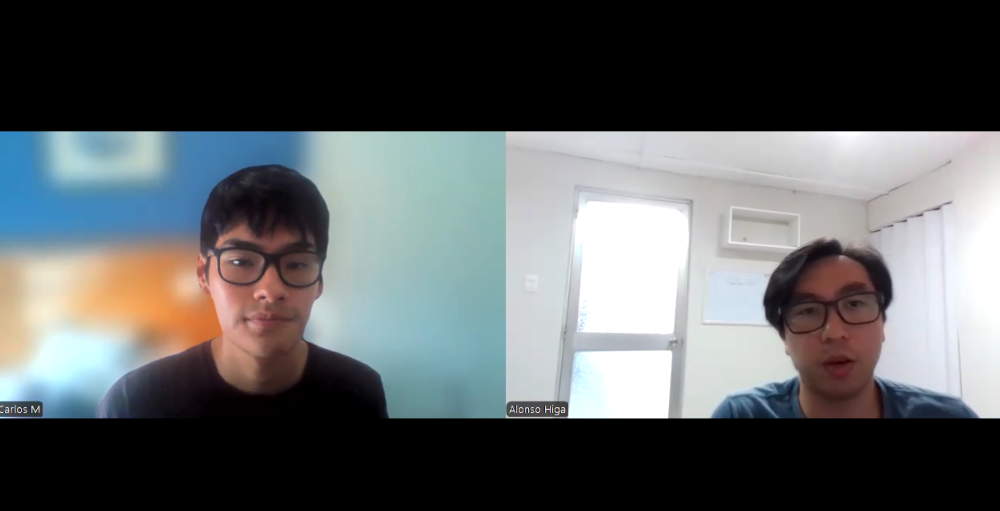
      </td>
    </tr>
  </tbody>
</table>

**Interview Summary**

Carlos is a school transportation driver with little experience in the field, so he still depends on tools such as Waze or Google Maps to organize his routes and avoid mistakes. In his daily routine, he focuses on picking up students, maintaining punctuality, and constantly coordinating with parents through WhatsApp. However, he faces several problems such as the lack of punctuality of some students, which affects his entire route, and the dense traffic in Lima, which increases his stress and makes it difficult to meet schedules. In addition, he is concerned about his image in front of parents because, as a new driver, he feels greater pressure to demonstrate responsibility and build trust.

Another critical point is communication with parents, since he constantly receives messages and calls asking about his location. This forces him to respond while driving, creating dangerous distractions. Given this situation, he highly values a solution that automates proximity alerts, which could help him focus on driving and reduce stress. He also emphasizes that the tool must be very simple to use, with minimal interaction, because he is behind the wheel. Finally, he expects such a solution to help him improve his reputation, optimize his time, and reduce costs such as fuel consumption caused by unnecessary waiting.

<table width="100%">
  <thead>
    <tr>
      <th colspan="2" align="center"><h2>Interview #2</h2></th>
    </tr>
  </thead>
  <tbody>
    <tr>
      <th colspan="2" align="left">Interviewee Data</th>
    </tr>
    <tr>
      <td width="30%"><b>Full name</b></td>
      <td>Mateo Nicolás de Mendiburu Aguilar</td>
    </tr>
    <tr>
      <td><b>Age</b></td>
      <td>20 years old</td>
    </tr>
    <tr>
      <td><b>Occupation</b></td>
      <td>School transportation driver</td>
    </tr>
    <tr>
      <td><b>District of residence</b></td>
      <td>Santiago de Surco</td>
    </tr>
    <tr>
      <th colspan="2" align="left">Video Data</th>
    </tr>
    <tr>
      <td><b>Link</b></td>
      <td><a href="https://upcedupe-my.sharepoint.com/:v:/g/personal/u202416276_upc_edu_pe/IQA-DOpWocdhQrjURH4aFymkAf11kUHWX2Q4IBU9GKxnASg?nav=eyJyZWZlcnJhbEluZm8iOnsicmVmZXJyYWxBcHAiOiJPbmVEcml2ZUZvckJ1c2luZXNzIiwicmVmZXJyYWxBcHBQbGF0Zm9ybSI6IldlYiIsInJlZmVycmFsTW9kZSI6InZpZXciLCJyZWZlcnJhbFZpZXciOiJNeUZpbGVzTGlua0NvcHkifX0&e=LIyPrn" target="_blank">Interview</a></td>
    </tr>
    <tr>
      <td><b>Duration</b></td>
      <td>6.20 minutes</td>
    </tr>
    <tr>
      <td><b>Start timing</b></td>
      <td>4:54</td>
    </tr>
    <tr>
      <th colspan="2" align="center">Screenshot</th>
    </tr>
    <tr>
      <td colspan="2" align="center">
        
      </td>
    </tr>
  </tbody>
</table>

**Interview Summary**

Mateo is a school transportation driver with approximately two years of experience who mainly operates in districts such as Surco. In his daily routine, he combines the use of digital tools such as Google Maps with his own route knowledge, also using a calendar to organize his trips. This mix of technological support and experience allows him to optimize his work, although he still depends on environmental conditions, especially rush-hour traffic, which represents one of his greatest challenges and directly affects his punctuality and stress level.

During his routes, one of the main problems he faces is the lack of punctuality of some students when parents do not notify him in advance, which generates accumulated delays and disorder throughout the route. Added to this is the constant communication with parents, who frequently contact him not only to ask about his location, but also because of unforeseen situations such as forgotten items. This situation forces him to divide his attention between driving, answering messages, and supervising the students inside the vehicle, creating an overload that affects both his performance and safety during the trip.

In this context, Mateo values very positively a solution that automates communication with parents, especially through proximity alerts, since it would significantly reduce interruptions and allow him to focus on driving. In addition, he highlights the importance of the application being simple, visual, and easy to use, with large elements that do not cause distraction. Finally, he expects a tool like KidsOnWay to help him optimize his time, reduce fuel consumption, and make his work more efficient, while also improving the experience for parents and students and making his service stronger.

<table width="100%">
  <thead>
    <tr>
      <th colspan="2" align="center"><h2>Interview #3</h2></th>
    </tr>
  </thead>
  <tbody>
    <tr>
      <th colspan="2" align="left">Interviewee Data</th>
    </tr>
    <tr>
      <td width="30%"><b>Full name</b></td>
      <td>Joao David Jiménez Abarca</td>
    </tr>
    <tr>
      <td><b>Age</b></td>
      <td>36 years old</td>
    </tr>
    <tr>
      <td><b>Occupation</b></td>
      <td>School transportation driver</td>
    </tr>
    <tr>
      <td><b>District of residence</b></td>
      <td>Comas</td>
    </tr>
    <tr>
      <th colspan="2" align="left">Video Data</th>
    </tr>
    <tr>
      <td><b>Link</b></td>
      <td><a href="https://upcedupe-my.sharepoint.com/:v:/g/personal/u202416276_upc_edu_pe/IQA-DOpWocdhQrjURH4aFymkAf11kUHWX2Q4IBU9GKxnASg?nav=eyJyZWZlcnJhbEluZm8iOnsicmVmZXJyYWxBcHAiOiJPbmVEcml2ZUZvckJ1c2luZXNzIiwicmVmZXJyYWxBcHBQbGF0Zm9ybSI6IldlYiIsInJlZmVycmFsTW9kZSI6InZpZXciLCJyZWZlcnJhbFZpZXciOiJNeUZpbGVzTGlua0NvcHkifX0&e=LIyPrn" target="_blank">Interview</a></td>
    </tr>
    <tr>
      <td><b>Duration</b></td>
      <td>4.33 minutes</td>
    </tr>
    <tr>
      <td><b>Start timing</b></td>
      <td>11:14</td>
    </tr>
    <tr>
      <th colspan="2" align="center">Screenshot</th>
    </tr>
    <tr>
      <td colspan="2" align="center">
        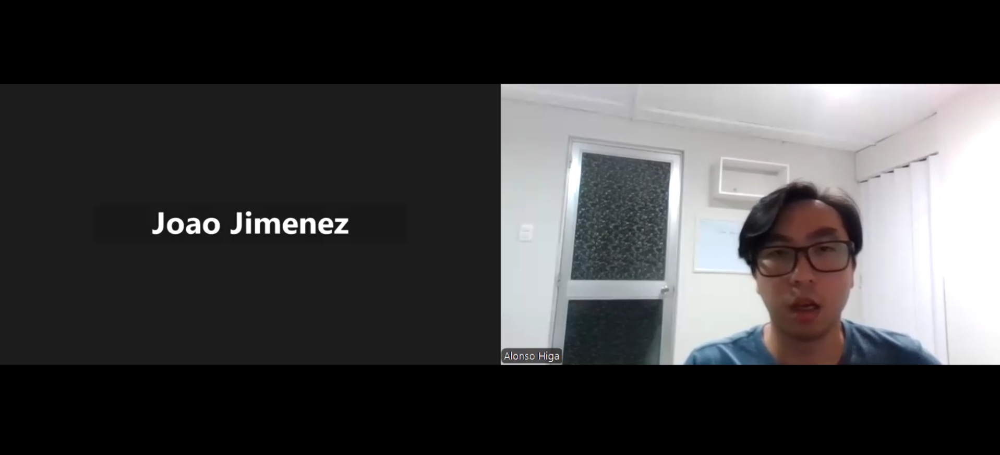
      </td>
    </tr>
  </tbody>
</table>

**Interview Summary**

Joao is a school transportation driver with several years of experience, which allows him to organize his routes mainly from memory, occasionally relying on tools such as Waze to avoid traffic. His daily routine consists of picking up students while respecting established schedules, although traffic conditions in Lima often cause him stress and delays. Unlike some newer drivers, he handles the service dynamics related to punctuality better, but he is still affected when students are not ready on time, since this can alter his planning, even though he tries to adapt to the situation.

One of the main challenges he faces is constant communication with parents, receiving several calls a day asking about his location. This puts him in a difficult situation because, although he understands parents' concern, answering while driving represents a risk for him and the students. For this reason, he considers that a solution that automates alerts would be very helpful, since it would reduce interruptions and allow him to focus on driving. He also highlights the importance of the application being simple and accessible for all types of drivers. Finally, he mentions that he expects such a tool to help him save time on his routes, avoid delays, and improve his reputation, even allowing him to take on more services.

**Segment 2: Companies Dedicated to School Transportation**

<table width="100%">
  <thead>
    <tr>
      <th colspan="2" align="center"><h2>Interview #1</h2></th>
    </tr>
  </thead>
  <tbody>
    <tr>
      <th colspan="2" align="left">Interviewee Data</th>
    </tr>
    <tr>
      <td width="30%"><b>Full name</b></td>
      <td>Dery Estrella Perez</td>
    </tr>
    <tr>
      <td><b>Age</b></td>
      <td>27 years old</td>
    </tr>
    <tr>
      <td><b>Occupation</b></td>
      <td>Owner and driver of a small family business</td>
    </tr>
    <tr>
      <td><b>District of residence</b></td>
      <td>Los Olivos</td>
    </tr>
    <tr>
      <th colspan="2" align="left">Video Data</th>
    </tr>
    <tr>
      <td><b>Link</b></td>
      <td><a href="[(link)](https://upcedupe-my.sharepoint.com/:v:/g/personal/u202416276_upc_edu_pe/IQA-DOpWocdhQrjURH4aFymkAf11kUHWX2Q4IBU9GKxnASg?nav=eyJyZWZlcnJhbEluZm8iOnsicmVmZXJyYWxBcHAiOiJPbmVEcml2ZUZvckJ1c2luZXNzIiwicmVmZXJyYWxBcHBQbGF0Zm9ybSI6IldlYiIsInJlZmVycmFsTW9kZSI6InZpZXciLCJyZWZlcnJhbFZpZXciOiJNeUZpbGVzTGlua0NvcHkifX0&e=LIyPrn)" target="_blank">Interview</a></td>
    </tr>
    <tr>
      <td><b>Duration</b></td>
      <td>4:09 minutes</td>
    </tr>
    <tr>
      <td><b>Start timing</b></td>
      <td>15:47</td>
    </tr>
    <tr>
      <th colspan="2" align="center">Screenshot</th>
    </tr>
    <tr>
      <td colspan="2" align="center">
        
      </td>
    </tr>
  </tbody>
</table>

**Interview Summary**

Dery Estrella Perez is the owner and driver of a small family school transportation company with a fleet of five units, operating mainly in Los Olivos and San Martín de Porres. In her daily routine, she faces challenges such as avoiding areas with constant roadwork and maintaining punctuality when picking up and dropping off students. Since it is a small team, coordination is quite direct, relying on calls between drivers to report delays or route problems.

Unit supervision is completely manual and depends on constant communication among the team. Likewise, attendance records are kept in individual notebooks by each driver, which creates a poorly centralized system that is prone to errors or loss of information. Although this way of working is functional, it limits the ability to have a general real-time view of the service.

Regarding costs, the main problems are related to fuel consumption and fines, which they try to reduce by looking for alternative routes to avoid traffic. From the customer service side, the main point of tension is parents' uncertainty, since they frequently call when they perceive delays, generating additional pressure on drivers while they are behind the wheel.

Dery sees high value in having a more organized system, such as a centralized dashboard that allows her to see the location of her units and react quickly to unforeseen events, such as mechanical failures. She also believes that an app for parents would provide peace of mind and improve the perceived safety of the service. She would expect our solution to include clear reports on route incidents and monthly attendance, helping her maintain better operational and administrative control.

<table width="100%">
  <thead>
    <tr>
      <th colspan="2" align="center"><h2>Interview #2</h2></th>
    </tr>
  </thead>
  <tbody>
    <tr>
      <th colspan="2" align="left">Interviewee Data</th>
    </tr>
    <tr>
      <td width="30%"><b>Full name</b></td>
      <td>Cheyla Paredes Mattos</td>
    </tr>
    <tr>
      <td><b>Age</b></td>
      <td>27 years old</td>
    </tr>
    <tr>
      <td><b>Occupation</b></td>
      <td>School transportation company administrator</td>
    </tr>
    <tr>
      <td><b>District of residence</b></td>
      <td>Ate</td>
    </tr>
    <tr>
      <th colspan="2" align="left">Video Data</th>
    </tr>
    <tr>
      <td><b>Link</b></td>
      <td><a href="[(link)](https://upcedupe-my.sharepoint.com/:v:/g/personal/u202416276_upc_edu_pe/IQA-DOpWocdhQrjURH4aFymkAf11kUHWX2Q4IBU9GKxnASg?nav=eyJyZWZlcnJhbEluZm8iOnsicmVmZXJyYWxBcHAiOiJPbmVEcml2ZUZvckJ1c2luZXNzIiwicmVmZXJyYWxBcHBQbGF0Zm9ybSI6IldlYiIsInJlZmVycmFsTW9kZSI6InZpZXciLCJyZWZlcnJhbFZpZXciOiJNeUZpbGVzTGlua0NvcHkifX0&e=LIyPrn)" target="_blank">Interview</a></td>
    </tr>
    <tr>
      <td><b>Duration</b></td>
      <td>3.26 minutes</td>
    </tr>
    <tr>
      <td><b>Start timing</b></td>
      <td>19:56</td>
    </tr>
    <tr>
      <th colspan="2" align="center">Screenshot</th>
    </tr>
    <tr>
      <td colspan="2" align="center">
        
      </td>
    </tr>
  </tbody>
</table>

**Interview Summary**

Cheyla Paredes Mattos manages a school transportation company in Santa Clara with a fleet of 15 minibuses that operate mainly in La Molina and Ate. In her daily routine, she faces challenges such as traffic congestion, especially on Javier Prado Avenue, and the need to react quickly to last-minute changes due to absences. Currently, route supervision is manual and scattered, since it depends on a basic GPS and WhatsApp reports sent by drivers. Attendance control is also mixed, combining paper records with photos sent as digital backup.

At the operational level, one of her highest costs comes from corrective maintenance due to road conditions, which she tries to reduce through preventive inspections. In terms of service, the main complaints from parents are related to lack of synchronization in schedules, either because of early arrivals or delays without prior notice, which affects the perceived quality of the service.

Cheyla considers that a centralized dashboard would be key to improving her management, since it would allow her to monitor all units in real time without depending on multiple communication channels. In addition, she sees value in offering parents an application as a competitive differentiator that projects greater safety and modernity. To adopt a solution like KidsOnWay, she would expect clear and useful reports, such as driver punctuality indicators and estimated fuel consumption per route.

<table width="100%">
  <thead>
    <tr>
      <th colspan="2" align="center"><h2>Interview #3</h2></th>
    </tr>
  </thead>
  <tbody>
    <tr>
      <th colspan="2" align="left">Interviewee Data</th>
    </tr>
    <tr>
      <td width="30%"><b>Full name</b></td>
      <td>Luis Fernando Becerra Ninahuanca</td>
    </tr>
    <tr>
      <td><b>Age</b></td>
      <td>25 years old</td>
    </tr>
    <tr>
      <td><b>Occupation</b></td>
      <td>School route operations coordinator</td>
    </tr>
    <tr>
      <td><b>District of residence</b></td>
      <td>Santiago de Surco</td>
    </tr>
    <tr>
      <th colspan="2" align="left">Video Data</th>
    </tr>
    <tr>
      <td><b>Link</b></td>
      <td><a href="https://upcedupe-my.sharepoint.com/:v:/g/personal/u202416276_upc_edu_pe/IQA-DOpWocdhQrjURH4aFymkAf11kUHWX2Q4IBU9GKxnASg?nav=eyJyZWZlcnJhbEluZm8iOnsicmVmZXJyYWxBcHAiOiJPbmVEcml2ZUZvckJ1c2luZXNzIiwicmVmZXJyYWxBcHBQbGF0Zm9ybSI6IldlYiIsInJlZmVycmFsTW9kZSI6InZpZXciLCJyZWZlcnJhbFZpZXciOiJNeUZpbGVzTGlua0NvcHkifX0&e=LIyPrn" target="_blank">Interview</a></td>
    </tr>
    <tr>
      <td><b>Duration</b></td>
      <td>3.46 minutes</td>
    </tr>
    <tr>
      <td><b>Start timing</b></td>
      <td>23:22</td>
    </tr>
    <tr>
      <th colspan="2" align="center">Screenshot</th>
    </tr>
    <tr>
      <td colspan="2" align="center">
        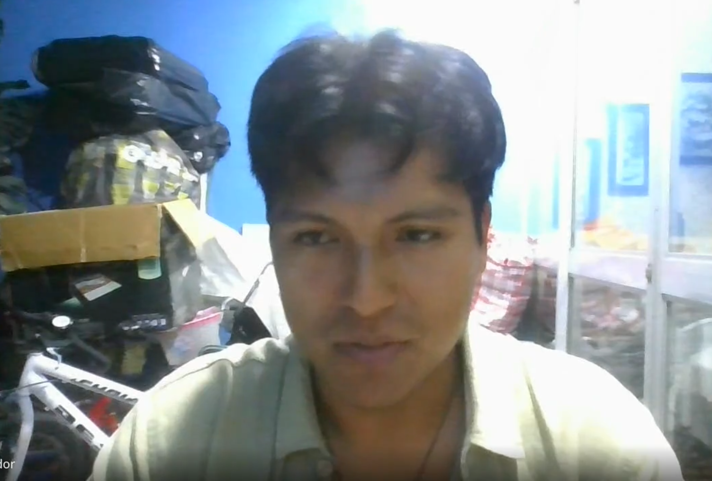
      </td>
    </tr>
  </tbody>
</table>

**Interview Summary**

Luis Becerra Ninahuanca, 25 years old, is an operations coordinator at Rutas Escolares S.A., a company with a fleet of 10 minivans operating in districts such as Surco, San Borja, and the Monterrico area. In his daily routine, he faces problems such as unpredictable traffic and idle time when students are not ready, which ends up affecting the entire route planning. His role requires coordinating multiple units at the same time, increasing operational complexity.

Currently, the company uses a basic GPS that only provides a general location, while real supervision depends on WhatsApp groups where drivers manually report their progress. This process is inefficient and also encourages distraction while driving. Attendance control is also manual, since it is recorded on physical lists that are reviewed days later, limiting the ability to react to any incident.

At the operational level, the highest cost is fuel, which they try to reduce without much success due to the lack of tools that optimize routes in real time. From the customers' side, the main problem is the lack of information, since parents often worry and call even after minimal delays, generating additional pressure on the team.

Luis believes that having a centralized dashboard could be key to improving management, as it would allow him to monitor all units in real time without depending on constant calls. Likewise, he sees great value in offering an app to parents, since it would increase trust and reduce uncertainty during trips. To use KidsOnWay, he would expect clear reports on punctuality, driving behavior, and digital attendance, helping him optimize both operations and administrative processes.

### **2.2.3. Interview Analysis**

<table width="100%">
  <thead>
    <tr>
      <th colspan="4" align="center">
        <h2>Segment 1: Independent Drivers (Objective Analysis)</h2>
      </th>
    </tr>
    <tr>
      <th align="left" width="30%">Characteristic</th>
      <th align="center" width="15%">Frequency in interviews</th>
      <th align="center" width="10%">Percentage</th>
      <th align="left" width="45%">Source in interviews</th>
    </tr>
  </thead>

  <tbody>
    <tr>
      <td><b>Intensive use of messaging applications (WhatsApp) for daily management</b></td>
      <td align="center">Mentioned by all 3</td>
      <td align="center">100%</td>
      <td>
        <b>Joao:</b> "I use WhatsApp a lot to communicate with parents" 
        <b>Mateo:</b> "what I use the most in my daily life may be... WhatsApp" 
        <b>Marcelo:</b> "WhatsApp for parent groups"
      </td>
    </tr>
    <tr>
      <td><b>Traffic generates high stress levels, affecting their workday and mood</b></td>
      <td align="center">Mentioned by all 3</td>
      <td align="center">100%</td>
      <td>
        <b>Joao:</b> "it is very complicated... it sometimes causes me stress" 
        <b>Mateo:</b> "the schedule is very intense... there are vans that cut in" 
        <b>Marcelo:</b> "driving during rush hour is very tedious... it makes me tense"
      </td>
    </tr>
    <tr>
      <td><b>Frustration and domino effect on the route due to student delays during pickup</b></td>
      <td align="center">Mentioned by all 3</td>
      <td align="center">100%</td>
      <td>
        <b>Joao:</b> "it can affect the route, sometimes it does not" 
        <b>Mateo:</b> "it delays all the other passengers... my route gets longer" 
        <b>Marcelo:</b> "it ruins my whole route and then I have to apologize"
      </td>
    </tr>
    <tr>
      <td><b>Pre-plans the route in advance using calendars or digital tools</b></td>
      <td align="center">Mentioned by 2/3</td>
      <td align="center">66.7%</td>
      <td>
        <b>Mateo:</b> "I organize my route with a calendar... and also with Google Maps" 
        <b>Marcelo:</b> "I use Waze to mark the points the night before"
      </td>
    </tr>
    <tr>
      <td><b>Primarily relies on memory to structure the pickup order</b></td>
      <td align="center">Mentioned by 1/3</td>
      <td align="center">33.3%</td>
      <td>
        <b>Joao:</b> "I mostly do it from memory because I know my students"
      </td>
    </tr>
    <tr>
      <td><b>They explicitly seek to improve their reputation and professionalism in front of parents</b></td>
      <td align="center">Mentioned by 2/3</td>
      <td align="center">66.7%</td>
      <td>
        <b>Joao:</b> "improve my reputation with parents" 
        <b>Marcelo:</b> "it would give me a lot of authority... I would like to gain reputation"
      </td>
    </tr>
    <tr>
      <td><b>They prioritize direct economic savings, such as gasoline and battery, thanks to the app</b></td>
      <td align="center">Mentioned by 2/3</td>
      <td align="center">66.7%</td>
      <td>
        <b>Mateo:</b> "economic savings through fuel... I use less electricity" 
        <b>Marcelo:</b> "save gasoline by not having to drive around or stay stopped"
      </td>
    </tr>
    <tr>
      <td><b>They have experienced dangerous maneuvers, such as turns or sudden braking, because of phone use</b></td>
      <td align="center">Mentioned by 2/3</td>
      <td align="center">66.7%</td>
      <td>
        <b>Mateo:</b> "a van came in and cut me off, and I had to make an unexpected turn" 
        <b>Marcelo:</b> "I almost braked suddenly because the car ahead stopped out of nowhere"
      </td>
    </tr>
    <tr>
      <td><b>They receive route interruptions due to students' forgotten items</b></td>
      <td align="center">Mentioned by 1/3</td>
      <td align="center">33.3%</td>
      <td>
        <b>Mateo:</b> "one of the kids forgot their lunchbox or something else... and they are calling me"
      </td>
    </tr>
    <tr>
      <td><b>Positive validation of automatic alerts to improve concentration</b></td>
      <td align="center">Mentioned by all 3</td>
      <td align="center">100%</td>
      <td>
        <b>Joao:</b> "it would allow me to concentrate more on driving" 
        <b>Mateo:</b> "I would not have to look at two things at once" 
        <b>Marcelo:</b> "they would stop texting me so much and I would only focus on driving well"
      </td>
    </tr>
  </tbody>
</table>

 

<table width="100%">
  <thead>
    <tr>
      <th colspan="4" align="center">
        <h2>Segment 1: Independent Drivers (Subjective Analysis)</h2>
      </th>
    </tr>
    <tr>
      <th align="left" width="30%">Characteristic</th>
      <th align="center" width="15%">Frequency in interviews</th>
      <th align="center" width="10%">Percentage</th>
      <th align="left" width="45%">Source in interviews</th>
    </tr>
  </thead>
  <tbody>
    <tr>
      <td><b>They feel constant pressure to respond to parents and build trust</b></td>
      <td align="center">Mentioned by all 3</td>
      <td align="center">100%</td>
      <td>
        <b>Joao:</b> "I know that parents... must be worried" 
        <b>Mateo:</b> "parents who already have the established time call me and ask where I am" 
        <b>Marcelo:</b> "It is extra pressure because I want to answer so they trust me"
      </td>
    </tr>
    <tr>
      <td><b>They have difficulty driving and answering messages at the same time</b></td>
      <td align="center">Mentioned by all 3</td>
      <td align="center">100%</td>
      <td>
        <b>Joao:</b> "looking at the phone while driving... is very risky for me and for the students" 
        <b>Mateo:</b> "I have to do both things at the same time... there are several things I am seeing at the same moment and I cannot concentrate" 
        <b>Marcelo:</b> "because I wanted to provide good service, I was putting myself at risk"
      </td>
    </tr>
    <tr>
      <td><b>Student delays affect the entire route and generate complaints from other parents</b></td>
      <td align="center">Mentioned by 2/3</td>
      <td align="center">66.7%</td>
      <td>
        <b>Mateo:</b> "it delays all the other passengers... the mothers start texting me" 
        <b>Marcelo:</b> "what hurts me the most is that it makes me look bad with the next parent"
      </td>
    </tr>
    <tr>
      <td><b>They seek to be seen as reliable and organized drivers by parents</b></td>
      <td align="center">Mentioned by 2/3</td>
      <td align="center">66.7%</td>
      <td>
        <b>Joao:</b> "improve my reputation with parents" 
        <b>Marcelo:</b> "that they recommend me because I am the school transport driver who has everything under control"
      </td>
    </tr>
    <tr>
      <td><b>They perceive that using technology improves their image in front of parents</b></td>
      <td align="center">Mentioned by 1/3</td>
      <td align="center">33.3%</td>
      <td>
        <b>Marcelo:</b> "It would give me a lot of authority and professionalism. Parents would see that I am technological and also organized"
      </td>
    </tr>
    <tr>
      <td><b>Some drivers feel insecure because of their limited experience in the field</b></td>
      <td align="center">Mentioned by 1/3</td>
      <td align="center">33.3%</td>
      <td>
        <b>Marcelo:</b> "I worry that they think I am not punctual because I am young"
      </td>
    </tr>
    <tr>
      <td><b>There is a difference in technology use depending on the driver's age or experience</b></td>
      <td align="center">Mentioned by 1/3</td>
      <td align="center">33.3%</td>
      <td>
        <b>Joao:</b> "there are other colleagues... older than me who may have difficulty seeing"
      </td>
    </tr>
  </tbody>
</table>

<table width="100%">
  <thead>
    <tr>
      <th colspan="4" align="center"><h2>Segment 2: School Transportation Companies (Objective Analysis)</h2></th>
    </tr>
    <tr>
      <th align="left" width="30%">Characteristic</th>
      <th align="center" width="15%">Frequency in interviews</th>
      <th align="center" width="10%">Percentage</th>
      <th align="left" width="45%">Source in interviews</th>
    </tr>
  </thead>
  <tbody>
    <tr>
      <td><b>Strictly manual attendance record management, using paper or notebooks</b></td>
      <td align="center">Mentioned by all 3</td>
      <td align="center">100%</td>
      <td>
        <b>Cheyla:</b> "The assistant marks a paper list and then sends a photo" 
        <b>Dery:</b> "It is manual... each driver has their notebook" 
        <b>Luis:</b> "Ours is manual, on paper... each driver carries a list and marks it with a pen"
      </td>
    </tr>
    <tr>
      <td><b>Operational supervision depends on direct communication through WhatsApp or calls</b></td>
      <td align="center">Mentioned by all 3</td>
      <td align="center">100%</td>
      <td>
        <b>Cheyla:</b> "we depend on drivers reporting through WhatsApp when they arrive" 
        <b>Dery:</b> "we supervise each other through constant phone calls" 
        <b>Luis:</b> "real supervision is through WhatsApp... sending a message every time they reach a point"
      </td>
    </tr>
    <tr>
      <td><b>Fuel expense is identified as the main operating cost to reduce</b></td>
      <td align="center">Mentioned by 2/3</td>
      <td align="center">66.7%</td>
      <td>
        <b>Dery:</b> "Fines and fuel... looking for alternative routes to avoid burning gasoline" 
        <b>Luis:</b> "the highest cost is fuel, which is the strongest expense we have"
      </td>
    </tr>
    <tr>
      <td><b>They use basic GPS required by third parties as secondary monitoring</b></td>
      <td align="center">Mentioned by 2/3</td>
      <td align="center">66.7%</td>
      <td>
        <b>Cheyla:</b> "we use the GPS required by the insurance company"  
        <b>Luis:</b> "we use basic GPS to see the general location, but real supervision is through WhatsApp"
      </td>
    </tr>
    <tr>
      <td><b>They demand automatic attendance reports to speed up payment collection and billing</b></td>
      <td align="center">Mentioned by 2/3</td>
      <td align="center">66.7%</td>
      <td>
        <b>Dery:</b> "monthly attendance to charge parents without errors" 
        <b>Luis:</b> "the digital attendance summary for billing"
      </td>
    </tr>
    <tr>
      <td><b>They require fleet management metrics, such as punctuality, speed, and incidents</b></td>
      <td align="center">Mentioned by all 3</td>
      <td align="center">100%</td>
      <td>
        <b>Cheyla:</b> "I would need a ranking of drivers based on punctuality" 
        <b>Dery:</b> "a report of incidents on the route" 
        <b>Luis:</b> "a punctuality report... and one about driver speed"
      </td>
    </tr>
  </tbody>
</table>

<table width="100%">
  <thead>
    <tr>
      <th colspan="4" align="center"><h2>Segment 2: School Transportation Companies (Subjective Analysis)</h2></th>
    </tr>
    <tr>
      <th align="left" width="30%">Characteristic</th>
      <th align="center" width="15%">Frequency in interviews</th>
      <th align="center" width="10%">Percentage</th>
      <th align="left" width="45%">Source in interviews</th>
    </tr>
  </thead>
  <tbody>
    <tr>
      <td><b>They perceive parents' anxiety due to lack of information as their biggest source of complaints</b></td>
      <td align="center">Mentioned by all 3</td>
      <td align="center">100%</td>
      <td>
        <b>Cheyla:</b> "they complain when the bus passes too early... or when there are delays and they are not notified" 
        <b>Dery:</b> "Uncertainty. Parents become desperate if they do not see their children arrive on time" 
        <b>Luis:</b> "The lack of information. Parents call anxiously if the bus is delayed by 5 minutes"
      </td>
    </tr>
    <tr>
      <td><b>They feel they lose time by triangulating communication between drivers and parents</b></td>
      <td align="center">Mentioned by all 3</td>
      <td align="center">100%</td>
      <td>
        <b>Cheyla:</b> "without having to monitor individual chats" 
        <b>Dery:</b> "they start calling us while we are driving" 
        <b>Luis:</b> "It would save me many hours of calling each driver by phone to know where they are"
      </td>
    </tr>
    <tr>
      <td><b>They consider that an app will raise the status, safety, and trust of their company</b></td>
      <td align="center">Mentioned by all 3</td>
      <td align="center">100%</td>
      <td>
        <b>Cheyla:</b> "It would greatly improve the image... they would feel that we are a modern and safe company" 
        <b>Dery:</b> "It would give them a lot of security in this area... it would be a great relief" 
        <b>Luis:</b> "It would be a total change... they would feel they have control and safety"
      </td>
    </tr>
    <tr>
      <td><b>They feel frustrated by the inefficiency caused by unpunctual students</b></td>
      <td align="center">Mentioned by 2/3</td>
      <td align="center">66.7%</td>
      <td>
        <b>Cheyla:</b> "coordinate last-minute changes when a student is not going to attend" 
        <b>Luis:</b> "the minutes we lose waiting for students who are not ready at the door"
      </td>
    </tr>
    <tr>
      <td><b>They see the dashboard as a critical tool for support during emergencies or crises</b></td>
      <td align="center">Mentioned by 2/3</td>
      <td align="center">66.7%</td>
      <td>
        <b>Dery:</b> "If a unit breaks down, we need to see who is nearby to pick up the children" 
        <b>Luis:</b> "know where they are and why route they are stopped on"
      </td>
    </tr>
  </tbody>
</table>

In conclusion, this analysis of interviews from both segments reveals that the central problem of school transportation is not driving itself, but the inefficiency, danger, and stress generated by manual communication. Parents' anxiety due to lack of visibility forces drivers to become distracted while driving and forces administrators to spend hours acting as intermediaries. These findings validate the need to develop KidOnWay. The interviews confirm that the implementation of centralized GPS monitoring and an automatic proximity notification system are the fundamental software requirements to eliminate family uncertainty and optimize the logistics of operating companies.

## **2.3. Needfinding**

### **2.3.1. User Persona**

The User Personas have been built as representations of the main types of KidsOnWay users. These profiles are directly based on the findings obtained during the interviews, where recurring problems were identified, such as stress, difficulty managing several tasks at the same time, and the risks of using a phone while driving or coordinating a route.

In addition, the competitor analysis was considered, which made it possible to understand that users are looking for simpler and more automated solutions than the current options in the market. In this context, the need was identified for a tool that reduces manual intervention and facilitates use in real situations.

**Segment 1: Independent Drivers**

This archetype represents drivers who own their own vehicles and operate independently. Their main motivation is to provide a safe service and maintain a good reputation, but they are constantly frustrated by the stress of Lima traffic and phone interruptions from parents. They value technology as long as it offers automatic and extremely simple tools that allow them to keep their full attention on driving.

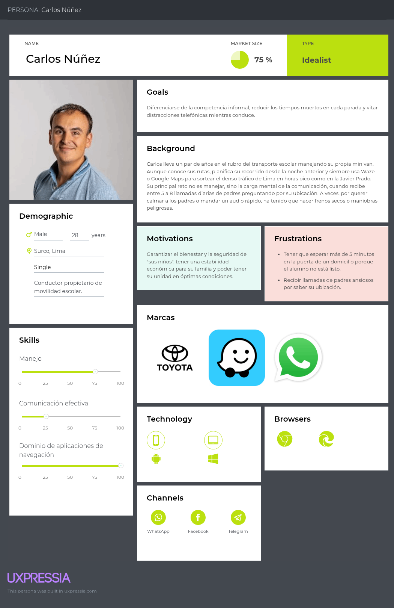

**Segment 2: School Transportation Companies**

This archetype represents owners and administrators of small and medium-sized school transportation companies, whose main motivation is to optimize operational efficiency and project an image of safety and trust toward parents. However, they are constantly limited by the lack of real-time visibility of their fleet and by the disorder involved in coordinating everything manually through WhatsApp. For this reason, they value technological solutions that allow them to centralize the monitoring of their units and automate communication, reducing the operational burden and avoiding dependence on calls and messages, so they can focus on improving service and strengthening the growth and prestige of their business.

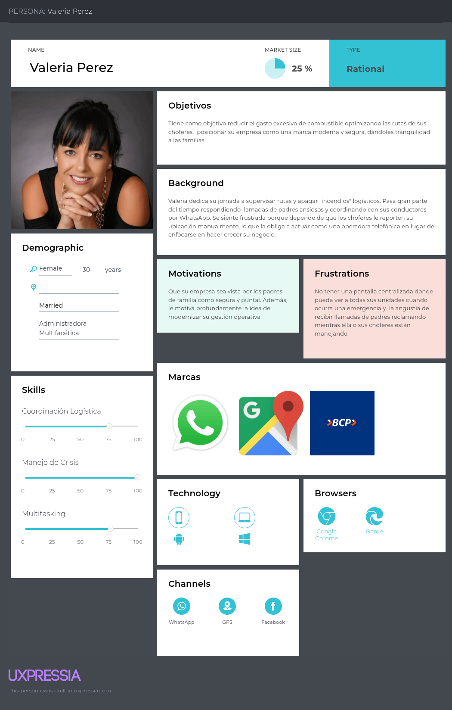

### **2.3.2. User Task Matrix**

This section presents the User Task Matrix, a tool that brings together the main activities our two user archetypes perform in their daily routine to meet their logistical and safety objectives, regardless of whether they use a digital platform or not. For this analysis, we considered our two key segments represented by Carlos Nuñez, who represents the independent driver, and Valeria Perez, who is a multifunctional administrator.

The tasks have been evaluated according to two variables: frequency, meaning how often the task is performed, which can be High, Medium, or Low; and importance, meaning how critical the task is to the success of their work, which can also be measured as High, Medium, or Low.

<table width="100%">
  <thead>
    <tr>
      <th align="left" width="40%">User Tasks</th>
      <th align="center" width="30%">Segment 1: Carlos (Independent Driver)</th>
      <th align="center" width="30%">Segment 2: Valeria (Fleet Administrator)</th>
    </tr>
  </thead>
  <tbody>
    <tr>
      <td><b>Navigate through traffic and follow the established route</b></td>
      <td align="center">High</td>
      <td align="center">Low</td>
    </tr>
    <tr>
      <td><b>Record student attendance when boarding or getting off</b></td>
      <td align="center">High</td>
      <td align="center">Never</td>
    </tr>
    <tr>
      <td><b>Monitor the status and location of multiple units</b></td>
      <td align="center">Never</td>
      <td align="center">High</td>
    </tr>
    <tr>
      <td><b>Send proximity or delay notifications to parents</b></td>
      <td align="center">High</td>
      <td align="center">High</td>
    </tr>
    <tr>
      <td><b>Answer calls from anxious parents asking about location</b></td>
      <td align="center">High</td>
      <td align="center">High</td>
    </tr>
    <tr>
      <td><b>Coordinate route changes and reassign vehicles due to breakdowns</b></td>
      <td align="center">Low</td>
      <td align="center">High</td>
    </tr>
    <tr>
      <td><b>Prepare attendance reports for month-end billing</b></td>
      <td align="center">Low</i></td>
      <td align="center">High</i></td>
    </tr>
  </tbody>
</table>

 

The User Task Matrix analysis shows a clear difference in the operational needs of both segments, which justifies the design of differentiated interfaces within the platform. On one hand, Segment 1 needs a mobile interface focused on execution, prioritizing navigation with as little interaction as possible and fast attendance registration, since their tasks are performed while the vehicle is moving and their attention must remain on driving. On the other hand, Segment 2 requires a broader view of the system through a centralized dashboard or panel that facilitates the monitoring of multiple units and the efficient management of incidents.

There is a clear difference, but it also reveals a key common point: communication with parents. Both segments present a high frequency in sending information and responding to questions, which creates a significant operational load. This coincidence confirms that the automation of proximity notifications directly addresses the main shared problem, since it reduces the need for calls and messages. In this way, the driver can focus on driving without distractions, and the administrator no longer depends on manual coordination, thus fulfilling the central objective of the solution.

### **2.3.3. User Journey Mapping**

**Segment 1: Independent Drivers**

Through User Journey Mapping, we will observe the operational journey of our archetype, Carlos Núñez, during his morning student pickup routine. The objective of this map is to show the high levels of stress and road insecurity experienced by the driver when trying to navigate Lima traffic and manually communicate with parents at the same time.

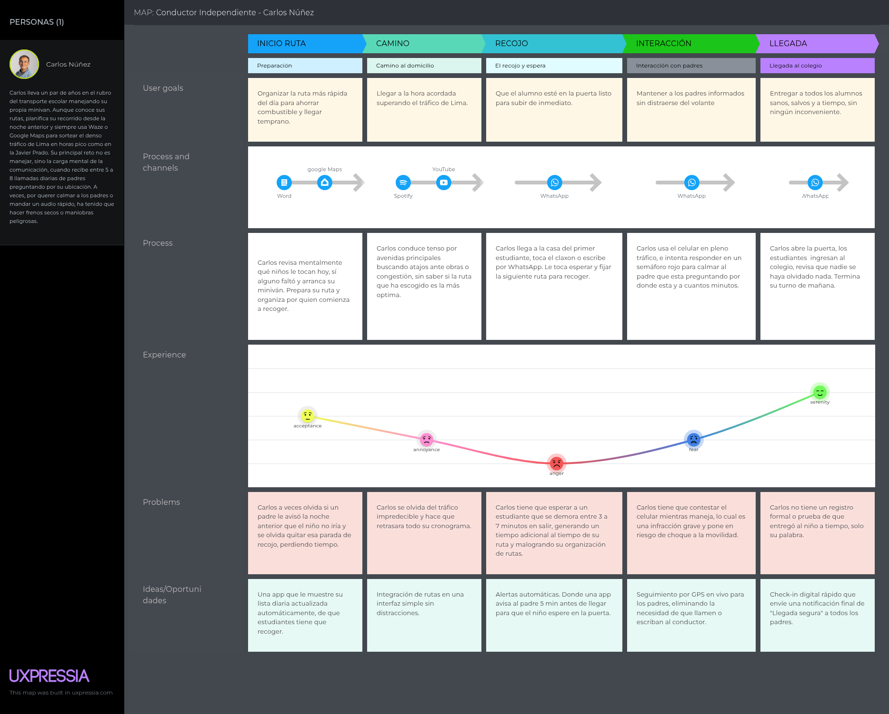

The map reflects that the most critical and dangerous moments of the driver's day are concentrated in the Pickup and Interaction stages. Student delays generate a domino effect that delays the entire route, which in turn causes calls from anxious parents. The driver's attempt to respond to WhatsApp messages or calls while driving represents a serious accident risk. This scenario confirms that the implementation of proximity alerts and live GPS tracking will not only improve punctuality but will also mitigate an imminent road safety risk.

**Segment 2: School Transportation Companies**

This User Journey Mapping illustrates the operational journey of our User Persona, Valeria, during morning fleet management, from dispatch planning to attendance registration. The objective of this mapping is to make visible the friction points and exhaustion generated by the manual coordination of multiple vehicles.

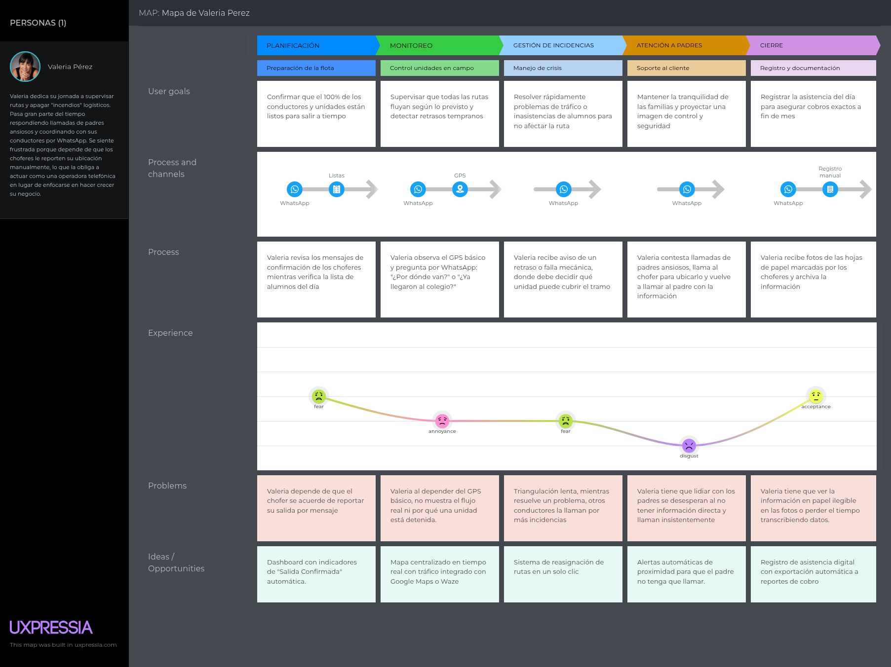

As shown in the map, the greatest breakdown point in the user experience occurs during the Monitoring and Parent Support stages. The need to triangulate phone communication between drivers and anxious parents generates a high level of stress and cognitive overload. This operational inefficiency confirms the critical opportunity to automate the information flow through proximity notifications.

### **2.3.4. Empathy Mapping**

The Empathy Map allows us to put ourselves in the place of our end users to deeply understand their environment, emotions, thoughts, and attitudes. These maps help us identify not only users' operational needs, but also their psychological pain points and expectations, ensuring software design that is truly oriented toward the target segments.

**Segment 1: Independent Drivers**

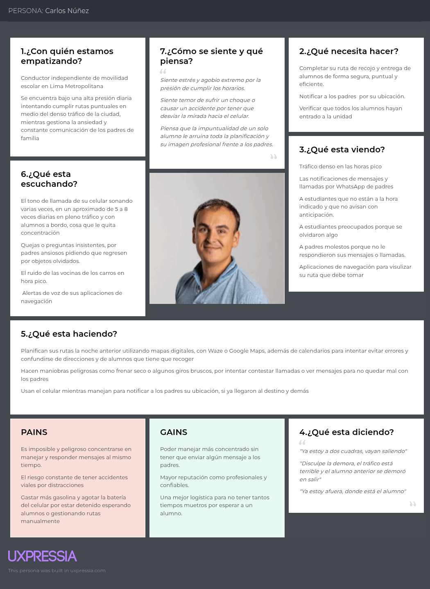

The analysis of Carlos's environment and feelings reveals an important finding: his greatest source of frustration and danger is not driving itself, but constant interruption. Since he is immersed in a noisy and highly demanding environment, his anxiety level behind the wheel increases when he is forced to interact with his mobile device to calm parents. His main gain is to regain full concentration on the road. This technically validates that the KidOnWay interface for the driver must require zero or minimal interaction during the route, fully automating communications to protect his life and the lives of the students.

**Segment 2: School Transportation Companies**

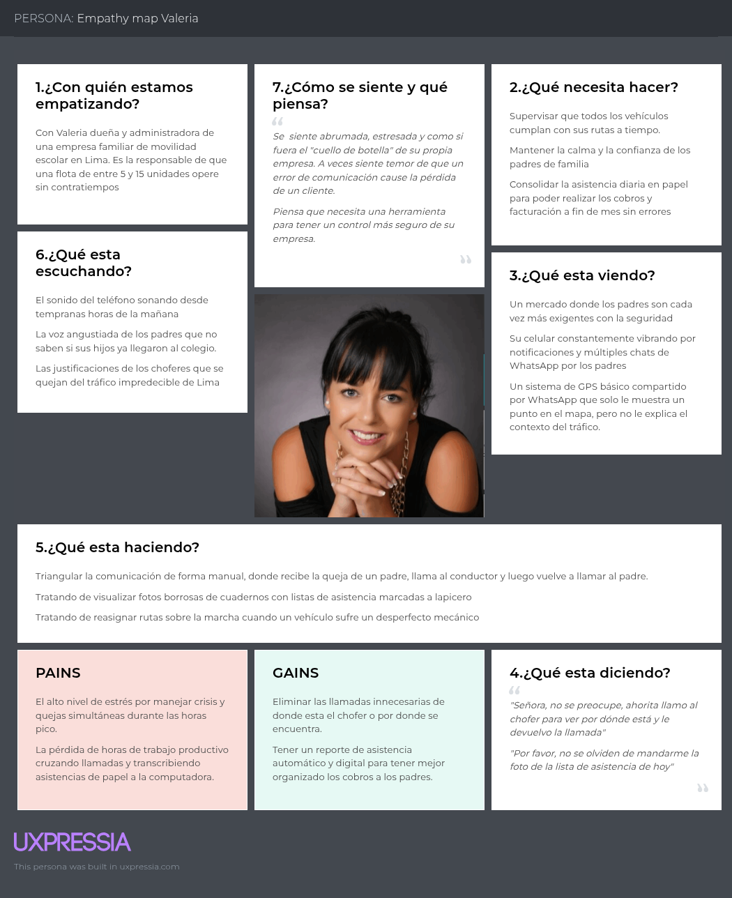

The analysis reveals that Valeria's main enemy is not vehicle logistics, but communication saturation. Since she is at the center of a manual information flow, our application's value proposition directly impacts her gains. By delegating monitoring to automated software, she recovers her time and reduces her mental load, transforming her business and making better use of her time for other activities.

**AS-IS Scenario Mapping**

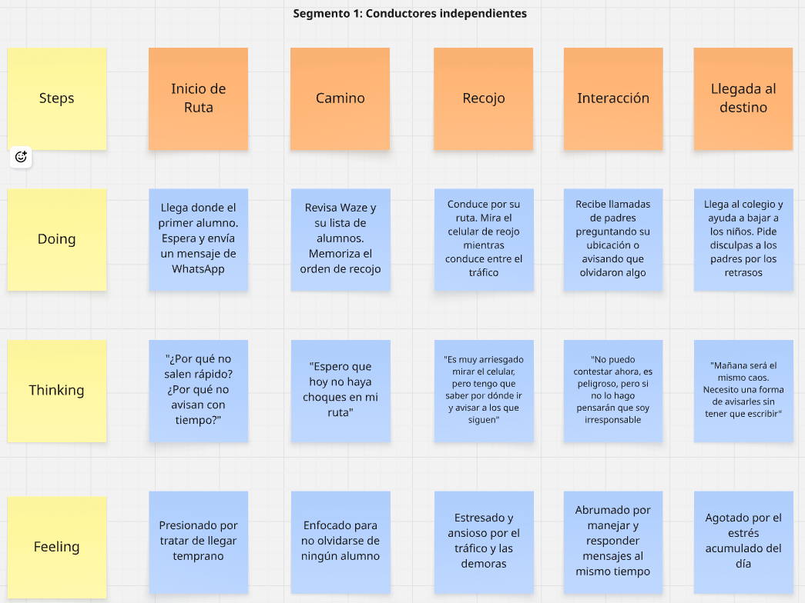

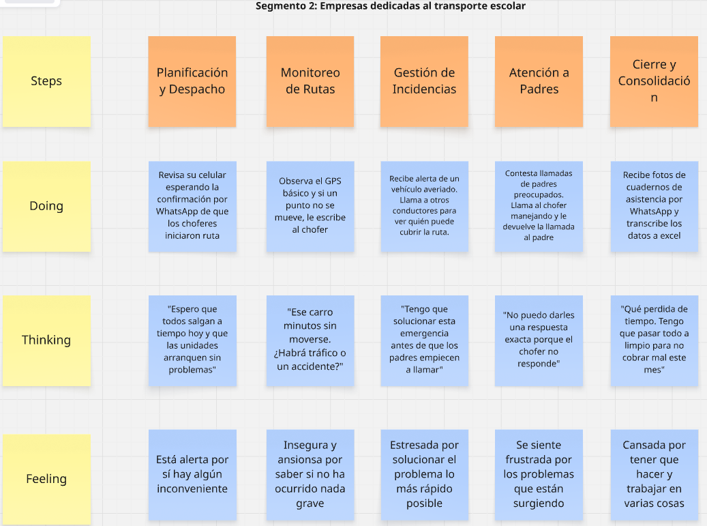

## **2.4. Big Picture Event Storming**

## **2.5. Ubiquitous Language**

Ubiquitous Language is a common and standardized vocabulary shared by the development team and domain experts, who in this case are school transportation drivers, administrators, and parents. It is a type of glossary that ensures all stakeholders share the same understanding of the key business concepts, reducing ambiguity in requirements specification and source code.

* **Administrator** is the user responsible for the logistical management of the fleet. Their main role is to monitor routes, resolve incidents, and manage high-level communication with customers.
* **Proximity Alert** is the automated push notification generated by the system and sent to the guardian's mobile device when the unit is at a predetermined distance or time from the pickup point.
* **Parent** is the final customer who hires the school transportation service and requires visibility over the transportation status of their minor child.
* **Attendance** is the record of the exact moment when a student boards or gets off the vehicle.
* **Driver** is the user responsible for driving the vehicle, executing the established route, and ensuring the physical safety of students during the trip.
* **Dashboard** is the centralized web or tablet interface, designed for administrators and parents, that shows the real-time location, speed, and status of all active units through GPS integration.
* **Student** is the passenger who will be transported.
* **Fleet** is the total set of operational vehicles managed by the same school transportation company.
* **Route** is the planned path of pickup and drop-off points.
* **Unit** is the physical transportation vehicle assigned to a driver and to a specific route.
