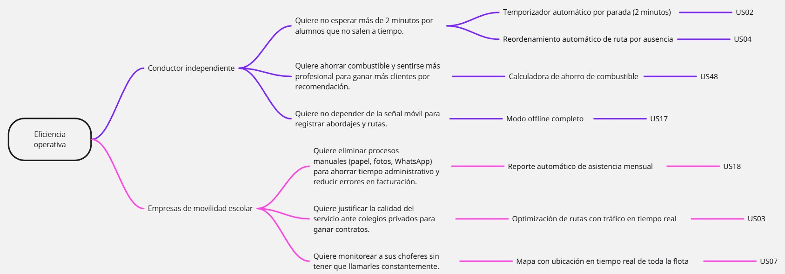

# **Chapter III: Requirements Specification**
## **3.1. User Stories**

# **Report Version Log**

<table>
    <thead>
        <tr>
            <th style="width: 8%">Epic/Story ID</th>
            <th style="width: 15%">Título</th>
            <th style="width: 30%">Descripción</th>
            <th style="width: 37%">Criterios de Aceptación</th>
            <th style="width: 10%">Relacionado con (Epic ID)</th>
        </tr>
    </thead>
    <tbody>
        <!-- EPICA 1 - AMBOS -->
        <tr>
            <td class="epic-id" style="text-align:center">EP01</td>
            <td style="text-align:center">Registro digital de abordaje</td>
            <td>Como <strong>conductor independiente o administrador de empresa</strong>, deseo registrar de forma rápida qué estudiantes suben o faltan en cada parada, para evitar errores y optimizar el recorrido.</td>
            <td class="acceptance-criteria">
                <ul>
                    <li><strong>Given</strong> que el conductor ha llegado a una parada programada, <strong>When</strong> el alumno aborda el vehículo, <strong>Then</strong> el sistema permite registrar el evento de "abordaje" con timestamp.</li>
                    <li><strong>Given</strong> que el conductor está en una parada y un alumno no se presenta, <strong>When</strong> transcurren 2 minutos sin registro, <strong>Then</strong> el sistema notifica automáticamente al padre sobre la ausencia.</li>
                    <li><strong>Given</strong> que el conductor opera sin conexión a internet, <strong>When</strong> registra abordajes, <strong>Then</strong> el sistema almacena los eventos localmente y los sincroniza al recuperar conectividad.</li>
                    <li><strong>Given</strong> que se registra un abordaje, <strong>When</strong> el evento es persistido, <strong>Then</strong> el sistema envía una notificación push al padre del alumno.</li>
                </ul>
            </td>
            <td style="text-align:center">-</td>
        </tr>
        <!-- EPICA 2 - AMBOS -->
        <tr>
            <td class="epic-id" style="text-align:center">EP02</td>
            <td style="text-align:center">Gestión de rutas</td>
            <td>Como <strong>conductor independiente o administrador de empresa</strong>, deseo visualizar y seguir una ruta organizada con paradas definidas, para reducir tiempos de espera y consumo de combustible.</td>
            <td class="acceptance-criteria">
                <ul>
                    <li><strong>Given</strong> que el conductor ha iniciado su jornada, <strong>When</strong> accede a la ruta del día, <strong>Then</strong> el sistema muestra el orden secuencial de las paradas con tiempos estimados de llegada.</li>
                    <li><strong>Given</strong> que ocurre un retraso en una parada, <strong>When</strong> el sistema detecta la demora, <strong>Then</strong> recalcula automáticamente los tiempos estimados para las paradas siguientes.</li>
                    <li><strong>Given</strong> que el conductor ha registrado una ausencia, <strong>When</strong> la parada corresponde a ese alumno, <strong>Then</strong> el sistema omite automáticamente la parada y reordena la ruta.</li>
                    <li><strong>Given</strong> que el conductor desea ahorrar combustible, <strong>When</strong> el sistema detecta una alternativa más eficiente, <strong>Then</strong> sugiere la ruta óptima considerando tráfico en tiempo real.</li>
                </ul>
            </td>
            <td style="text-align:center">-</td>
        </tr>
        <!-- EPICA 3 - AMBOS -->
        <tr>
            <td class="epic-id" style="text-align:center">EP03</td>
            <td style="text-align:center">Registro de incidencias</td>
            <td>Como <strong>conductor independiente o administrador de empresa</strong>, deseo registrar eventos como retrasos, ausencias o cambios en la ruta, para mantener trazabilidad del servicio.</td>
            <td class="acceptance-criteria">
                <ul>
                    <li><strong>Given</strong> que ocurre una incidencia en ruta, <strong>When</strong> el conductor selecciona el tipo de incidencia (retraso, accidente, cambio de ruta), <strong>Then</strong> el sistema registra el evento con ubicación y timestamp.</li>
                    <li><strong>Given</strong> que se registra una incidencia, <strong>When</strong> la incidencia afecta el tiempo estimado de llegada, <strong>Then</strong> el sistema notifica automáticamente a los padres afectados.</li>
                    <li><strong>Given</strong> que el conductor necesita documentar una incidencia, <strong>When</strong> adjunta evidencia (foto, audio, texto), <strong>Then</strong> el sistema guarda el adjunto asociado al evento.</li>
                    <li><strong>Given</strong> que la incidencia está cerrada, <strong>When</strong> el administrador o conductor consulta el historial, <strong>Then</strong> se muestra la línea de tiempo completa del evento.</li>
                </ul>
            </td>
            <td style="text-align:center">-</td>
        </tr>
        <!-- EPICA 4 - SOLO EMPRESA -->
        <tr>
            <td class="epic-id" style="text-align:center">EP04</td>
            <td style="text-align:center">Monitoreo de flota en tiempo real</td>
            <td>Como <strong>administrador de empresa de movilidad escolar</strong>, deseo visualizar todas mis unidades en tiempo real, para supervisar el cumplimiento de rutas y gestionar incidencias.</td>
            <td class="acceptance-criteria">
                <ul>
                    <li><strong>Given</strong> que el administrador accede al dashboard, <strong>When</strong> selecciona la vista de flota, <strong>Then</strong> el sistema muestra un mapa con la ubicación actual de todas las unidades activas de su empresa.</li>
                    <li><strong>Given</strong> que una unidad se desvía de su ruta establecida, <strong>When</strong> la desviación supera un umbral configurable, <strong>Then</strong> el sistema genera una alerta en el dashboard del administrador.</li>
                    <li><strong>Given</strong> que el administrador selecciona una unidad específica, <strong>When</strong> consulta su detalle, <strong>Then</strong> se muestra la ruta recorrida, paradas realizadas y estado actual.</li>
                    <li><strong>Given</strong> que ocurre una emergencia en una unidad, <strong>When</strong> el conductor reporta la emergencia, <strong>Then</strong> el sistema destaca la unidad en el dashboard con indicador visual de alerta.</li>
                    <li><strong>Given</strong> que una unidad no envía ubicación por más de 5 minutos, <strong>When</strong> se ejecuta el monitoreo, <strong>Then</strong> el sistema genera una alerta de "Unidad sin señal".</li>
                </ul>
            </td>
            <td style="text-align:center">-</td>
        </tr>
        <!-- EPICA 5A - SOLO CONDUCTOR INDEPENDIENTE (Reportes personales) -->
        <tr>
            <td class="epic-id" style="text-align:center">EP05A</td>
            <td style="text-align:center">Reportes personales de viaje</td>
            <td>Como <strong>conductor independiente</strong>, deseo acceder a mi historial de viajes, puntualidad e incidencias, para evaluar mi desempeño y mejorar mi reputación.</td>
            <td class="acceptance-criteria">
                <ul>
                    <li><strong>Given</strong> que el conductor accede a su perfil, <strong>When</strong> selecciona "Mi historial", <strong>Then</strong> el sistema muestra la lista de viajes realizados en los últimos 30 días con fechas y horarios.</li>
                    <li><strong>Given</strong> que el conductor desea conocer su puntualidad, <strong>When</strong> consulta su reporte de desempeño, <strong>Then</strong> el sistema muestra el porcentaje de llegadas a tiempo por parada.</li>
                    <li><strong>Given</strong> que el conductor ha tenido incidencias, <strong>When</strong> consulta el registro, <strong>Then</strong> visualiza la lista de eventos registrados con sus resoluciones.</li>
                    <li><strong>Given</strong> que el conductor quiere compartir su reputación, <strong>When</strong> genera un resumen, <strong>Then</strong> el sistema permite exportar un reporte simple (PDF) con sus métricas.</li>
                </ul>
            </td>
            <td style="text-align:center">-</td>
        </tr>
        <!-- EPICA 5B - SOLO EMPRESA (Reportes de gestión) -->
        <tr>
            <td class="epic-id" style="text-align:center">EP05B</td>
            <td style="text-align:center">Reportes de gestión de flota</td>
            <td>Como <strong>administrador de empresa de movilidad escolar</strong>, deseo generar reportes consolidados de toda la flota (puntualidad, asistencia, combustible, facturación), para evaluar el servicio y tomar decisiones.</td>
            <td class="acceptance-criteria">
                <ul>
                    <li><strong>Given</strong> que el administrador necesita un reporte de puntualidad por conductor, <strong>When</strong> selecciona un rango de fechas, <strong>Then</strong> el sistema genera un reporte con el porcentaje de llegadas a tiempo por cada unidad.</li>
                    <li><strong>Given</strong> que el administrador requiere el consolidado de asistencia mensual, <strong>When</strong> selecciona el mes y la ruta, <strong>Then</strong> el sistema exporta un archivo Excel con los días de servicio por alumno (útil para facturación).</li>
                    <li><strong>Given</strong> que el administrador desea evaluar el consumo de combustible, <strong>When</strong> consulta el reporte de eficiencia, <strong>Then</strong> el sistema muestra kilómetros recorridos vs. tiempo de motor encendido por unidad.</li>
                    <li><strong>Given</strong> que el administrador necesita un informe de incidencias, <strong>When</strong> filtra por tipo de incidente y período, <strong>Then</strong> el sistema presenta una tabla con fechas, conductores y descripciones.</li>
                    <li><strong>Given</strong> que el administrador debe justificar la calidad del servicio ante un colegio, <strong>When</strong> solicita un reporte ejecutivo, <strong>Then</strong> el sistema genera un PDF consolidado con indicadores clave de la flota.</li>
                </ul>
            </td>
            <td style="text-align:center">-</td>
        </tr>
        <!-- USER STORY 01 - Registrar abordaje -->
        <tr>
            <td class="user-story-id" style="text-align:center">US01</td>
            <td style="text-align:center">Registrar abordaje de alumno</td>
            <td>Como <strong>conductor</strong>, deseo registrar el momento en que un alumno aborda el vehículo en cada parada, para mantener un registro digital de asistencia.</td>
            <td class="acceptance-criteria">
                <ul>
                    <li><strong>Given</strong> que el conductor ha llegado a una parada programada y el alumno está presente, <strong>When</strong> el conductor selecciona al alumno en la lista, <strong>Then</strong> el sistema registra el evento con timestamp y ubicación.</li>
                    <li><strong>Given</strong> que el registro de abordaje es exitoso, <strong>When</strong> se completa la acción, <strong>Then</strong> el sistema envía una notificación push al padre del alumno con el mensaje "Tu hijo ha abordado el bus".</li>
                    <li><strong>Given</strong> que el conductor opera sin conexión a internet, <strong>When</strong> registra un abordaje, <strong>Then</strong> el sistema almacena el evento localmente y lo sincroniza automáticamente al recuperar conectividad.</li>
                </ul>
            </td>
            <td style="text-align:center">EP01</td>
        </tr>
        <!-- USER STORY 02 - Notificar ausencia automática -->
        <tr>
            <td class="user-story-id" style="text-align:center">US02</td>
            <td style="text-align:center">Notificar ausencia automática</td>
            <td>Como <strong>conductor</strong>, deseo que el sistema detecte automáticamente cuando un alumno no se presenta en su parada, para no tener que esperar más de lo necesario ni llamar manualmente al padre.</td>
            <td class="acceptance-criteria">
                <ul>
                    <li><strong>Given</strong> que el conductor ha llegado a una parada programada, <strong>When</strong> transcurren 2 minutos sin que se registre el abordaje del alumno, <strong>Then</strong> el sistema envía una notificación al padre informando la ausencia.</li>
                    <li><strong>Given</strong> que se notifica la ausencia, <strong>When</strong> el padre responde que el alumno no asistirá, <strong>Then</strong> el sistema omite automáticamente la parada y continúa con la siguiente.</li>
                    <li><strong>Given</strong> que se notifica la ausencia pero el alumno aparece después del tiempo límite, <strong>When</strong> el conductor registra el abordaje tardío, <strong>Then</strong> el sistema registra el evento con marca de "retraso por alumno".</li>
                </ul>
            </td>
            <td style="text-align:center">EP01</td>
        </tr>
        <!-- USER STORY 03 - Visualizar ruta optimizada -->
        <tr>
            <td class="user-story-id" style="text-align:center">US03</td>
            <td style="text-align:center">Visualizar ruta optimizada del día</td>
            <td>Como <strong>conductor</strong>, deseo visualizar la ruta del día con el orden de paradas y tiempos estimados, para reducir tiempos de espera y consumo de combustible.</td>
            <td class="acceptance-criteria">
                <ul>
                    <li><strong>Given</strong> que el conductor ha iniciado su jornada, <strong>When</strong> accede a la pantalla de ruta, <strong>Then</strong> el sistema muestra el orden secuencial de las paradas con la dirección y hora estimada de llegada para cada una.</li>
                    <li><strong>Given</strong> que el conductor sigue la ruta sugerida, <strong>When</strong> completa una parada, <strong>Then</strong> el sistema actualiza automáticamente la vista mostrando la siguiente parada como destino actual.</li>
                    <li><strong>Given</strong> que el conductor se desvía de la ruta sugerida, <strong>When</strong> el sistema detecta la desviación, <strong>Then</strong> recalcula la ruta restante y actualiza los tiempos estimados.</li>
                </ul>
            </td>
            <td style="text-align:center">EP02</td>
        </tr>
        <!-- USER STORY 04 - Reordenar ruta por ausencia -->
        <tr>
            <td class="user-story-id" style="text-align:center">US04</td>
            <td style="text-align:center">Reordenar ruta por ausencia</td>
            <td>Como <strong>conductor</strong>, deseo que la ruta se reordene automáticamente cuando un alumno falta, para no perder tiempo pasando por una parada vacía.</td>
            <td class="acceptance-criteria">
                <ul>
                    <li><strong>Given</strong> que se ha confirmado la ausencia de un alumno en su parada, <strong>When</strong> el sistema recibe la confirmación, <strong>Then</strong> omite esa parada de la ruta activa y reordena las siguientes.</li>
                    <li><strong>Given</strong> que la ruta ha sido reordenada, <strong>When</strong> el conductor visualiza la ruta actualizada, <strong>Then</strong> los tiempos estimados de llegada se han recalculado para todas las paradas restantes.</li>
                    <li><strong>Given</strong> que la ausencia fue registrada por el padre antes del inicio de la ruta, <strong>When</strong> el conductor inicia la jornada, <strong>Then</strong> la parada del alumno ausente no aparece en la ruta del día.</li>
                </ul>
            </td>
            <td style="text-align:center">EP02</td>
        </tr>
        <!-- USER STORY 05 - Registrar incidencia en ruta -->
        <tr>
            <td class="user-story-id" style="text-align:center">US05</td>
            <td style="text-align:center">Registrar incidencia en ruta</td>
            <td>Como <strong>conductor</strong>, deseo registrar cualquier incidencia que ocurra durante el recorrido (retraso, accidente, cambio de ruta), para mantener trazabilidad del servicio.</td>
            <td class="acceptance-criteria">
                <ul>
                    <li><strong>Given</strong> que ocurre una incidencia durante el recorrido, <strong>When</strong> el conductor selecciona el tipo de incidencia (retraso, accidente, desvío, emergencia médica), <strong>Then</strong> el sistema registra el evento con ubicación, timestamp y datos del vehículo.</li>
                    <li><strong>Given</strong> que el conductor necesita documentar la incidencia, <strong>When</strong> adjunta una foto o nota de texto, <strong>Then</strong> el sistema guarda la evidencia asociada al evento.</li>
                    <li><strong>Given</strong> que la incidencia afecta los tiempos de llegada, <strong>When</strong> el conductor la registra, <strong>Then</strong> el sistema recalcula los tiempos estimados y notifica a los padres afectados.</li>
                </ul>
            </td>
            <td style="text-align:center">EP03</td>
        </tr>
        <!-- USER STORY 06 - Notificar a padres por incidencia (automático) -->
        <tr>
            <td class="user-story-id" style="text-align:center">US06</td>
            <td style="text-align:center">Notificar a padres por incidencia</td>
            <td>Como <strong>sistema</strong>, deseo notificar automáticamente a los padres cuando se registra una incidencia que afecta la ruta de sus hijos, para mantenerlos informados sin intervención manual del conductor.</td>
            <td class="acceptance-criteria">
                <ul>
                    <li><strong>Given</strong> que se registra una incidencia que afecta los tiempos estimados, <strong>When</strong> el sistema calcula el nuevo tiempo de llegada, <strong>Then</strong> envía una notificación push a los padres de los alumnos afectados con el mensaje "El bus presentará un retraso de X minutos".</li>
                    <li><strong>Given</strong> que se registra una incidencia grave (accidente, emergencia), <strong>When</strong> el conductor marca el evento como crítico, <strong>Then</strong> el sistema notifica inmediatamente al administrador de la empresa y envía una alerta prioritaria a los padres.</li>
                    <li><strong>Given</strong> que la incidencia se resuelve, <strong>When</strong> el conductor confirma la normalización del servicio, <strong>Then</strong> el sistema envía una notificación de "Incidencia resuelta - el servicio continúa con normalidad".</li>
                </ul>
            </td>
            <td style="text-align:center">EP03</td>
        </tr>
        <!-- USER STORY 07 - Ver flota completa en mapa (Empresa) -->
        <tr>
            <td class="user-story-id" style="text-align:center">US07</td>
            <td style="text-align:center">Ver flota completa en mapa</td>
            <td>Como <strong>administrador de empresa de movilidad escolar</strong>, deseo visualizar en un mapa todas mis unidades activas en tiempo real, para supervisar el cumplimiento de rutas sin depender de llamadas telefónicas.</td>
            <td class="acceptance-criteria">
                <ul>
                    <li><strong>Given</strong> que el administrador accede al dashboard de la empresa, <strong>When</strong> selecciona la vista de flota, <strong>Then</strong> el sistema muestra un mapa con la ubicación actual de todas las unidades activas, identificadas por número o nombre del conductor.</li>
                    <li><strong>Given</strong> que el administrador selecciona una unidad específica en el mapa, <strong>When</strong> hace clic sobre ella, <strong>Then</strong> se despliega un panel con los detalles de la ruta, paradas realizadas, próximo destino y estado actual.</li>
                    <li><strong>Given</strong> que una unidad tiene activado el modo de emergencia, <strong>When</strong> el administrador visualiza el mapa, <strong>Then</strong> esa unidad se destaca con un ícono o color distintivo de alerta.</li>
                </ul>
            </td>
            <td style="text-align:center">EP04</td>
        </tr>
        <!-- USER STORY 08 - Alerta por desviación de ruta -->
        <tr>
            <td class="user-story-id" style="text-align:center">US08</td>
            <td style="text-align:center">Recibir alerta por desviación de ruta</td>
            <td>Como <strong>administrador de empresa de movilidad escolar</strong>, deseo recibir una alerta cuando una unidad se desvía significativamente de su ruta establecida, para poder actuar rápidamente ante posibles incidentes.</td>
            <td class="acceptance-criteria">
                <ul>
                    <li><strong>Given</strong> que una unidad activa tiene definida una ruta programada, <strong>When</strong> su ubicación se desvía más de 500 metros de la ruta planificada, <strong>Then</strong> el sistema genera una alerta en el dashboard del administrador.</li>
                    <li><strong>Given</strong> que se genera una alerta por desviación, <strong>When</strong> el administrador hace clic en la alerta, <strong>Then</strong> el sistema muestra la ubicación actual de la unidad y la ruta programada para comparación.</li>
                    <li><strong>Given</strong> que la desviación fue autorizada (ej. por cierre de vía), <strong>When</strong> el conductor registró previamente un desvío planificado, <strong>Then</strong> el sistema no genera alerta para ese desvío específico.</li>
                </ul>
            </td>
            <td style="text-align:center">EP04</td>
        </tr>
        <!-- USER STORY 09 - Historial personal de viajes (Conductor) -->
        <tr>
            <td class="user-story-id" style="text-align:center">US09</td>
            <td style="text-align:center">Ver historial personal de viajes</td>
            <td>Como <strong>conductor independiente</strong>, deseo acceder a mi historial de viajes, puntualidad e incidencias registradas, para evaluar mi desempeño y demostrar mi confiabilidad a los padres.</td>
            <td class="acceptance-criteria">
                <ul>
                    <li><strong>Given</strong> que el conductor accede a su perfil en la app, <strong>When</strong> selecciona "Mi historial", <strong>Then</strong> el sistema muestra una lista de los viajes realizados en los últimos 30 días con fecha, hora de inicio y fin.</li>
                    <li><strong>Given</strong> que el conductor consulta un día específico, <strong>When</strong> selecciona una fecha, <strong>Then</strong> el sistema muestra el detalle de la ruta: paradas, horarios reales vs. programados, e incidencias registradas.</li>
                    <li><strong>Given</strong> que el conductor desea compartir su historial con un padre, <strong>When</strong> solicita exportar su reporte, <strong>Then</strong> el sistema genera un PDF resumido con sus métricas de puntualidad y número de incidencias.</li>
                </ul>
            </td>
            <td style="text-align:center">EP05A</td>
        </tr>
        <!-- USER STORY 10 - Exportar reporte de asistencia mensual (Empresa) -->
        <tr>
            <td class="user-story-id" style="text-align:center">US10</td>
            <td style="text-align:center">Exportar reporte de asistencia mensual</td>
            <td>Como <strong>administrador de empresa de movilidad escolar</strong>, deseo exportar un consolidado de asistencia mensual por alumno, para agilizar el proceso de facturación a los padres sin errores manuales.</td>
            <td class="acceptance-criteria">
                <ul>
                    <li><strong>Given</strong> que el administrador necesita facturar por alumno, <strong>When</strong> selecciona un mes y una ruta, <strong>Then</strong> el sistema genera un archivo Excel con la lista de alumnos y los días del mes que efectivamente utilizaron el servicio.</li>
                    <li><strong>Given</strong> que se ha generado el reporte, <strong>When</strong> el administrador lo descarga, <strong>Then</strong> el archivo contiene columnas: nombre del alumno, grado, dirección de recojo, total de días servidos, ausencias justificadas e injustificadas.</li>
                    <li><strong>Given</strong> que un alumno tuvo ausencias registradas por el conductor, <strong>When</strong> se genera el reporte, <strong>Then</strong> esas ausencias aparecen marcadas con el tipo (justificada o injustificada) según lo reportado por el padre.</li>
                </ul>
            </td>
            <td style="text-align:center">EP05B</td>
        </tr>
        <!-- USER STORY 11 - Generar reporte de puntualidad por unidad -->
        <tr>
            <td class="user-story-id" style="text-align:center">US11</td>
            <td style="text-align:center">Generar reporte de puntualidad por unidad</td>
            <td>Como <strong>administrador de empresa de movilidad escolar</strong>, deseo generar un reporte de puntualidad por cada conductor/unidad, para evaluar su desempeño y tomar decisiones de mejora o incentivos.</td>
            <td class="acceptance-criteria">
                <ul>
                    <li><strong>Given</strong> que el administrador selecciona un rango de fechas, <strong>When</strong> solicita el reporte de puntualidad, <strong>Then</strong> el sistema genera una tabla con cada unidad, su porcentaje de llegadas a tiempo por parada, y el promedio de minutos de retraso.</li>
                    <li><strong>Given</strong> que se ha generado el reporte, <strong>When</strong> el administrador selecciona una unidad específica, <strong>Then</strong> el sistema muestra el detalle día por día con los horarios programados vs. reales.</li>
                    <li><strong>Given</strong> que el administrador necesita presentar el reporte ante un colegio, <strong>When</strong> solicita exportar en PDF, <strong>Then</strong> el sistema genera un documento profesional con gráficos de puntualidad por semana.</li>
                </ul>
            </td>
            <td style="text-align:center">EP05B</td>
        </tr>
          <tr>
    <td style="text-align: center;">US12</td>
    <td style="text-align: center;">Visualizar lista de estudiantes por ruta</td>
    <td style="text-align: center;">Como <strong>conductor</strong>, quiero ver la lista de estudiantes asignados a mi ruta, para saber a quién debo recoger.</td>
    <td class="acceptance-criteria">
        <ul>
            <li><strong>Given</strong> que el conductor ha iniciado sesión en la app, <strong>When</strong> accede a la sección de ruta del día, <strong>Then</strong> el sistema presenta la lista de estudiantes ordenada por secuencia de paradas.</li>
            <li><strong>Given</strong> que la lista de estudiantes es visible, <strong>When</strong> el conductor consulta un estudiante específico, <strong>Then</strong> el sistema muestra su nombre completo y la dirección de punto de recojo.</li>
            <li><strong>Given</strong> que existen estudiantes asignados a diferentes rutas, <strong>When</strong> el conductor visualiza su lista, <strong>Then</strong> el sistema filtra y muestra únicamente los estudiantes asignados a la ruta activa del conductor.</li>
        </ul>
    </td>
    <td style="text-align: center;">EP01</td>
  </tr>
    <tr>
    <td style="text-align: center;">US13</td>
    <td style="text-align: center;">Visualizar estudiantes por parada</td>
    <td style="text-align: center;">Como <strong>conductor</strong>, quiero ver qué estudiantes corresponden a cada parada, para organizar el recojo.</td>
    <td class="acceptance-criteria">
        <ul>
            <li><strong>Given</strong> que el conductor ha seleccionado una ruta activa, <strong>When</strong> accede a la lista de paradas, <strong>Then</strong> el sistema agrupa los estudiantes por cada parada programada.</li>
            <li><strong>Given</strong> que el conductor está en una parada específica, <strong>When</strong> consulta la lista, <strong>Then</strong> el sistema identifica cuál es la parada actual con un indicador visual diferenciado.</li>
            <li><strong>Given</strong> que el conductor necesita revisar otras paradas, <strong>When</strong> navega entre ellas, <strong>Then</strong> el sistema permite cambiar de una parada a otra sin perder el contexto de la ruta.</li>
        </ul>
    </td>
    <td style="text-align: center;">EP01</td>
  </tr>
    <tr>
    <td style="text-align: center;">US14</td>
    <td style="text-align: center;">Registrar abordaje</td>
    <td style="text-align: center;">Como <strong>conductor</strong>, quiero marcar rápidamente cuando un estudiante sube, para llevar control del traslado.</td>
    <td class="acceptance-criteria">
        <ul>
            <li><strong>Given</strong> que el conductor está en una parada y el estudiante aborda el vehículo, <strong>When</strong> el conductor ejecuta la acción de registro, <strong>Then</strong> el sistema cambia el estado del estudiante a "abordó" en la lista.</li>
            <li><strong>Given</strong> que se ha registrado el abordaje, <strong>When</strong> el conductor continúa con la ruta, <strong>Then</strong> el sistema guarda automáticamente el evento con timestamp y ubicación.</li>
            <li><strong>Given</strong> que el registro es exitoso, <strong>When</strong> el conductor revisa la lista actualizada, <strong>Then</strong> el estudiante aparece como ya abordado y no requiere acción adicional.</li>
        </ul>
    </td>
    <td style="text-align: center;">EP01</td>
  </tr>
    <tr>
    <td style="text-align: center;">US15</td>
    <td style="text-align: center;">Registrar ausencia</td>
    <td style="text-align: center;">Como <strong>conductor</strong>, quiero marcar cuando un estudiante no sube, para evitar esperas innecesarias.</td>
    <td class="acceptance-criteria">
        <ul>
            <li><strong>Given</strong> que el conductor ha llegado a una parada programada y el estudiante no se presenta, <strong>When</strong> el conductor selecciona la opción de ausencia, <strong>Then</strong> el sistema registra al estudiante como "ausente" en esa parada.</li>
            <li><strong>Given</strong> que el conductor registra una ausencia, <strong>When</strong> el sistema lo solicita, <strong>Then</strong> el conductor puede registrar el motivo de la ausencia (opcional).</li>
            <li><strong>Given</strong> que se registra una ausencia, <strong>When</strong> el evento es persistido, <strong>Then</strong> la información se actualiza en tiempo real en el sistema y está disponible para el administrador o los padres.</li>
        </ul>
    </td>
    <td style="text-align: center;">EP01</td>
  </tr>
    <tr>
    <td style="text-align: center;">US16</td>
    <td style="text-align: center;">Edición rápida de estado</td>
    <td style="text-align: center;">Como <strong>conductor</strong>, quiero corregir el estado de un estudiante en caso de error, para mantener información precisa.</td>
    <td class="acceptance-criteria">
        <ul>
            <li><strong>Given</strong> que un estudiante tiene un estado registrado erróneamente (abordaje o ausencia), <strong>When</strong> el conductor selecciona la opción de edición, <strong>Then</strong> el sistema permite cambiar el estado al valor correcto.</li>
            <li><strong>Given</strong> que se realiza una corrección de estado, <strong>When</strong> el cambio es guardado, <strong>Then</strong> el sistema registra la última actualización con nuevo timestamp y mantiene trazabilidad del cambio.</li>
            <li><strong>Given</strong> que el conductor necesita corregir un estado, <strong>When</strong> accede a la edición, <strong>Then</strong> el sistema permite completar la corrección sin requerir múltiples pasos o pantallas adicionales.</li>
        </ul>
    </td>
    <td style="text-align: center;">EP01</td>
  </tr>
  <tr>
    <td style="text-align: center;">US17</td>
    <td style="text-align: center;">Funcionamiento offline</td>
    <td style="text-align: center;">Como <strong>conductor</strong>, quiero poder registrar abordajes sin conexión a internet, para no depender de la señal.</td>
    <td class="acceptance-criteria">
        <ul>
            <li><strong>Given</strong> que el dispositivo del conductor no tiene conexión a internet, <strong>When</strong> el conductor registra un abordaje o ausencia, <strong>Then</strong> el sistema almacena el evento localmente en el dispositivo.</li>
            <li><strong>Given</strong> que existen eventos pendientes de sincronización, <strong>When</strong> el dispositivo recupera la conexión a internet, <strong>Then</strong> el sistema envía automáticamente todos los eventos almacenados al servidor.</li>
            <li><strong>Given</strong> que se ha completado la sincronización, <strong>When</strong> el sistema verifica los eventos transmitidos, <strong>Then</strong> no se pierde ni se duplica ninguna información registrada durante el modo offline.</li>
        </ul>
    </td>
    <td style="text-align: center;">EP01</td>
  </tr>
  <tr>
    <td style="text-align: center;">US18</td>
    <td style="text-align: center;">Confirmación visual rápida</td>
    <td style="text-align: center;">Como <strong>conductor</strong>, quiero identificar rápidamente quién ya subió y quién no, para tomar decisiones rápidas.</td>
    <td class="acceptance-criteria">
        <ul>
            <li><strong>Given</strong> que el conductor visualiza la lista de estudiantes de una parada, <strong>When</strong> un estudiante tiene el estado "abordó", <strong>Then</strong> el sistema lo diferencia visualmente de aquellos con estado pendiente.</li>
            <li><strong>Given</strong> que el conductor está en movimiento, <strong>When</strong> consulta la lista de estudiantes, <strong>Then</strong> el sistema presenta la información de forma legible y sin necesidad de interacciones complejas.</li>
            <li><strong>Given</strong> que el conductor necesita conocer el estado general de la parada, <strong>When</strong> revisa la lista, <strong>Then</strong> el sistema permite distinguir de un vistazo cuántos estudiantes han abordado y cuántos faltan.</li>
        </ul>
    </td>
    <td style="text-align: center;">EP01</td>
  </table>
  <tr>
    <td style="text-align: center;">US19</td>
    <td style="text-align: center;">Visualizar ruta asignada</td>
    <td style="text-align: center;">Como <strong>conductor</strong>, quiero visualizar la ruta asignada del día, para saber el orden de recorrido.</td>
    <td class="acceptance-criteria">
        <ul>
            <li><strong>Given</strong> que el conductor ha iniciado su jornada laboral, <strong>When</strong> accede a la sección de ruta, <strong>Then</strong> el sistema presenta la ruta asignada para el día actual.</li>
            <li><strong>Given</strong> que la ruta del día es visible, <strong>When</strong> el conductor la consulta, <strong>Then</strong> el sistema muestra la lista completa de paradas en el orden secuencial del recorrido.</li>
            <li><strong>Given</strong> que existen múltiples conductores en la misma empresa, <strong>When</strong> un conductor consulta su ruta, <strong>Then</strong> el sistema muestra únicamente la ruta asignada a ese conductor específico.</li>
        </ul>
    </td>
    <td style="text-align: center;">EP02</td>
  </tr>
  <tr>
    <td style="text-align: center;">US20</td>
    <td style="text-align: center;">Visualizar paradas en mapa</td>
    <td style="text-align: center;">Como <strong>conductor</strong>, quiero ver las paradas de mi ruta en un mapa, para ubicarme fácilmente durante el recorrido.</td>
    <td class="acceptance-criteria">
        <ul>
            <li><strong>Given</strong> que el conductor ha seleccionado su ruta activa, <strong>When</strong> accede a la vista de mapa, <strong>Then</strong> el sistema muestra todas las paradas de la ruta como puntos geolocalizados.</li>
            <li><strong>Given</strong> que el mapa está visible, <strong>When</strong> el conductor se desplaza durante el recorrido, <strong>Then</strong> el sistema muestra la ubicación actual del vehículo en el mapa.</li>
            <li><strong>Given</strong> que las paradas están representadas en el mapa, <strong>When</strong> el conductor las visualiza, <strong>Then</strong> cada parada está claramente diferenciada (ej. paradas completadas vs. pendientes).</li>
        </ul>
    </td>
    <td style="text-align: center;">EP02</td>
  </table>
  <tr>
    <td style="text-align: center;">US21</td>
    <td style="text-align: center;">Navegación entre paradas</td>
    <td style="text-align: center;">Como <strong>conductor</strong>, quiero recibir indicaciones para llegar a cada parada, para optimizar mi recorrido.</td>
    <td class="acceptance-criteria">
        <ul>
            <li><strong>Given</strong> que el conductor ha completado una parada, <strong>When</strong> el sistema detecta la finalización, <strong>Then</strong> selecciona automáticamente la siguiente parada como siguiente destino.</li>
            <li><strong>Given</strong> que la siguiente parada está seleccionada, <strong>When</strong> el conductor requiere orientación, <strong>Then</strong> el sistema proporciona indicaciones de navegación para llegar a esa parada.</li>
            <li><strong>Given</strong> que el conductor necesita cambiar el orden de navegación, <strong>When</strong> selecciona manualmente otra parada, <strong>Then</strong> el sistema actualiza las indicaciones hacia la nueva parada seleccionada.</li>
        </ul>
    </td>
    <td style="text-align: center;">EP02</td>
  </tr>
  <tr>
    <td style="text-align: center;">US22</td>
    <td style="text-align: center;">Marcar parada como completada</td>
    <td style="text-align: center;">Como <strong>conductor</strong>, quiero marcar una parada como completada, para avanzar en mi ruta de forma ordenada.</td>
    <td class="acceptance-criteria">
        <ul>
            <li><strong>Given</strong> que el conductor ha finalizado las acciones en una parada (abordajes y ausencias), <strong>When</strong> el conductor ejecuta la acción para finalizar la parada, <strong>Then</strong> el sistema cambia el estado de la parada a "completada".</li>
            <li><strong>Given</strong> que una parada ha sido marcada como completada, <strong>When</strong> el conductor visualiza la lista de paradas, <strong>Then</strong> la parada completada se diferencia visualmente de las paradas pendientes.</li>
            <li><strong>Given</strong> que la parada actual es marcada como completada, <strong>When</strong> el sistema registra el evento, <strong>Then</strong> avanza automáticamente a la siguiente parada de la ruta.</li>
        </ul>
    </td>
    <td style="text-align: center;">EP02</td>
  </tr>
  <tr>
    <td style="text-align: center;">US23</td>
    <td style="text-align: center;">Reordenamiento básico de ruta</td>
    <td style="text-align: center;">Como <strong>conductor</strong>, quiero ajustar el orden de paradas en caso de imprevistos, para adaptarme a cambios en el recorrido.</td>
    <td class="acceptance-criteria">
        <ul>
            <li><strong>Given</strong> que ocurre un imprevisto que requiere cambiar el orden de las paradas, <strong>When</strong> el conductor modifica la secuencia de paradas, <strong>Then</strong> el sistema permite reordenar la lista según la nueva prioridad.</li>
            <li><strong>Given</strong> que el conductor ha reordenado las paradas, <strong>When</strong> confirma los cambios, <strong>Then</strong> el sistema actualiza la ruta activa en tiempo real con el nuevo orden.</li>
            <li><strong>Given</strong> que la ruta ha sido reordenada, <strong>When</strong> el conductor consulta los registros de estudiantes, <strong>Then</strong> los datos de abordaje y ausencia permanecen correctamente asociados a cada estudiante.</li>
        </ul>
    </td>
    <td style="text-align: center;">EP02</td>
  </tr>
  <tr>
    <td style="text-align: center;">US24</td>
    <td style="text-align: center;">Visualizar estado de la ruta</td>
    <td style="text-align: center;">Como <strong>conductor</strong>, quiero ver el progreso de mi ruta, para saber cuánto falta completar.</td>
    <td class="acceptance-criteria">
        <ul>
            <li><strong>Given</strong> que el conductor tiene una ruta activa, <strong>When</strong> accede a la vista de progreso, <strong>Then</strong> el sistema muestra la cantidad o porcentaje de paradas completadas sobre el total.</li>
            <li><strong>Given</strong> que el conductor visualiza el estado de la ruta, <strong>When</strong> consulta la lista de paradas, <strong>Then</strong> el sistema diferencia claramente entre paradas completadas y paradas pendientes.</li>
            <li><strong>Given</strong> que el conductor avanza en su recorrido, <strong>When</strong> completa una nueva parada, <strong>Then</strong> el sistema actualiza el estado de progreso en tiempo real.</li>
        </ul>
    </td>
    <td style="text-align: center;">EP02</td>
  </tr>
  <tr>
    <td style="text-align: center;">US25</td>
    <td style="text-align: center;">Funcionamiento offline de ruta</td>
    <td style="text-align: center;">Como <strong>conductor</strong>, quiero acceder a mi ruta sin conexión a internet, para no depender de la señal.</td>
    <td class="acceptance-criteria">
        <ul>
            <li><strong>Given</strong> que el conductor tiene conexión a internet al inicio de la jornada, <strong>When</strong> el sistema descarga la ruta asignada, <strong>Then</strong> los datos de la ruta se almacenan localmente en el dispositivo.</li>
            <li><strong>Given</strong> que la ruta está almacenada localmente, <strong>When</strong> el dispositivo no tiene conexión a internet, <strong>Then</strong> el conductor puede visualizar la ruta y sus paradas sin interrupciones.</li>
            <li><strong>Given</strong> que el conductor realiza cambios en la ruta (reordenamiento, estados) sin conexión, <strong>When</strong> el dispositivo recupera la conexión, <strong>Then</strong> el sistema sincroniza automáticamente todos los cambios pendientes con el servidor.</li>
        </ul>
    </td>
    <td style="text-align: center;">EP02</td>
  </tr>
  <tr>
    <td style="text-align: center;">US26</td>
    <td style="text-align: center;">Registrar incidencia rápida</td>
    <td style="text-align: center;">Como <strong>conductor</strong>, quiero registrar una incidencia en pocos pasos, para no distraerme durante el recorrido.</td>
    <td class="acceptance-criteria">
        <ul>
            <li><strong>Given</strong> que ocurre un evento inesperado durante el recorrido, <strong>When</strong> el conductor necesita reportarlo, <strong>Then</strong> el sistema permite iniciar el registro de incidencia con una acción accesible.</li>
            <li><strong>Given</strong> que el conductor ha iniciado el registro de una incidencia, <strong>When</strong> selecciona el tipo de evento, <strong>Then</strong> el sistema permite completar la selección en máximo dos interacciones.</li>
            <li><strong>Given</strong> que el conductor requiere registrar la incidencia, <strong>When</strong> completa el registro, <strong>Then</strong> el sistema no obliga al conductor a escribir texto para guardar el evento.</li>
        </ul>
    </td>
    <td style="text-align: center;">EP03</td>
  </tr>
  <tr>
    <td style="text-align: center;">US28</td>
    <td style="text-align: center;">Seleccionar tipo de incidencia</td>
    <td style="text-align: center;">Como <strong>conductor</strong>, quiero elegir el tipo de incidencia, para clasificar correctamente el evento.</td>
    <td class="acceptance-criteria">
        <ul>
            <li><strong>Given</strong> que el conductor está registrando una incidencia, <strong>When</strong> accede a la selección de tipo, <strong>Then</strong> el sistema presenta una lista predefinida de tipos de incidencia disponibles.</li>
            <li><strong>Given</strong> que la lista de tipos de incidencia está visible, <strong>When</strong> el conductor la revisa, <strong>Then</strong> cada opción está redactada de forma clara y entendible para su contexto.</li>
            <li><strong>Given</strong> que el conductor necesita clasificar la incidencia, <strong>When</strong> selecciona un tipo, <strong>Then</strong> el sistema permite elegir únicamente una opción principal por evento.</li>
        </ul>
    </td>
    <td style="text-align: center;">EP03</td>
  </tr>
  <tr>
    <td style="text-align: center;">US29</td>
    <td style="text-align: center;">Registrar detalle opcional</td>
    <td style="text-align: center;">Como <strong>conductor</strong>, quiero añadir un comentario opcional, para dar más contexto si es necesario.</td>
    <td class="acceptance-criteria">
        <ul>
            <li><strong>Given</strong> que el conductor está registrando una incidencia, <strong>When</strong> desea agregar información adicional, <strong>Then</strong> el sistema dispone de un campo para ingresar texto de forma opcional.</li>
            <li><strong>Given</strong> que el conductor no tiene información adicional que agregar, <strong>When</strong> omite el campo de comentario, <strong>Then</strong> el sistema permite completar el registro sin bloquear la acción.</li>
            <li><strong>Given</strong> que el conductor ingresa un comentario, <strong>When</strong> se guarda la incidencia, <strong>Then</strong> el sistema almacena el comentario junto al resto de los datos del evento.</li>
        </ul>
    </td>
    <td style="text-align: center;">EP03</td>
  </tr>
  <tr>
    <td style="text-align: center;">US30</td>
    <td style="text-align: center;">Asociar incidencia a parada o estudiante</td>
    <td style="text-align: center;">Como <strong>conductor</strong>, quiero vincular la incidencia a una parada o estudiante, para mayor precisión en el registro.</td>
    <td class="acceptance-criteria">
        <ul>
            <li><strong>Given</strong> que el conductor está registrando una incidencia, <strong>When</strong> la incidencia está relacionada con un punto específico del recorrido, <strong>Then</strong> el sistema permite seleccionar la parada o el estudiante asociado.</li>
            <li><strong>Given</strong> que el conductor vincula la incidencia a una parada o estudiante, <strong>When</strong> confirma el registro, <strong>Then</strong> el sistema guarda la asociación como parte del evento.</li>
            <li><strong>Given</strong> que la incidencia no está relacionada con una parada o estudiante específico, <strong>When</strong> el conductor completa el registro, <strong>Then</strong> el sistema permite guardar la incidencia sin necesidad de realizar una asociación.</li>
        </ul>
    </td>
    <td style="text-align: center;">EP03</td>
  </tr>
  <tr>
    <td style="text-align: center;">US31</td>
    <td style="text-align: center;">Registro automático de hora y ubicación</td>
    <td style="text-align: center;">Como <strong>conductor</strong>, quiero que el sistema registre automáticamente la hora y ubicación, para no tener que hacerlo manualmente.</td>
    <td class="acceptance-criteria">
        <ul>
            <li><strong>Given</strong> que el conductor registra una incidencia, <strong>When</strong> el evento es creado, <strong>Then</strong> el sistema guarda automáticamente un timestamp con la fecha y hora del momento del registro.</li>
            <li><strong>Given</strong> que el conductor registra una incidencia, <strong>When</strong> el dispositivo tiene GPS disponible, <strong>Then</strong> el sistema captura y almacena automáticamente la ubicación geográfica del evento.</li>
            <li><strong>Given</strong> que el sistema registra hora y ubicación, <strong>When</strong> se completa el registro, <strong>Then</strong> no se requiere ninguna acción adicional por parte del conductor para capturar estos datos.</li>
        </ul>
    </td>
    <td style="text-align: center;">EP03</td>
  </tr>
  <tr>
    <td style="text-align: center;">US32</td>
    <td style="text-align: center;">Visualizar historial de incidencias</td>
    <td style="text-align: center;">Como <strong>conductor</strong>, quiero ver las incidencias registradas, para hacer seguimiento del recorrido.</td>
    <td class="acceptance-criteria">
        <ul>
            <li><strong>Given</strong> que el conductor necesita revisar los eventos del día, <strong>When</strong> accede al historial de incidencias, <strong>Then</strong> el sistema presenta una lista con todas las incidencias registradas en la jornada actual.</li>
            <li><strong>Given</strong> que la lista de incidencias está visible, <strong>When</strong> el conductor consulta un evento, <strong>Then</strong> el sistema muestra el tipo de incidencia, la hora de registro y el estado actual.</li>
            <li><strong>Given</strong> que existen múltiples incidencias registradas, <strong>When</strong> el conductor visualiza el listado, <strong>Then</strong> el sistema las presenta ordenadas cronológicamente (de la más reciente a la más antigua o viceversa).</li>
        </ul>
    </td>
    <td style="text-align: center;">EP03</td>
  </tr>
  <tr>
    <td style="text-align: center;">US33</td>
    <td style="text-align: center;">Editar o corregir incidencia</td>
    <td style="text-align: center;">Como <strong>conductor</strong>, quiero corregir una incidencia en caso de error, para mantener información precisa.</td>
    <td class="acceptance-criteria">
        <ul>
            <li><strong>Given</strong> que el conductor identifica un error en una incidencia registrada previamente, <strong>When</strong> accede a la opción de edición, <strong>Then</strong> el sistema permite modificar el tipo de incidencia y/o el comentario asociado.</li>
            <li><strong>Given</strong> que el conductor ha realizado cambios en una incidencia, <strong>When</strong> confirma la edición, <strong>Then</strong> el sistema guarda correctamente los nuevos valores.</li>
            <li><strong>Given</strong> que una incidencia es editada, <strong>When</strong> el conductor consulta el historial, <strong>Then</strong> el sistema muestra la información actualizada con el registro de la última modificación.</li>
        </ul>
    </td>
    <td style="text-align: center;">EP03</td>
  </tr>
  <tr>
    <td style="text-align: center;">US34</td>
    <td style="text-align: center;">Funcionamiento offline de incidencias</td>
    <td style="text-align: center;">Como <strong>conductor</strong>, quiero registrar incidencias sin conexión, para no depender de la red.</td>
    <td class="acceptance-criteria">
        <ul>
            <li><strong>Given</strong> que el dispositivo del conductor no tiene conexión a internet, <strong>When</strong> el conductor registra una incidencia, <strong>Then</strong> el sistema almacena la incidencia localmente en el dispositivo.</li>
            <li><strong>Given</strong> que existen incidencias pendientes de sincronización, <strong>When</strong> el dispositivo recupera la conexión a internet, <strong>Then</strong> el sistema envía automáticamente todas las incidencias almacenadas al servidor.</li>
            <li><strong>Given</strong> que la sincronización se completa, <strong>When</strong> el sistema verifica los datos transmitidos, <strong>Then</strong> no se pierde ninguna incidencia registrada durante el modo offline.</li>
        </ul>
    </td>
    <td style="text-align: center;">EP03</td>
  </tr>
  <tr>
    <td style="text-align: center;">US35</td>
    <td style="text-align: center;">Visualizar movilidades en mapa</td>
    <td style="text-align: center;">Como <strong>administrador de empresa de movilidad escolar</strong>, quiero ver todas mis unidades en un mapa en tiempo real, para supervisar su ubicación.</td>
    <td class="acceptance-criteria">
        <ul>
            <li><strong>Given</strong> que el administrador accede al dashboard de monitoreo, <strong>When</strong> selecciona la vista de mapa, <strong>Then</strong> el sistema muestra todas las unidades activas de la empresa geolocalizadas en el mapa.</li>
            <li><strong>Given</strong> que las unidades están representadas en el mapa, <strong>When</strong> el administrador las visualiza, <strong>Then</strong> cada unidad cuenta con un identificador visible (número o nombre del conductor).</li>
            <li><strong>Given</strong> que las unidades se desplazan durante la jornada, <strong>When</strong> cambia su ubicación, <strong>Then</strong> el sistema actualiza automáticamente las posiciones en el mapa.</li>
        </ul>
    </td>
    <td style="text-align: center;">EP04</td>
  </tr>
  <tr>
    <td style="text-align: center;">US36</td>
    <td style="text-align: center;">Visualizar detalle de unidad</td>
    <td style="text-align: center;">Como <strong>administrador de empresa de movilidad escolar</strong>, quiero seleccionar una unidad y ver su información, para conocer su estado actual.</td>
    <td class="acceptance-criteria">
        <ul>
            <li><strong>Given</strong> que el administrador visualiza el mapa con las unidades activas, <strong>When</strong> selecciona una unidad específica, <strong>Then</strong> el sistema despliega un panel con la información detallada de esa unidad.</li>
            <li><strong>Given</strong> que el panel de detalle está visible, <strong>When</strong> el administrador consulta la información, <strong>Then</strong> el sistema muestra los datos del conductor, la ruta asignada y el estado actual de la unidad.</li>
            <li><strong>Given</strong> que la información de la unidad ha cambiado, <strong>When</strong> el administrador consulta el detalle, <strong>Then</strong> los datos presentados están actualizados al momento de la consulta.</li>
        </ul>
    </td>
    <td style="text-align: center;">EP04</td>
  </tr>
  <tr>
    <td style="text-align: center;">US37</td>
    <td style="text-align: center;">Visualizar estado de unidades</td>
    <td style="text-align: center;">Como <strong>administrador de empresa de movilidad escolar</strong>, quiero identificar el estado de cada unidad, para detectar problemas rápidamente.</td>
    <td class="acceptance-criteria">
        <ul>
            <li><strong>Given</strong> que el administrador visualiza el mapa o la lista de unidades, <strong>When</strong> consulta el estado de las mismas, <strong>Then</strong> el sistema muestra el estado actual de cada unidad (en ruta, detenido, retrasado).</li>
            <li><strong>Given</strong> que los estados están representados, <strong>When</strong> el administrador los revisa, <strong>Then</strong> cada estado se diferencia visualmente de los demás (ej. distintivo visual según el tipo de estado).</li>
            <li><strong>Given</strong> que el estado de una unidad cambia durante la jornada, <strong>When</strong> ocurre el cambio, <strong>Then</strong> el sistema actualiza la información en tiempo real en el dashboard del administrador.</li>
        </ul>
    </td>
    <td style="text-align: center;">EP04</td>
  </tr>
  <tr>
    <td style="text-align: center;">US38</td>
    <td style="text-align: center;">Filtrar unidades</td>
    <td style="text-align: center;">Como <strong>administrador de empresa de movilidad escolar</strong>, quiero filtrar las unidades por estado o ruta, para enfocarme en lo relevante.</td>
    <td class="acceptance-criteria">
        <ul>
            <li><strong>Given</strong> que el administrador visualiza la lista o mapa de unidades, <strong>When</strong> aplica un filtro por estado, <strong>Then</strong> el sistema muestra únicamente las unidades que coinciden con el estado seleccionado.</li>
            <li><strong>Given</strong> que el administrador necesita filtrar por ruta, <strong>When</strong> selecciona una ruta específica, <strong>Then</strong> el sistema muestra únicamente las unidades asignadas a esa ruta.</li>
            <li><strong>Given</strong> que el administrador aplica uno o más filtros, <strong>When</strong> confirma la selección, <strong>Then</strong> la vista se actualiza automáticamente mostrando solo las unidades que cumplen los criterios.</li>
        </ul>
    </td>
    <td style="text-align: center;">EP04</td>
  </tr>
  <tr>
    <td style="text-align: center;">US39</td>
    <td style="text-align: center;">Alertas de desviación</td>
    <td style="text-align: center;">Como <strong>administrador de empresa de movilidad escolar</strong>, quiero recibir alertas cuando una unidad se desvíe de su ruta, para tomar acciones oportunas.</td>
    <td class="acceptance-criteria">
        <ul>
            <li><strong>Given</strong> que una unidad activa tiene definida una ruta programada, <strong>When</strong> su ubicación se desvía significativamente de la ruta planificada, <strong>Then</strong> el sistema detecta automáticamente la desviación.</li>
            <li><strong>Given</strong> que se detecta una desviación, <strong>When</strong> el evento ocurre, <strong>Then</strong> el sistema genera una alerta visible o notificación para el administrador.</li>
            <li><strong>Given</strong> que se genera una alerta por desviación, <strong>When</strong> el administrador la recibe, <strong>Then</strong> la alerta indica claramente qué unidad presenta el problema.</li>
        </ul>
    </td>
    <td style="text-align: center;">EP04</td>
  </tr>
  <tr>
    <td style="text-align: center;">US40</td>
    <td style="text-align: center;">Visualizar recorrido en tiempo real</td>
    <td style="text-align: center;">Como <strong>administrador de empresa de movilidad escolar</strong>, quiero ver el recorrido que está realizando cada unidad, para validar el cumplimiento de la ruta.</td>
    <td class="acceptance-criteria">
        <ul>
            <li><strong>Given</strong> que el administrador selecciona una unidad activa, <strong>When</strong> accede a la vista de recorrido, <strong>Then</strong> el sistema muestra la trayectoria que la unidad ha seguido en el mapa.</li>
            <li><strong>Given</strong> que la trayectoria está visible, <strong>When</strong> la unidad avanza durante su recorrido, <strong>Then</strong> el sistema actualiza la trayectoria en el mapa conforme avanza.</li>
            <li><strong>Given</strong> que el administrador consulta el recorrido de una unidad, <strong>When</strong> la visualiza, <strong>Then</strong> el sistema permite identificar qué parte de la ruta ya ha sido completada y cuál falta.</li>
        </ul>
    </td>
    <td style="text-align: center;">EP04</td>
  </tr>
  <tr>
    <td style="text-align: center;">US41</td>
    <td style="text-align: center;">Historial reciente de ubicación</td>
    <td style="text-align: center;">Como <strong>administrador de empresa de movilidad escolar</strong>, quiero consultar las ubicaciones recientes de una unidad, para analizar su comportamiento.</td>
    <td class="acceptance-criteria">
        <ul>
            <li><strong>Given</strong> que el administrador selecciona una unidad específica, <strong>When</strong> accede a la sección de historial, <strong>Then</strong> el sistema muestra las ubicaciones recientes registradas para esa unidad.</li>
            <li><strong>Given</strong> que el historial de ubicaciones está visible, <strong>When</strong> el administrador lo consulta, <strong>Then</strong> las ubicaciones se presentan en orden cronológico.</li>
            <li><strong>Given</strong> que el administrador necesita revisar el historial de una unidad, <strong>When</strong> está en el detalle de la unidad, <strong>Then</strong> el sistema permite acceder al historial desde esa misma vista.</li>
        </ul>
    </td>
    <td style="text-align: center;">EP04</td>
  </tr>
  <tr>
    <td style="text-align: center;">US42</td>
    <td style="text-align: center;">Actualización automática de datos</td>
    <td style="text-align: center;">Como <strong>administrador de empresa de movilidad escolar</strong>, quiero que la información se actualice automáticamente, para no tener que recargar manualmente.</td>
    <td class="acceptance-criteria">
        <ul>
            <li><strong>Given</strong> que el administrador está visualizando el dashboard de monitoreo, <strong>When</strong> transcurre un intervalo de tiempo definido, <strong>Then</strong> el sistema actualiza automáticamente los datos mostrados.</li>
            <li><strong>Given</strong> que los datos se actualizan automáticamente, <strong>When</strong> ocurre la actualización, <strong>Then</strong> el administrador no necesita realizar ninguna acción manual para recargar la información.</li>
            <li><strong>Given</strong> que se ha realizado una actualización automática, <strong>When</strong> el administrador consulta la información, <strong>Then</strong> el sistema indica la hora de la última actualización realizada.</li>
            <li><strong>Given</strong> que los datos se actualizan en segundo plano, <strong>When</strong> ocurre la actualización, <strong>Then</strong> la navegación o interacción del administrador no se ve interrumpida.</li>
        </ul>
    </td>
    <td style="text-align: center;">EP04</td>
  </tr>
  <tr>
    <td style="text-align: center;">US43</td>
    <td style="text-align: center;">Generar reporte de recorridos</td>
    <td style="text-align: center;">Como <strong>administrador de empresa de movilidad escolar</strong>, quiero generar reportes de recorridos realizados, para analizar el cumplimiento de rutas.</td>
    <td class="acceptance-criteria"><ul>
            <li><strong>Given</strong> que el administrador necesita un reporte de recorridos, <strong>When</strong> selecciona un rango de fechas, <strong>Then</strong> el sistema genera un reporte con los recorridos realizados en ese período.</li>
            <li><strong>Given</strong> que el reporte ha sido generado, <strong>When</strong> el administrador lo consulta, <strong>Then</strong> el reporte incluye las rutas realizadas por cada unidad.</li>
            <li><strong>Given</strong> que el reporte está disponible, <strong>When</strong> el administrador lo visualiza, <strong>Then</strong> la información se presenta en pantalla de forma legible.</li>
        </ul></td>
    <td style="text-align: center;">EP05B</td>
  </tr>
  <tr>
    <td style="text-align: center;">US44</td>
    <td style="text-align: center;">Generar reporte de desempeño</td>
    <td style="text-align: center;">Como <strong>administrador de empresa de movilidad escolar</strong>, quiero visualizar métricas de desempeño de conductores y unidades, para evaluar la eficiencia operativa.</td>
    <td class="acceptance-criteria"><ul>
            <li><strong>Given</strong> que el administrador solicita un reporte de desempeño, <strong>When</strong> se genera el reporte, <strong>Then</strong> el sistema muestra métricas clave como tiempos de recorrido y paradas completadas.</li>
            <li><strong>Given</strong> que el reporte de desempeño está visible, <strong>When</strong> el administrador lo consulta, <strong>Then</strong> la información se presenta agrupada por conductor o por unidad.</li>
            <li><strong>Given</strong> que el reporte contiene métricas, <strong>When</strong> el administrador las revisa, <strong>Then</strong> los datos son claros, comprensibles y permiten evaluar la eficiencia operativa.</li>
        </ul></td>
    <td style="text-align: center;">EP05B</td>
  </tr>
  <tr>
    <td style="text-align: center;">US45</td>
    <td style="text-align: center;">Exportar reportes</td>
    <td style="text-align: center;">Como <strong>administrador de empresa de movilidad escolar</strong>, quiero exportar reportes, para compartirlos o analizarlos externamente.</td>
    <td class="acceptance-criteria"><ul>
            <li><strong>Given</strong> que el administrador ha generado un reporte, <strong>When</strong> selecciona la opción de exportación, <strong>Then</strong> el sistema permite exportar el reporte en formato PDF o Excel.</li>
            <li><strong>Given</strong> que se inicia la exportación, <strong>When</strong> el proceso se completa, <strong>Then</strong> el archivo se descarga rápidamente en el dispositivo del administrador.</li>
            <li><strong>Given</strong> que el administrador exporta un reporte, <strong>When</strong> abre el archivo descargado, <strong>Then</strong> el contenido incluye toda la información seleccionada durante la generación del reporte.</li>
        </ul></td>
    <td style="text-align: center;">EP05B</td>
  </tr>
  <tr>
    <td style="text-align: center;">US46</td>
    <td style="text-align: center;">Filtrar reportes</td>
    <td style="text-align: center;">Como <strong>administrador de empresa de movilidad escolar</strong>, quiero aplicar filtros a los reportes, para enfocarme en información específica.</td>
    <td class="acceptance-criteria"><ul>
            <li><strong>Given</strong> que el administrador está generando un reporte, <strong>When</strong> aplica un filtro por rango de fechas, <strong>Then</strong> el sistema muestra únicamente la información correspondiente a ese período.</li>
            <li><strong>Given</strong> que el administrador necesita información específica, <strong>When</strong> aplica un filtro por conductor o por unidad, <strong>Then</strong> el sistema muestra únicamente los datos asociados a ese conductor o unidad.</li>
            <li><strong>Given</strong> que el administrador aplica uno o más filtros, <strong>When</strong> confirma la selección, <strong>Then</strong> la información del reporte se actualiza automáticamente según los filtros aplicados.</li>
        </ul></td>
    <td style="text-align: center;">EP05B</td>
  </tr>
  <tr>
    <td style="text-align: center;">US47</td>
    <td style="text-align: center;">Visualizar incidencias en reportes</td>
    <td style="text-align: center;">Como <strong>administrador de empresa de movilidad escolar</strong>, quiero incluir incidencias en los reportes, para tener contexto completo del servicio.</td>
    <td class="acceptance-criteria"><ul>
            <li><strong>Given</strong> que el administrador genera un reporte, <strong>When</strong> el reporte incluye incidencias, <strong>Then</strong> el sistema muestra las incidencias registradas en el período seleccionado.</li>
            <li><strong>Given</strong> que las incidencias están visibles en el reporte, <strong>When</strong> el administrador las consulta, <strong>Then</strong> cada incidencia está asociada a la ruta o unidad correspondiente.</li>
            <li><strong>Given</strong> que el administrador exporta el reporte, <strong>When</strong> se genera el archivo, <strong>Then</strong> las incidencias quedan incluidas en el reporte exportado.</li>
        </ul></td>
    <td style="text-align: center;">EP05B</td>
  </tr>
  <tr>
    <td style="text-align: center;">US48</td>
    <td style="text-align: center;">Resumen general</td>
    <td style="text-align: center;">Como <strong>administrador de empresa de movilidad escolar</strong>, quiero ver un resumen general del desempeño, para tomar decisiones rápidas.</td>
    <td class="acceptance-criteria"><ul>
            <li><strong>Given</strong> que el administrador accede al dashboard de reportes, <strong>When</strong> visualiza el resumen general, <strong>Then</strong> el sistema muestra indicadores clave resumidos del desempeño operativo.</li>
            <li><strong>Given</strong> que el resumen general está visible, <strong>When</strong> el administrador lo consulta, <strong>Then</strong> la presentación de los indicadores es simple, clara y de fácil comprensión.</li>
            <li><strong>Given</strong> que el administrador utiliza el resumen para toma de decisiones, <strong>When</strong> los datos cambian durante la jornada, <strong>Then</strong> el sistema actualiza los indicadores periódicamente.</li>
        </ul></td>
    <td style="text-align: center;">EP05B</td>
  </tr>
  <tr>
    <td style="text-align: center;">US49</td>
    <td style="text-align: center;">Descarga rápida de reportes recientes</td>
    <td style="text-align: center;">Como <strong>administrador de empresa de movilidad escolar</strong>, quiero acceder rápidamente a reportes recientes, para ahorrar tiempo en consultas frecuentes.</td>
    <td class="acceptance-criteria"><ul>
            <li><strong>Given</strong> que el administrador ha generado reportes previamente, <strong>When</strong> accede a la sección de reportes recientes, <strong>Then</strong> el sistema presenta una lista de los reportes generados recientemente.</li>
            <li><strong>Given</strong> que el administrador visualiza la lista de reportes recientes, <strong>When</strong> selecciona uno de ellos, <strong>Then</strong> el sistema permite acceder al reporte con una sola acción.</li>
            <li><strong>Given</strong> que el administrador necesita un reporte ya generado anteriormente, <strong>When</strong> accede a él desde la lista de recientes, <strong>Then</strong> no es necesario volver a generarlo desde cero.</li>
        </ul></td>
    <td style="text-align: center;">EP05B</td>
  </tr>
    <tr>
    <td style="text-align: center;">US50</td>
    <td style="text-align: center;">Ver resumen de viajes personales</td>
    <td style="text-align: center;">Como <strong>conductor independiente</strong>, quiero ver un resumen de mis viajes realizados, para hacer seguimiento de mi actividad diaria.</td>
    <td class="acceptance-criteria">
        <ul>
            <li><strong>Given</strong> que el conductor ha completado uno o más viajes, <strong>When</strong> accede a su sección de reportes, <strong>Then</strong> el sistema muestra un resumen de los viajes realizados en la jornada o período seleccionado.</li>
            <li><strong>Given</strong> que el resumen de viajes está visible, <strong>When</strong> el conductor lo consulta, <strong>Then</strong> el sistema incluye la cantidad de viajes, paradas realizadas y horarios.</li>
            <li><strong>Given</strong> que el conductor necesita revisar su actividad, <strong>When</strong> accede al resumen, <strong>Then</strong> la información es clara y de fácil comprensión.</li>
        </ul>
    </td>
    <td style="text-align: center;">EP05A</td>
  </tr>
    <tr>
    <td style="text-align: center;">US51</td>
    <td style="text-align: center;">Ver métricas de puntualidad personal</td>
    <td style="text-align: center;">Como <strong>conductor independiente</strong>, quiero ver mis métricas de puntualidad, para evaluar mi desempeño y mejorar mi reputación.</td>
    <td class="acceptance-criteria">
        <ul>
            <li><strong>Given</strong> que el conductor ha realizado recorridos en los últimos días, <strong>When</strong> accede a sus métricas de puntualidad, <strong>Then</strong> el sistema muestra el porcentaje de llegadas a tiempo por parada o por viaje.</li>
            <li><strong>Given</strong> que las métricas están visibles, <strong>When</strong> el conductor las consulta, <strong>Then</strong> la información se presenta de forma clara y comprensible.</li>
            <li><strong>Given</strong> que el conductor desea mejorar su reputación, <strong>When</strong> revisa sus métricas, <strong>Then</strong> puede identificar días o paradas donde tuvo retrasos.</li>
        </ul>
    </td>
    <td style="text-align: center;">EP05A</td>
  </tr>
    <tr>
    <td style="text-align: center;">US52</td>
    <td style="text-align: center;">Exportar historial personal de viajes</td>
    <td style="text-align: center;">Como <strong>conductor independiente</strong>, quiero exportar mi historial de viajes, para compartirlo con padres o empresas que me soliciten referencias.</td>
    <td class="acceptance-criteria">
        <ul>
            <li><strong>Given</strong> que el conductor ha seleccionado un período de tiempo, <strong>When</strong> solicita la exportación de su historial, <strong>Then</strong> el sistema permite exportar los datos en formato PDF.</li>
            <li><strong>Given</strong> que se inicia la exportación, <strong>When</strong> el proceso se completa, <strong>Then</strong> el archivo descargado incluye los viajes realizados, fechas, horarios y puntualidad.</li>
            <li><strong>Given</strong> que el conductor necesita demostrar su confiabilidad, <strong>When</strong> comparte el reporte exportado, <strong>Then</strong> la información es suficiente para validar su desempeño.</li>
        </ul>
    </td>
    <td style="text-align: center;">EP05A</td>
  </tr>
    <tr>
    <td style="text-align: center;">US53</td>
    <td style="text-align: center;">Ver historial de incidencias personales</td>
    <td style="text-align: center;">Como <strong>conductor independiente</strong>, quiero ver las incidencias que he registrado, para tener trazabilidad de los eventos ocurridos durante mis servicios.</td>
    <td class="acceptance-criteria">
        <ul>
            <li><strong>Given</strong> que el conductor ha registrado incidencias en recorridos pasados, <strong>When</strong> accede a su historial de incidencias, <strong>Then</strong> el sistema muestra una lista de las incidencias registradas.</li>
            <li><strong>Given</strong> que la lista de incidencias está visible, <strong>When</strong> el conductor la consulta, <strong>Then</strong> cada incidencia incluye tipo, fecha, hora y ubicación.</li>
            <li><strong>Given</strong> que el conductor necesita justificar un evento ante un padre o empresa, <strong>When</strong> consulta el detalle de una incidencia, <strong>Then</strong> la información es suficiente para respaldar su explicación.</li>
        </ul>
    </td>
    <td style="text-align: center;">EP05A</td>
  </tr>
    </tbody>
</table>

## **3.2. Impact Mapping**

## **3.3. Product Backlog**

| Orden | User Story Id | Título | Descripción | Story Points |
|-------|---------------|--------|-------------|--------------|
| 1 | US01 | Registrar abordaje de alumno | Como conductor, deseo registrar el momento en que un alumno aborda el vehículo en cada parada, para mantener un registro digital de asistencia. | 3 |
| 2 | US02 | Notificar ausencia automática | Como conductor, deseo que el sistema detecte automáticamente cuando un alumno no se presenta en su parada, para no tener que esperar más de lo necesario ni llamar manualmente al padre. | 3 |
| 3 | US14 | Registrar abordaje | Como conductor, quiero marcar rápidamente cuando un estudiante sube, para llevar control del traslado. | 2 |
| 4 | US15 | Registrar ausencia | Como conductor, quiero marcar cuando un estudiante no sube, para evitar esperas innecesarias. | 2 |
| 5 | US12 | Visualizar lista de estudiantes por ruta | Como conductor, quiero ver la lista de estudiantes asignados a mi ruta, para saber a quién debo recoger. | 2 |
| 6 | US13 | Visualizar estudiantes por parada | Como conductor, quiero ver qué estudiantes corresponden a cada parada, para organizar el recojo. | 2 |
| 7 | US18 | Confirmación visual rápida | Como conductor, quiero identificar rápidamente quién ya subió y quién no, para tomar decisiones rápidas. | 1 |
| 8 | US16 | Edición rápida de estado | Como conductor, quiero corregir el estado de un estudiante en caso de error, para mantener información precisa. | 2 |
| 9 | US17 | Funcionamiento offline | Como conductor, quiero poder registrar abordajes sin conexión a internet, para no depender de la señal. | 5 |
| 10 | US03 | Visualizar ruta optimizada del día | Como conductor, deseo visualizar la ruta del día con el orden de paradas y tiempos estimados, para reducir tiempos de espera y consumo de combustible. | 3 |
| 11 | US19 | Visualizar ruta asignada | Como conductor, quiero visualizar la ruta asignada del día, para saber el orden de recorrido. | 2 |
| 12 | US20 | Visualizar paradas en mapa | Como conductor, quiero ver las paradas de mi ruta en un mapa, para ubicarme fácilmente durante el recorrido. | 3 |
| 13 | US21 | Navegación entre paradas | Como conductor, quiero recibir indicaciones para llegar a cada parada, para optimizar mi recorrido. | 3 |
| 14 | US22 | Marcar parada como completada | Como conductor, quiero marcar una parada como completada, para avanzar en mi ruta de forma ordenada. | 1 |
| 15 | US24 | Visualizar estado de la ruta | Como conductor, quiero ver el progreso de mi ruta, para saber cuánto falta completar. | 2 |
| 16 | US04 | Reordenar ruta por ausencia | Como conductor, deseo que la ruta se reordene automáticamente cuando un alumno falta, para no perder tiempo pasando por una parada vacía. | 3 |
| 17 | US23 | Reordenamiento básico de ruta | Como conductor, quiero ajustar el orden de paradas en caso de imprevistos, para adaptarme a cambios en el recorrido. | 3 |
| 18 | US25 | Funcionamiento offline de ruta | Como conductor, quiero acceder a mi ruta sin conexión a internet, para no depender de la señal. | 5 |
| 19 | US05 | Registrar incidencia en ruta | Como conductor, deseo registrar cualquier incidencia que ocurra durante el recorrido (retraso, accidente, cambio de ruta), para mantener trazabilidad del servicio. | 3 |
| 20 | US26 | Registrar incidencia rápida | Como conductor, quiero registrar una incidencia en pocos pasos, para no distraerme durante el recorrido. | 2 |
| 21 | US28 | Seleccionar tipo de incidencia | Como conductor, quiero elegir el tipo de incidencia, para clasificar correctamente el evento. | 2 |
| 22 | US29 | Registrar detalle opcional | Como conductor, quiero añadir un comentario opcional, para dar más contexto si es necesario. | 1 |
| 23 | US30 | Asociar incidencia a parada o estudiante | Como conductor, quiero vincular la incidencia a una parada o estudiante, para mayor precisión en el registro. | 2 |
| 24 | US31 | Registro automático de hora y ubicación | Como conductor, quiero que el sistema registre automáticamente la hora y ubicación, para no tener que hacerlo manualmente. | 2 |
| 25 | US32 | Visualizar historial de incidencias | Como conductor, quiero ver las incidencias registradas, para hacer seguimiento del recorrido. | 2 |
| 26 | US33 | Editar o corregir incidencia | Como conductor, quiero corregir una incidencia en caso de error, para mantener información precisa. | 2 |
| 27 | US34 | Funcionamiento offline de incidencias | Como conductor, quiero registrar incidencias sin conexión, para no depender de la red. | 5 |
| 28 | US06 | Notificar a padres por incidencia | Como sistema, deseo notificar automáticamente a los padres cuando se registra una incidencia que afecta la ruta de sus hijos, para mantenerlos informados sin intervención manual del conductor. | 3 |
| 29 | US07 | Ver flota completa en mapa | Como administrador de empresa de movilidad escolar, deseo visualizar en un mapa todas mis unidades activas en tiempo real, para supervisar el cumplimiento de rutas sin depender de llamadas telefónicas. | 3 |
| 30 | US35 | Visualizar movilidades en mapa | Como administrador de empresa de movilidad escolar, quiero ver todas mis unidades en un mapa en tiempo real, para supervisar su ubicación. | 3 |
| 31 | US36 | Visualizar detalle de unidad | Como administrador de empresa de movilidad escolar, quiero seleccionar una unidad y ver su información, para conocer su estado actual. | 2 |
| 32 | US37 | Visualizar estado de unidades | Como administrador de empresa de movilidad escolar, quiero identificar el estado de cada unidad, para detectar problemas rápidamente. | 2 |
| 33 | US38 | Filtrar unidades | Como administrador de empresa de movilidad escolar, quiero filtrar las unidades por estado o ruta, para enfocarme en lo relevante. | 2 |
| 34 | US39 | Alertas de desviación | Como administrador de empresa de movilidad escolar, quiero recibir alertas cuando una unidad se desvíe de su ruta, para tomar acciones oportunas. | 3 |
| 35 | US08 | Recibir alerta por desviación de ruta | Como administrador de empresa de movilidad escolar, deseo recibir una alerta cuando una unidad se desvía significativamente de su ruta establecida, para poder actuar rápidamente ante posibles incidentes. | 3 |
| 36 | US40 | Visualizar recorrido en tiempo real | Como administrador de empresa de movilidad escolar, quiero ver el recorrido que está realizando cada unidad, para validar el cumplimiento de la ruta. | 3 |
| 37 | US41 | Historial reciente de ubicación | Como administrador de empresa de movilidad escolar, quiero consultar las ubicaciones recientes de una unidad, para analizar su comportamiento. | 2 |
| 38 | US42 | Actualización automática de datos | Como administrador de empresa de movilidad escolar, quiero que la información se actualice automáticamente, para no tener que recargar manualmente. | 3 |
| 39 | US09 | Ver historial personal de viajes | Como conductor independiente, deseo acceder a mi historial de viajes, puntualidad e incidencias registradas, para evaluar mi desempeño y demostrar mi confiabilidad a los padres. | 3 |
| 40 | US50 | Ver resumen de viajes personales | Como conductor independiente, quiero ver un resumen de mis viajes realizados, para hacer seguimiento de mi actividad diaria. | 2 |
| 41 | US51 | Ver métricas de puntualidad personal | Como conductor independiente, quiero ver mis métricas de puntualidad, para evaluar mi desempeño y mejorar mi reputación. | 3 |
| 42 | US52 | Exportar historial personal de viajes | Como conductor independiente, quiero exportar mi historial de viajes, para compartirlo con padres o empresas que me soliciten referencias. | 3 |
| 43 | US53 | Ver historial de incidencias personales | Como conductor independiente, quiero ver las incidencias que he registrado, para tener trazabilidad de los eventos ocurridos durante mis servicios. | 2 |
| 44 | US10 | Exportar reporte de asistencia mensual | Como administrador de empresa de movilidad escolar, deseo exportar un consolidado de asistencia mensual por alumno, para agilizar el proceso de facturación a los padres sin errores manuales. | 5 |
| 45 | US11 | Generar reporte de puntualidad por unidad | Como administrador de empresa de movilidad escolar, deseo generar un reporte de puntualidad por cada conductor/unidad, para evaluar su desempeño y tomar decisiones de mejora o incentivos. | 5 |
| 46 | US43 | Generar reporte de recorridos | Como administrador de empresa de movilidad escolar, quiero generar reportes de recorridos realizados, para analizar el cumplimiento de rutas. | 3 |
| 47 | US44 | Generar reporte de desempeño | Como administrador de empresa de movilidad escolar, quiero visualizar métricas de desempeño de conductores y unidades, para evaluar la eficiencia operativa. | 5 |
| 48 | US45 | Exportar reportes | Como administrador de empresa de movilidad escolar, quiero exportar reportes, para compartirlos o analizarlos externamente. | 3 |
| 49 | US46 | Filtrar reportes | Como administrador de empresa de movilidad escolar, quiero aplicar filtros a los reportes, para enfocarme en información específica. | 2 |
| 50 | US47 | Visualizar incidencias en reportes | Como administrador de empresa de movilidad escolar, quiero incluir incidencias en los reportes, para tener contexto completo del servicio. | 2 |
| 51 | US48 | Resumen general | Como administrador de empresa de movilidad escolar, quiero ver un resumen general del desempeño, para tomar decisiones rápidas. | 3 |
| 52 | US49 | Descarga rápida de reportes recientes | Como administrador de empresa de movilidad escolar, quiero acceder rápidamente a reportes recientes, para ahorrar tiempo en consultas frecuentes. | 2 |